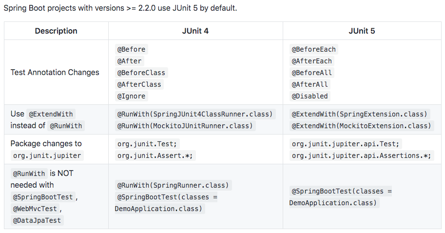

## JUnit 5 Changes

Spring Boot projects with versions >= 2.2.0 use JUnit 5 by default.

|Description|JUnit 4| JUnit 5|
|--|--|--|
|Test Annotation Changes|`@Before`<BR/>`@After`<BR/>`@BeforeClass`<BR/>`@AfterClass`<BR/>`@Ignore`|`@BeforeEach`<BR/>`@AfterEach`<BR/>`@BeforeAll`<BR/>`@AfterAll`<BR/>`@Disabled`|
|Use `@ExtendWith` instead of `@RunWith`|`@RunWith(SpringJUnit4ClassRunner.class)`<BR/>`@RunWith(MockitoJUnitRunner.class)`|`@ExtendWith(SpringExtension.class)` <BR/>`@ExtendWith(MockitoExtension.class)`|
|Package changes to `org.junit.jupiter` |`org.junit.Test;` <BR/> `org.junit.Assert.*;`|`org.junit.jupiter.api.Test;` <BR/>`org.junit.jupiter.api.Assertions.*;`|
|`@RunWith` is NOT needed with `@SpringBootTest`, `@WebMvcTest`, `@DataJpaTest`|`@RunWith(SpringRunner.class)`<BR/>`@SpringBootTest(classes = DemoApplication.class)`|`@SpringBootTest(classes = DemoApplication.class)`|

## JUnit 5 Upgrades For Different Projects

- JPA - https://github.com/in28minutes/jpa-with-hibernate/commit/0ae2007c8e08420e6d5ab2a86499274c7c60c8ae
- Unit Testing with Spring Boot - https://github.com/in28minutes/spring-unit-testing-with-junit-and-mockito/commit/2c6df429aec248d455b7ad19e60e90743979ba1c
- Spring Framework - https://github.com/in28minutes/spring-master-class/commit/60b61500f8f80517ef86d50e7dffb5826b2b3720

## pom.xml changes

Spring Boot projects with versions >= 2.2.0 use JUnit 5 by default. You should see something like this in your pom.xml

```
<dependency>
	<groupId>org.springframework.boot</groupId>
	<artifactId>spring-boot-starter-test</artifactId>
	<scope>test</scope>
	<exclusions>
		<exclusion>
			<groupId>org.junit.vintage</groupId>
			<artifactId>junit-vintage-engine</artifactId>
		</exclusion>
	</exclusions>
<dependency>
```

## JUnit 5 Image


