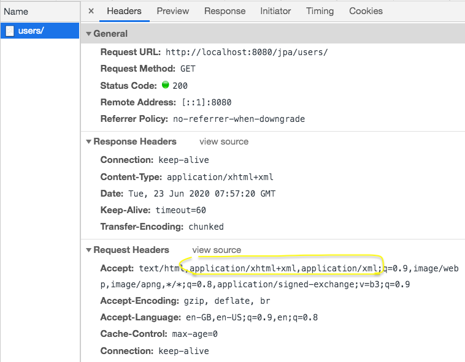
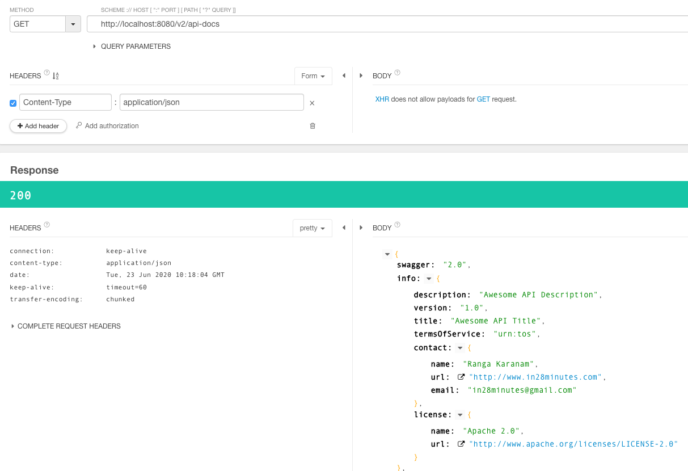

# Microservices

## 2.3.1 UPGRADE Changes

- Microservices - https://github.com/in28minutes/spring-microservices/commit/445efb12e083acc1334e49569a32cc7d9c7a0fe2
- REST API - https://github.com/in28minutes/spring-microservices/commit/5c6dbe14aeb34e0109be03e41d810a7dec050ac1

Complete Code Backup
- REST API - https://github.com/in28minutes/spring-microservices/blob/master/02.restful-web-services/2.3.1.RELEASE-upgrade.md
- Microservices - https://github.com/in28minutes/spring-microservices/blob/master/03.microservices/2.3.1.RELEASE-upgrade.md


## Errors

### Validation

If you are making use of Spring Boot Release (> 2.3.0) make sure to add the following dependency to your pom.xml (We are going to implement validations in next step):

```
<dependency>    
    <groupId>org.springframework.boot</groupId>    
    <artifactId>spring-boot-starter-validation</artifactId>
</dependency>
```

If it is not working, ensure that you 
1. stop the server
2. rebuild the project
3. start the server again

### HATEOAS

For Spring Boot v2.2 or greater - complete code: https://github.com/in28minutes/spring-microservices/blob/master/02.restful-web-services/2.3.1.RELEASE-upgrade.md#srcmainjavacomin28minutesrestwebservicesrestfulwebservicesuseruserresourcejava

### Swagger

#### Recommended Versions

Refer pom.xml here - https://github.com/in28minutes/spring-microservices/blob/master/02.restful-web-services/2.3.1.RELEASE-upgrade.md#pomxml

Refer SwaggerConfig file from here - https://github.com/in28minutes/spring-microservices/blob/master/02.restful-web-services/2.3.1.RELEASE-upgrade.md#srcmainjavacomin28minutesrestwebservicesrestfulwebservicesswaggerconfigjava

We recommend 3.0.0 version for Spring Boot >= 2.2
```
<dependency>
			<groupId>io.springfox</groupId>
			<artifactId>springfox-boot-starter</artifactId>
			<version>3.0.0</version>
		</dependency>
```

```
<repositories>
		<repository>
			<id>spring-snapshots</id>
			<name>Spring Snapshots</name>
			<url>https://repo.spring.io/snapshot</url>
			<snapshots>
				<enabled>true</enabled>
			</snapshots>
		</repository>
		<repository>
			<id>jfrog-snapshots</id>
			<name>JFROG Snapshots</name>
			<url>http://oss.jfrog.org/artifactory/oss-snapshot-local</url>
			<snapshots>
				<enabled>true</enabled>
			</snapshots>
		</repository>
		<repository>
			<id>spring-milestones</id>
			<name>Spring Milestones</name>
			<url>https://repo.spring.io/milestone</url>
			<snapshots>
				<enabled>false</enabled>
			</snapshots>
		</repository>
	</repositories>
```

SwaggerConfig - key parts
```
import java.util.Arrays;
import java.util.HashSet;
import java.util.Set;

import org.springframework.context.annotation.Bean;
import org.springframework.context.annotation.Configuration;

import springfox.documentation.service.ApiInfo;
import springfox.documentation.service.Contact;
import springfox.documentation.spi.DocumentationType;
import springfox.documentation.spring.web.plugins.Docket;
import springfox.documentation.swagger2.annotations.EnableSwagger2WebMvc;

@Configuration
@EnableSwagger2WebMvc
public class SwaggerConfig {

	public static final Contact DEFAULT_CONTACT = new Contact(
			"Ranga Karanam", "http://www.in28minutes.com", "in28minutes@gmail.com");
	
	public static final ApiInfo DEFAULT_API_INFO = new ApiInfo(
			"Awesome API Title", "Awesome API Description", "1.0",
			"urn:tos", DEFAULT_CONTACT, 
			"Apache 2.0", "http://www.apache.org/licenses/LICENSE-2.0", Arrays.asList());
```

### Could not write JSON: Underlying Stax XMLStreamWriter

If http://localhost:8080/v2/api-docs gives error below

```
org.springframework.http.converter.HttpMessageNotWritableException: Could not write JSON: Underlying Stax XMLStreamWriter (of type com.sun.xml.internal.stream.writers.XMLStreamWriterImpl) does not implement Stax2 API natively and is missing method 'writeRawValue': this breaks functionality such as indentation that relies on it. You need to upgrade to using compliant Stax implementation like Woodstox or Aalto; nested exception is com.fasterxml.jackson.core.JsonGenerationException: Underlying Stax XMLStreamWriter (of type com.sun.xml.internal.stream.writers.XMLStreamWriterImpl) does not implement Stax2 API natively and is missing method 'writeRawValue': this breaks functionality such as indentation that relies on it. You need to upgrade to using compliant Stax implementation like Woodstox or Aalto
	org.springframework.http.converter.json.AbstractJackson2HttpMessageConverter.writeInternal(AbstractJackson2HttpMessageConverter.java:326)
```

Browsers send accept header as `application/xml` causing a problem.



#### Recommendation 1

Send the request from a REST Client



#### Recommendation 2 

Remove XML support. (Application would default to JSON)

Remove dependency from pom.xml
```
<dependency>
	<groupId>com.fasterxml.jackson.dataformat</groupId>
	<artifactId>jackson-dataformat-xml</artifactId>
</dependency>
```

### Database Errors

Configure this in application.properties

```
spring.datasource.url=jdbc:h2:mem:testdb
spring.data.jpa.repositories.bootstrap-mode=default
```

For more details, refer to database debugging guide - https://github.com/in28minutes/in28minutes-initiatives/blob/master/The-in28Minutes-TroubleshootingGuide-And-FAQ/jpa-and-hibernate.md


### Getting XML Responses

OPEN BUG with spring-cloud-starter-netflix-eureka-client. It uses `jackson-dataformat-xml`.

Hence, you would see XML responses instead of JSON responses in the browser.

If you want to see JSON responses, you can add an exclusion for `jackson-dataformat-xml` dependency.

You need to make this change in 3 POM.XML files - Currency Exchange, Zuul and Currency Conversion

```
<dependency>
	<groupId>org.springframework.cloud</groupId>
	<artifactId>spring-cloud-starter-netflix-eureka-client</artifactId>
	<exclusions>
		<exclusion>
			<groupId>com.fasterxml.jackson.dataformat</groupId>
			<artifactId>jackson-dataformat-xml</artifactId>
		</exclusion>
	</exclusions>
</dependency>
```

### Load balancer does not have available server for client

If you see an error of this kind - Wait for 5 minutes and give it a try again! 

```
com.netflix.client.ClientException: Load balancer does not have available server for client: 
```
