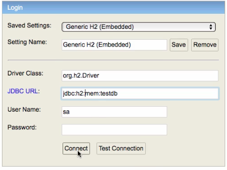

We love all our 300,000 learners. We want to help you in every way possible.

We do not want you to get stuck because of a simple error.

This Longggg....... troubleshooting guide and faq is our way of thanking you for choosing to learn from in28Minutes. 

If you do not find a good answer here, I would request you post the following details in the question:

```
Can you post more details with screenshots?
- What was the last working state?
- What changes did you make? Can you be specific and put the code changes etc?
- What do you expect to happen? Can you be specific and put the code changes, screenshots etc?
- What did you try to fix the issue?
- What do you observe?
- Include Code snippets, Properties files, pom.xml, Log, Stack Trace etc
```

### Debugging Full Stack Course Problems

```
Following questions would be great to think about:
- What debugging steps did you take?
- Were you able to identify which line of Front code is throwing this error?
- Which scenario are you executing?
- Are you having the same problem with other requests? Or is it just this request you are facing a problem with?
- Was there a HTTP Call going to backend?
- Do you see other errors in console?
- What request/response is going to the REST API? Can you get the Request Content and Header from Network Tab? Can you get the Response Content and Response Headers from the Network Tab?
- Are you able to use the request from network tab to execute the request  from Restlet client? Can you post a screenshot?
- Can you log all the things from the frontend - URL, header and use them to execute the request? You can do a console.log of all the details in the request.
- Can you enable debug logging and monitor the messages in the console on the server side? It should give you a clue.
logging.level.org.springframework = debug

Here are some of the things that could cause problems
- Is code from basic.auth package active?
- SpringSecurityConfigurationBasicAuth class should be in Component Scan. You can watch this video about Component Scan - https://youtu.be/L1Y5pwy09Vw?t=24
- Check if @CrossOrigin is enabled on HelloWorldController, BasicAuthenticationController and TodoResource.
- Extra / in the URL. Ex: http://localhost:8080//hello-world/path-variable/in28minutes
- Is the url for the REST API called from the frontend right? Does it match the mapping in controller?
- Is the Authorization header name right? `Authorization` - Check the exact case as well.
- Is the Authorization header value right? `Bearer ${data.token}` for JWT and 'Basic ' + window.btoa(username + ':' + password) for Basic Authentication.


If you've checked all the things above, post the following details
- Can you post your hello world controller and the code changes you made to add JWT Header in frontend?
- Can you post a screenshot of executing the request and the request details and headers?
- Can you post a screenshot of your package structure showing individual classes?
- Can you post the request headers from the browser network tab?
- Can you execute the request from REST API Client using the request headers coming from the browser network tab?
- Can you post the frontend code to execute the request?
- Can you post the code changes you made in this step?
```

### Github Repositories

- https://github.com/in28minutes/java-tutorial-for-beginners
- https://github.com/in28minutes/in28minutes.github.io/tree/master/_posts
- https://github.com/in28minutes/pcf-crash-course-with-spring-boot
- https://github.com/in28minutes/deploy-spring-microservices-to-aws-ecs-fargate
- https://github.com/in28minutes/JavaInterviewQuestionsAndAnswers
- https://github.com/in28minutes/java-to-python-in-100-steps
- https://github.com/in28minutes/deploy-spring-boot-aws-eb
- https://github.com/in28minutes/spring-boot-master-class
- https://github.com/in28minutes/spring-web-services
- https://github.com/in28minutes/full-stack-with-react-and-spring-boot
- https://github.com/in28minutes/JavaWebApplicationStepByStep
- https://github.com/in28minutes/spring-master-class
- https://github.com/in28minutes/first-steps-to-software-architect
- https://github.com/in28minutes/SpringMvcStepByStep
- https://github.com/in28minutes/MockitoTutorialForBeginners
- https://github.com/in28minutes/automation-testing-with-java-and-selenium
- https://github.com/in28minutes/java-a-course-for-beginners
- https://github.com/in28minutes/spring-microservices
- https://github.com/in28minutes/spring-interview-guide

### Recommended Versions

#### Java  Path Variable Windows

You would need to set PATH variable in Windows.

Instructions here - https://github.com/in28minutes/java-a-course-for-beginners/blob/master/00-02-java-eclipse-installation.md#setting-path-environment-variable-in-windows

Can you post the following details?

Where is your JDK installed? Can you post a screenshot of it?

What is in your PATH variable? Can you post a screenshot of it?

What error do you see when you type jshell in command prompt? Can you post a screenshot of it?

#### Use Latest Version of Eclipse

Correct the classpath of your application so that it contains a single, compatible version of org.springframework.plugin.core.PluginRegistry

I downloaded a project from spring initializr but when I see the pom.xml showing errors on parent tag.

https://stackoverflow.com/questions/56154266/why-does-change-from-spring-boot-version-2-1-4-to-2-1-5-gives-unknown-configurat

Add the following entry `<maven-jar-plugin.version>3.1.1</maven-jar-plugin.version>` to your pom to fix that issue. 

```
<properties>
	...
	...
	...

    <maven-jar-plugin.version>3.1.1</maven-jar-plugin.version>
</properties>

```

Other option is to use 2.1.3.RELEASE.

```
<parent>
    <groupId>org.springframework.boot</groupId>
    <artifactId>spring-boot-starter-parent</artifactId>
    <version>2.1.3.RELEASE</version>
    <relativePath/> <!-- lookup parent from repository -->
</parent>
```

#### Use Spring Cloud - Greenwich.RC2 and Spring Boot - 2.1.1.RELEASE.

Change 1
```
<parent>
<groupId>org.springframework.boot</groupId>
<artifactId>spring-boot-starter-parent</artifactId>
<version>2.1.1.RELEASE</version>
<relativePath/> <!-- lookup parent from repository -->
</parent>
```

Change 2
```
<spring-cloud.version>Greenwich.RC2</spring-cloud.version>
```

## Recent Course Updates

### Using Java 9+ => 9 , 10 & 11

You are using Java 9+. Here's a great read - https://www.jesperdj.com/2018/09/30/jaxb-on-java-9-10-11-and-beyond/

You can upgrade to Java 9+ (10, 11, ... ) by making this change in pom.xml

```
<java.version>9</java.version> <!-- 10 or 11 or ..-->
```

You might face this exception

```
Caused by: java.lang.NoClassDefFoundError: javax/xml/bind/JAXBException
Caused by: java.lang.ClassNotFoundException: javax.xml.bind.JAXBException
java.lang.NoClassDefFoundError: javax/transaction/SystemException
Caused by: java.lang.ClassNotFoundException: javax.transaction.SystemException

```

Solution
```
   <dependency>
      <groupId>javax.xml.bind</groupId>
      <artifactId>jaxb-api</artifactId>
      <version>2.3.0</version>
   </dependency>
   <dependency>
      <groupId>com.sun.xml.bind</groupId>
      <artifactId>jaxb-impl</artifactId>
      <version>2.3.0</version>
   </dependency>
   <dependency>
      <groupId>org.glassfish.jaxb</groupId>
      <artifactId>jaxb-runtime</artifactId>
      <version>2.3.0</version>
   </dependency>
   <dependency>
      <groupId>javax.activation</groupId>
      <artifactId>activation</artifactId>
      <version>1.1.1</version>
   </dependency>
```

### Hateoas

There are a few modifications of HATEOAS  in the latest release of Spring HATEOAS 1.0.0:

One of these should work

#### Option 1 : Latest SNAPSHOT releases

```
import org.springframework.hateoas.EntityModel;
import static org.springframework.hateoas.server.mvc.WebMvcLinkBuilder.*;
EntityModel<User> model = new EntityModel<>(user);
WebMvcLinkBuilder linkTo = linkTo(methodOn(this.getClass()).retrieveAllUsers());
model.add(linkTo.withRel("all-users"));
```

#### Option 2: Older versions

```
import static org.springframework.hateoas.mvc.ControllerLinkBuilder.linkTo;
import static org.springframework.hateoas.mvc.ControllerLinkBuilder.methodOn;
import org.springframework.hateoas.Resource;
import org.springframework.hateoas.mvc.ControllerLinkBuilder;
 
Resource<User> resource = new Resource<User>(user);
ControllerLinkBuilder linkTo = linkTo(methodOn(this.getClass()).retrieveAllUsers());
resource.add(linkTo.withRel("all-users"));
return resource;
```

## Spring 2.0.0.RELEASE Upgrades

Video - https://www.youtube.com/watch?v=e2J4NfJ1Mns

### Actuator

Replace old url - http://localhost:8080/application
New URL - http://localhost:8080/actuator

application.properties

```
management.endpoints.web.exposure.include=*
```

In HAL Browser, enter the actuator URL to browse.

### Spring Security

```
#security.user.name=username
#security.user.password=password
spring.security.user.name=username
spring.security.user.password=password
spring.security.filter.dispatcher-types=request
```

```
+        auth.inMemoryAuthentication()
+            .passwordEncoder(NoOpPasswordEncoder.getInstance())
+           .withUser("in28Minutes").password("dummy")
```

### Internationalization!

```java
    @GetMapping("/hello")
    public String helloWorld() {
        return msgSource.getMessage("msg.hello", null, "Whoops!", LocaleContextHolder.getLocale());
    }
```

```java
    @Bean
    public LocaleResolver localeResolver() {
        AcceptHeaderLocaleResolver localeResolver = new AcceptHeaderLocaleResolver();
        localeResolver.setDefaultLocale(Locale.US);
        return localeResolver;
    }
```

```properties
spring.jackson.serialization.write-dates-as-timestamps=false
spring.messages.basename=messages

```

### Spring Cloud Artifact/Code Changes
```xml
-     <artifactId>spring-cloud-starter-zuul</artifactId>
+     <artifactId>spring-cloud-starter-netflix-zuul</artifactId>

-     <artifactId>spring-cloud-starter-feign</artifactId>
+     <artifactId>spring-cloud-starter-openfeign</artifactId>

-     <artifactId>spring-cloud-starter-eureka</artifactId>
+     <artifactId>spring-cloud-starter-netflix-eureka-client</artifactId>

-     <artifactId>spring-cloud-starter-eureka-server</artifactId>
+     <artifactId>spring-cloud-starter-netflix-eureka-server</

-     <artifactId>spring-cloud-starter-ribbon</artifactId>
+     <artifactId>spring-cloud-starter-netflix-ribbon</artifactId>

-     <artifactId>spring-cloud-starter-hystrix</artifactId>
+     <artifactId>spring-cloud-starter-netflix-hystrix</artifactId>
```

```java
- public AlwaysSampler defaultSampler() {
-   return new AlwaysSampler();
+ public Sampler defaultSampler() {
+   return Sampler.ALWAYS_SAMPLE;
```

#### New Installation Approach for Zipkin

Quick Start Page
- https://zipkin.io/pages/quickstart

Downloading Zipkin Jar
- https://search.maven.org/remote_content?g=io.zipkin.java&a=zipkin-server&v=LATEST&c=exec

Command to run

```
RABBIT_URI=amqp://localhost java -jar zipkin-server-2.5.2-exec.jar
```

### command " RABBIT_URL=amqp://localhost java -jar zipkin-server-2.6.1-exec.jar" doesn't work in windows 

```
SET RABBIT_URI=amqp://localhost 
java -jar zipkin-server-2.5.2-exec.jar
```

The other problem we found is when we run tests using `mvn test`.

```
  <build>
    <plugins>
      <plugin>
        <groupId>org.springframework.boot</groupId>
        <artifactId>spring-boot-maven-plugin</artifactId>
      </plugin>
      <plugin>
        <groupId>org.apache.maven.plugins</groupId>
        <artifactId>maven-surefire-plugin</artifactId>
        <configuration><!-- https://issues.apache.org/jira/browse/SUREFIRE-1424 -->
          <argLine>--add-modules java.base</argLine>
        </configuration>
      </plugin>
    </plugins>
  </build>
```

References
- https://stackoverflow.com/questions/46515230/hibernate-java-9-and-systemexception
- https://stackoverflow.com/questions/44385846/hibernate-5-issue-with-jdk-9
- https://issues.apache.org/jira/browse/SUREFIRE-1424

## How to use this guide?

### 1. Ensure You Have The Recommended Versions of Tools/Versions

First of all - Make sure you are using the right versions. Here is the recommended versions and errors if you don't use them:

| Recommended Version  | Possible Errors if you are using other versions | More Details |
| -------------------- |:-----------------------------------------------:|--------------|
| Java 8  | Unsupported major.minor version 52.0 |[Basics](#basics)|
| Eclipse Java EE Oxygen | org.codehaus.plexus.archiver.jar.Manifest.write(java.io.PrintWriter)      |[Basics](#basics)|
| Spring Boot 2.0.0.RELEASE    | Maven download issues. Hal Browser and Spring Boot Actuator are not working!|[Configure 2.0.0.RELEASE](#error---hal-browser-and-spring-boot-actuator-are-not-working)|


### 2. Highly Probable Errors

Problems a high proportionate of our learners face.

| Error                | Solution Reference |
| -------------------- |:-------------:|
| Compilation failure [ERROR] No compiler is provided in this environment. Perhaps you are running on a JRE rather than a JDK?  |[Configure Eclipse to use JDK](#error---you-are-not-using-a-jdk) | 
| Could not transfer artifact           |[Check Maven Configuration](#error--you-are-not-connected-to-internet-or-you-are-behind-a-proxy) |
|Hal Browser and Spring Boot Actuator are not working   |[Configure Spring Boot Version 2.0.0.RELEASE](#error---hal-browser-and-spring-boot-actuator-are-not-working)|
|H2 Embedded Database - Cannot find tables |[Use the right database name](#error---table-is-not-created-automatically-in-h2-embedded-db-or-im-unable-to-see-the-tables) |
| Failed to load class (or)Could not find or load main class or Failed to read Class-Path attribute from manifest    |[Redownload artifacts with Maven](#error--files-downloaded-by-maven-are-corrupt) |
|java.net.BindException: Address already in use: JVM_Bind   |[Stop 8080 or Use Other Port](#q---what-should-i-do-when-some-other-application-is-using-default-port-8080) |
|No mapping found for HTTP request   |[Check your component scan configuration](#q---how-do-i-solve-errors-related-to-component-scan) |
|No qualifying bean of type   |[Check your component scan configuration](#q---how-do-i-solve-errors-related-to-component-scan) |
|java.lang.NoClassDefFoundError: org/springframework/web/cors/CorsConfigurationSource|[Solution](#error---spring-security---javalangnoclassdeffounderror-orgspringframeworkwebcorscorsconfigurationsource) |
|Unable to find setter method for attribute commandName   |[Use modelAttribute](#error---unable-to-find-setter-method-for-attribute-commandname) |

### 3. Go for the complete list

If you are facing a exception or an error
 - Try searching with complete exception text
 - Try searching with a substring
 - Try searching with name of exception
 - Try searching with the direct cause of exception
 - Try searching for the framework and browse through the FAQ

> If the troubleshooting guide does not help you solve your specific problem, raise a pull request with the problem and solution to improve the troubleshooting guide.

> If you see a bug in the troubleshooting guide, raise a pull request to improve the troubleshooting guide.

If you are here for fun, continue reading. 

This will be the best 20 minute investment you made in your programming career. You get an understanding of how you can troubleshoot a wide variety of issues.

Happy Troubleshooting.


## Basics

This video can help with simple troubleshooting - https://www.youtube.com/watch?v=ZZw8XNz5N-c&t=6s

### Tip :  Ensure you have the right version of Java Installed

Recommended Java Version
- Java 8 for Spring Boot 2.0+ or Spring 5.0+
- Java 7/Java 8 for earlier versions

Java JDK Version in Eclipse
You can use JavaSE-1.8 to develop Java 8 and any lower version of Java applications. You can control the version of an application through maven.

https://maven.apache.org/plugins/maven-compiler-plugin/examples/set-compiler-source-and-target.html

### Tip : Ensure you have the right version of Eclipse Installed

> Recommended to use Eclipse Java EE version

Recommended Eclipse Version
- Oxygen https://www.eclipse.org/downloads/packages/release/Oxygen/
- Eclipse Java EE version

### Tip : Troubleshooting Embedded Maven in Eclipse

This video is good start for your troubleshoot embedded maven issues in Eclipse - https://www.youtube.com/watch?v=ZZw8XNz5N-c&list=PLBBog2r6uMCSmMVTW_QmDLyASBvovyAO3&index=5

> In Windows, use Window -> Preferences for Preferences.

There are typically 4 reasons for errors with Embedded Maven in Eclipse

### Error :  You are not using a JDK
```
Failed to execute goal org.apache.maven.plugins:maven-compiler-plugin:3.2:compile (default-compile) on project in28minutes-multi-module-model: Compilation failure [ERROR] No compiler is provided in this environment. Perhaps you are running on a JRE rather than a JDK?
```

Fix - You would need to configure Eclipse to use JDK instead of JRE 
- Go to Your Eclipse > (Window/Eclipse) -> Preferences -> Java -> Installed JRE's
- Change to use a JDK

Following links will help you if you have questions
- http://stackoverflow.com/questions/13635563/setting-jdk-in-eclipse
- http://stackoverflow.com/questions/19655184/no-compiler-is-provided-in-this-environment-perhaps-you-are-running-on-a-jre-ra
- http://stackoverflow.com/questions/21099072/eclipse-maven-error-no-compiler-is-provided-in-this-environment

### Error : You are not connected to internet or You are behind a proxy!

Maven downloads the dependencies (i.e. frameworks and libraries(jars)) from the Maven repository (repo.maven.apache.org). 

This is the error you would see
```
Plugin org.apache.maven.plugins:maven-compiler-plugin:3.1 or one of its dependencies could not be resolved: Failed to read artifact descriptor for org.apache.maven.plugins:maven-compiler-plugin:jar:3.1: Could not transfer artifact org.apache.maven.plugins:maven-compiler-plugin:pom:3.1 from/to central (https://repo.maven.apache.org/maven2): sun.security.validator.ValidatorException: PKIX path building failed: sun.security.provider.certpath.SunCertPathBuilderException: unable to find valid certification path to requested target -> [Help 1]
```

Run this command at command prompt or terminal
```
telnet repo.maven.apache.org 80
```

If you are able to connect you should see this. 
```
telnet repo.maven.apache.org 80
Trying 151.101.200.215...
Connected to maven.map.fastly.net.
Escape character is '^]'.
```

If you do not see above text ```Connected to maven.map.fastly.net.``` you would need to check your internet connection.

If you are trying this at work, you might be behind a proxy. 

You need to talk to maven experts in your organization to figure out the right settings.
- Here's a discussion which will be useful 
  - http://stackoverflow.com/questions/25911623/problems-using-maven-and-ssl-behind-proxy
  - http://stackoverflow.com/questions/5074063/maven-error-failure-to-transfer
- The section below shows how to configure a proxy in Eclipse

###### Configuring a Proxy 

Maven plugin uses a settings file where the configuration can be set. Its path is available in Eclipse at Window -> Preferences -> Maven -> User Settings. If the file doesn't exist, create it and put on something like the example below:

```
<settings xmlns="http://maven.apache.org/SETTINGS/1.0.0"
  xmlns:xsi="http://www.w3.org/2001/XMLSchema-instance"
  xsi:schemaLocation="http://maven.apache.org/SETTINGS/1.0.0
                      http://maven.apache.org/xsd/settings-1.0.0.xsd">
  <localRepository/>
  <interactiveMode/>
  <usePluginRegistry/>
  <offline/>
  <pluginGroups/>
  <servers/>
  <mirrors/>
  <proxies>
    <proxy>
      <id>myproxy</id>
      <active>true</active>
      <protocol>http</protocol>
      <host>192.168.1.100</host>
      <port>6666</port>
      <username></username>
      <password></password>
      <nonProxyHosts>localhost|127.0.0.1</nonProxyHosts>
    </proxy>
  </proxies>
  <profiles/>
  <activeProfiles/>
</settings>
```

### Error : Files Downloaded by Maven are Corrupt

Typical Errors
```
Exception in thread "main" java.lang.NoClassDefFoundError: ch/qos/logback/classic/turbo/TurboFilter
at java.lang.Class.getDeclaredConstructors0(Native Method)
at java.lang.Class.privateGetDeclaredConstructors(Unknown Source)
at java.lang.Class.getConstructor0(Unknown Source)

Could not find or load main class com.springboot.app.Application

Exception in thread "main" java.lang.IllegalStateException: Failed to read Class-Path attribute from manifest of jar file:/home/edas/.m2/repository/javax/servlet/jstl/1.2/jstl-1.2.jar
And here is my the complete exception stack

Exception in thread "main" java.lang.IllegalStateException: Failed to read Class-Path attribute from manifest of jar file:/C:/Users/pervacio/.m2/repository/org/springframework/security/spring-security-config/5.0.0.M3/spring-security-config-5.0.0.M3.jar

```

Options that can be tried are listed below:

###### Force Update of Snapshots/Release

- Right click on your project -> Maven -> Update Project -> Use "Force Update of Snapshots/Releases" -> Check this checkbox

###### Purge Your Maven Repository

This can be done in two ways

- Inside Eclipse - Right click on the project > Run as Maven Build > dependency:purge-local-repository

- From Command Prompt cd to the project of the folder
   - ```mvn dependency:purge-local-repository```

###### Delete your local repository
This will be last resort

### Error :  org.codehaus.plexus.archiver.jar.Manifest.write(java.io.PrintWriter)

Reason - You are using an old version of Eclipse without the latest maven archiver plugin

You get this error
```
org.codehaus.plexus.archiver.jar.Manifest.write(java.io.PrintWriter)
```

Recommended Actions
- Recommended - Download latest version of Eclipse
- Other option - It might be a problem with your specific version of eclipse : https://github.com/tesla/m2eclipse-mavenarchiver/issues/9. You can try updating m2e.
   - Eclipse > Goto Intall New Software then input https://otto.takari.io/content/sites/m2e.extras/m2eclipse-mavenarchiver/0.17.0/N/LATEST/ and continue.
   - Go ahead and install the plugin

For more information read these
- https://stackoverflow.com/questions/37936646/eclipse-2-0-2-and-maven-0-17-configuration
- https://github.com/tesla/m2eclipse-mavenarchiver/issues/8

### Error : Unsupported major.minor version 52.0

Reason - You are using an old version of JDK

You would get this error
```
Unsupported major.minor version 52.0
```

This error happens when you try to run code compiled using JDK 8 in a lesser version of JDK or JRE.

Fix 
- If you do not have JDK 8, go ahead an install it.
- Configure Eclipse to use JDK 8. Refer to "You are not using a JDK" section to find out how to configure JDK 8

### Should we use Eclipse IDE for Java Developers or Eclipse IDE for Java EE Developers?

Here is a quick summary:
- Eclipse IDE for Java Developers - Used to develop Java applications.
- Eclipse IDE for Java EE Developers - Used to develop web application, Java EE application, web services and micro services with Java


### Tip :  Your Project Maven configuration should be configured to compile at Java 8

If you are using Spring Boot, check configuration in Approach 1.

If you are doing a JSP/Servlet or a Spring MVC course without using Spring Boot use Approach 2.

###### Approach 1 : Spring Boot Project

In pom.xml, the property java.version should be set to 1.8.

```
  <properties>
    <project.build.sourceEncoding>UTF-8</project.build.sourceEncoding>
    <project.reporting.outputEncoding>UTF-8</project.reporting.outputEncoding>
    <java.version>1.8</java.version>
  </properties>
```

###### Approach 2: Non Spring Boot Project

In pom.xml, the source and target of maven-compiler-plugin should be set to 1.8

```
<project>
  [...]
  <build>
    [...]
    <plugins>
      <plugin>
        <groupId>org.apache.maven.plugins</groupId>
        <artifactId>maven-compiler-plugin</artifactId>
        <configuration>
          <source>1.8</source>
          <target>1.8</target>
        </configuration>
      </plugin>
    </plugins>
    [...]
  </build>
  [...]
</project>
```

### Error :  On Maven > Update Project, Java 1.4 is auto selected

Ensure that you have the latest version of Eclipse and Java installed.

### Error :  Changes you made are not reflected

- Did you restart the server?
- Did you stop and start the server?
- Did you reload your web page?

Changes to configuration and web.xml are reflected only when you completely restart the server. 

### Q :  What should I do when some other application is using default port 8080?

```
Embedded servlet container failed to start. Port 8080 was already in use.
```

You have two options
- Option 1 - Identify and stop the process that's listening on port 8080 or
- Option 2 - Configure this application to listen on another port.

###### Option 1 - Kill

- In Eclipse console tab, on the right hand side, click the double cross icon (Kill all terminated launches). You should see the running program highlighted by a red terminate button. You can kill the red button to kill the running application.
- In windows, Use Ctrl + Shift + Esc to launch windows task manager. Kill all java.exe or javaw.exe
- In Mac, You can use one of these commands to find the PID of process using 8080
```
netstat -vanp tcp | grep 8080
sudo lsof -i tcp:8080
```
- After you have the PID, execute the command below:
```
kill -9 <PID>
```

###### Option 2 - Switch Port

Add a property in application.properties

```
server.port = 8081
```

```
java.net.BindException: Address already in use: JVM_Bind <null>:8080. 
```

You have two options
1) Option 1 - Identify and stop the process that's listening on port 8080 or
2) Option 2 - Configure this application to listen on another port.

###### Option 1 - Kill

- In Eclipse console tab, on the right hand side, click the double cross icon (Kill all terminated launches). You should see the running program highlighted by a red terminate button. You can kill the red button to kill the running application.
- In windows, Use Ctrl + Shift + Esc to launch windows task manager. Kill all java.exe or javaw.exe
- In Mac, You can use one of these commands to find the PID of process using 8080
```
netstat -vanp tcp | grep 8080
sudo lsof -i tcp:8080
```
- After you have the PID, execute the command below:
```
kill -9 <PID>
```

###### Option 2 - Switch Port

Option 2a - change pom.xml. port is changed to 8081.

```
 <plugin>
            <groupId>org.apache.tomcat.maven</groupId>
            <artifactId>tomcat7-maven-plugin</artifactId>
            <version>2.2</version>
            <configuration>
                <port>8081</port>
            </configuration>
        </plugin>

```

Option 2b - Instead of tomcat7:run use the command below to run the application. This will run it on port 8081

```
-Dmaven.tomcat.port=8081 tomcat7:run
```

### Q :  Do I need to install Tomcat seperately for this course?

During the course we would configure a tomcat plugin or embedded tomcat (in Spring Boot courses), which will download tomcat 7 and use it. 

You don't need Tomcat installed on your system.

### Q :  Why do we use this specific project structure in all our courses?

We follow maven standard project structure. 

We recommend you spend sometime understanding this directory layout 
- https://maven.apache.org/guides/introduction/introduction-to-the-standard-directory-layout.html.

### Q :  What software do you use for your diagrams or Mind Maps?

Its called MindMup. https://www.mindmup.com/

I loved the first version of it. And am finding it difficult to adapt to the second version. But as usual, we programmers find a way :)

### Q :  How to debug the application?

Instead of Run as -> Maven application, use Debug as -> Maven application. Add your breakpoints. You should be all set.

If you are using Spring Boot and Running using Run as -> Java application, then you can use Debug as -> Java Application. Add your breakpoints. You should be all set.


### Spring MVC Context Root

Two Options: Either remove context path or add context path to all urls

Adding Context Path to All Buttons

Do this in all pages

<c:set var="contextPath" value="${pageContext.request.contextPath}"/>
<a type="button" class="btn btn-primary" 
    href="${contextPath}/update-todo?id=${todo.id}">Edit</a>
Removing Context Path

In Your web.xml set an url pattern of / to dispatcher servlet!

    <servlet-mapping>
        <servlet-name>dispatcher</servlet-name>
        <url-pattern>/</url-pattern>
    </servlet-mapping>


If these dont work for you - can you post your pom.xml, dispatcher servlet.xml and web.xml along with a sample jsp with button?

Good Luck


### Q :  How do I configure auto restarting the server whenever source code changes?

If you are using Spring Boot, check configuration in Approach 1.

If you are doing a JSP/Servlet or a Spring MVC course without using Spring Boot use Approach 2.


###### Approach 1 : Spring Boot Project

In pom.xml, add a dependency on devtools and restart the server. You are all set.

> If you are using Intellij, there is one more configuration you need. Check out the intellij faq section.

```
<dependency>
      <groupId>org.springframework.boot</groupId>
      <artifactId>spring-boot-devtools</artifactId>
      <scope>runtime</scope>
    </dependency>
```

###### Approach 2: Non Spring Boot Project

Use ```<contextReloadable>true</contextReloadable>``` in your pom.xml maven plugin configuration. Restart the server. You are all set.

```
<plugin>
    <groupId>org.apache.tomcat.maven</groupId>
    <artifactId>tomcat7-maven-plugin</artifactId>
    <version>2.2</version>
    <configuration>
        <path>/</path>
        <contextReloadable>true</contextReloadable>
        <port>8080</port>
    </configuration>
</plugin>
```

### Q :  Can I use jboss instead of tomcat server?
Yeah. You can find more details of how to use the jboss maven plugin at https://docs.jboss.org/jbossas/7/plugins/maven/latest/examples/deployment-example.html.

### Q :  How to get the projects to run in Tomcat 8 or 9?
I’ve done a quick search to find the plugins for tomcat 8 and tomcat 9. Here’s the best I could find 
- http://jtuts.com/2016/09/14/run-embedded-tomcat8-maven/

See also here: https://stackoverflow.com/questions/26883836/tomcat-8-maven-plugin-for-java-8


## Maven

### Q :  Why Maven?

You don’t want to store all the libraries in your project!

You want to tell I need A, B, C and you would want the tool to download the libraries and make them available to you.

That's Maven. The tool which you use to manage the libraries.

If you need a new version of the library, you can change the version and your project is ready!

Also, You don't need to worry about what libraries your library needs to work. For example, Spring might need other libaries - logging, xml etc. 

Once you declare a dependency on Spring, Maven would download
- Spring
- And all dependencies of Spring

Isn't that cool?

### Q :  What is ArtifactId and GroupId?

You don’t want to store all the libraries in your project!

So, you define dependencies in your pom.xml. 

Maven would download the dependencies and make them available for use in your project.

But, how does Maven know what dependency to download?

You need to tell it by giving the details of the dependency. 

Just like you can identify a Java class with a class name and a package name, you can identify a maven artifact by a GroupId and an ArtifactId.

### Q :  How to know the exact string and name of a dependency and its artifactid?

You can either google or you can visit our Github repository.

You can find it on the home page of the section on github

(Details would have been explained in the introduction video of the section)

- For example - https://github.com/in28minutes/spring-web-services/tree/master/restful-web-services

```
  <dependency>
      <groupId>org.springframework.boot</groupId>
      <artifactId>spring-boot-starter-hateoas</artifactId>
    </dependency>
```

### Q :  What's the difference between scope and phase?

A scope specifies areas of the application, a dependency can be used.  I can use the dependency in tests or I can used it in source code or I can use it when I run the application.

Phase - Different steps in the build life cycle. You compile code first. Then compile test code. Then you run unit tests, Then you run integration tests and so on..

### Q :  Maven - How did a specific jar end up in our deployable?

In Maven terminology, what you are trying to see is called a dependency tree.

You can type in the command mvn dependency:tree to figure it out.

In eclipse. Right click on Project > Run as > Maven Build > dependency:tree

### Q :  What is a SNAPSHOT as in 0.0.1-SNAPSHOT?

A project in development uses a snapshot version. Once you have completed developing a version you would release it as 0.0.1 or 0.0.1-RELEASE. 

The next version in development will be 0.0.2-SNAPSHOT.

Versioning convention is MAJOR.MINOR.FIX

You can read more about it here : http://books.sonatype.com/mvnref-book/reference/pom-relationships-sect-pom-syntax.html


### Q :  What is difference between runtime and provided scopes?

Provided is when you expect the runtime environment to provide the dependency. For example, the Java ee api will be provided by tomcat or web sphere. We declare it as provided. 

Let’s say you want to use a specific class from a jar in your code. However, you don’t want that jar to be part of your deployable unit. You want this jar to be provided by the runtime server - say tomcat or web sphere or web logic. In those cases, we use a scope of provided to indicate that 
- It is NOT included in Deployable unit
- It is available while compiling code

Let's say We would want a jar to be only available when running the app and not when compiling it. We would use scope of runtime. 
- For example - business layer wants to use the api of data layer but not the implementation of data layer. We will make the implementation dependency of data layer as having a scope of runtime.

```
<dependency>
  <groupId>javax</groupId>
  <artifactId>javaee-web-api</artifactId>
  <version>6.0</version>
  <scope>provided</scope>
</dependency>
```

### Q :  How can you always exclude a specific jar using Maven Exclusions?

Maven exclusion is an awesome feature to exclude dependencies that we would not want to be part of our deployable

```
<dependency>
    <groupId>org.springframework.boot</groupId>
    <artifactId>spring-boot-starter-web</artifactId>
    <exclusions>
        <exclusion>
            <groupId>org.springframework.boot</groupId>
            <artifactId>spring-boot-starter-tomcat</artifactId>
        </exclusion>
    </exclusions>
</dependency>
```
A good example of using dependency exclusion is logging with Spring Boot.  Default logging framework is logback. However, if I want to use log4j, I can exclude logback and add log4j. 
- You can read about it here : https://docs.spring.io/spring-boot/docs/current/reference/html/howto-logging.html#howto-configure-log4j-for-logging

However, there is no concept of general exclusion in Maven. 

Dependency exclusion is specific to the dependency where it is declared. 

You have to exclude a jar in all the dependencies where it is declared as a dependency.

## Tip : Example of a multi layered maven project

https://github.com/in28minutes/MavenIn28Minutes/tree/master/4.web-application-with-maven

### Error : java.lang.ClassNotFoundException

```
Caused by: java.lang.ClassNotFoundException: org.springframework.beans.factory.config.BeanDefinitionCustomizer
```

When ever you get this kind of exception. Find out which jar this class belongs to by doing a google - org.springframework.beans.factory.config.BeanDefinitionCustomizer

In this example I'm missing spring-beans. So, find the right version and add it in. You are all set.

```
<dependency>
 <groupId>org.springframework</groupId>
 <artifactId>spring-beans</artifactId>
 <version>4.3.10.RELEASE</version>
</dependency>
```

### Q :  Why are we not using Gradle?

Gradle is awesome. 

If Gradle came before Maven, that is what I would have used for this course :)

Maven has the first mover advantage and has retained it and hence the choice for this course. But, if Gradle become more popular, I would be the first one to switch :)

If you want to create a Spring Boot app with Gradle, this should help you get started - https://spring.io/guides/gs/gradle/

### What is SNAPSHOT Version? Are all starter versions snapshots or not are good?

SNAPSHOT versions are versions under development. Of late, some of the SNAPSHOT version of Spring Boot 2 are having a few issues.

> A project in development uses a snapshot version. Once you have completed developing a version you would release it as 0.0.1 or 0.0.1-RELEASE. The next version in development will be 0.0.2-SNAPSHOT.

Spring Boot SNAPSHOTs are more reliable than other frameworks but you are right we would like to use Released versions as much as possible.

So, we are advising not use SNAPSHOT version.

Versioning convention is MAJOR.MINOR.FIX

### Existing Maven Projects

Here are the steps to import existing maven projects:
- Click File > Import.
- Type Maven in the search box under Select an import source:
- Select Existing Maven Projects.
- Click Next.
- Click Browse and select the folder that is the root of the Maven project(probably contains the pom.xml file)
- Click Next.
- Click Finish.

### Using Maven for jstl

The absolute uri: java.sun.com/jsp/jstl/core cannot be resolved in either web.xml or the jar files deployed with this application

solution was: 

```
    <dependency>
      <groupId>jstl</groupId>
      <artifactId>jstl</artifactId>
      <version>1.2</version>
    </dependency>
```
which works


## Eclipse

### Package Presentation > Hierarchical

Yeah, I figured it out. I just needed to Package Presentation > Hierarchical on Eclipse. 

It’s called hierarchical package representation.

```
Package Explorer / View Menu / Package Presentation... / Hierarchical
```

The "View Menu" can be opened with Ctrl + F10, or the small arrow-down icon in the top-right corner of the Package Explorer.

From - https://stackoverflow.com/questions/3915961/how-to-view-hierarchical-package-structure-in-eclipse-package-explorer

### Bug in Eclipse when generating toString?

https://bugs.eclipse.org/bugs/show_bug.cgi?id=521995​

Will be fixed only in Photon 4.8 - Verified for 4.8 M6 with build I20180306-2000.
​
Until then write it manually :)


### Q :  How do I see the list of methods in a class?

Its called outline. Short cut is Ctrl + O.

### Q :  How do I become more efficient developer? 

First Step. Use Keyboard Shortcuts :)

- Eclipse - https://shortcutworld.com/Eclipse/win/Eclipse-Helios_Shortcuts
- Intellij - https://www.jetbrains.com/help/idea/keyboard-shortcuts-you-cannot-miss.html

### Q :  How do you download source code to Eclipse so that you can see the code for frameworks?

Its easy. Three Options.
- Ctrl + Click on the Class Name and see if the jar is auto downloaded. 
- Right click on your project and go to Maven -> Download JavaDoc, you can also select Maven -> Download Sources
- In Eclipse menus, open Window -> Preferences -> Maven and there you check the box with download sources and download javadoc as well.


## Intellij and/or Mac

### Q :  How to install Maven on MAC OS X?

Recommended Reading
- Updating PATH environment variable - https://www.mkyong.com/maven/install-maven-on-mac-osx/

### Q :  How do I import a Maven project into Intellij?

Here's a starting guide 
- https://www.jetbrains.com/help/idea/2016.1/importing-project-from-maven-model.html

A few tips:
- When importing project, check the option to "Search for projects recursively"
	- https://s31.postimg.org/gadu5g7l7/Options.png
- After importing the project, wait for all background tasks to complete - "Resolving Maven dependencies" etc.....
	- https://s31.postimg.org/z448g6v6z/Resolving_Dependencies.png

### Q :  How do I create and run unit tests (JUnit) with Intellij?
Here's the complete guide 
- https://www.jetbrains.com/help/idea/creating-tests.html

This can be another option for setting up a unit test
- https://stackoverflow.com/questions/19330832/setting-up-junit-with-intellij-idea

### Error :  I'm having a problem running jsps with Spring Boot in Intellij. What should I do?

Changed the scope of the embedded Tomcat dependency to required. Hope this helps anyone using IntelliJ.

```
<dependency>
    <groupId>org.apache.tomcat.embed</groupId>
    <artifactId>tomcat-embed-jasper</artifactId>
    <scope>required</scope> <!-- 'provided' for Eclipse, 'required' for IntelliJ -->
</dependency>
```

### Q :  Why does Hot reload not work with Spring Boot DevTools and Intellij?

Here's a quick summary of what you have to do
- Settings --> Build-Execution-Deployment --> Compiler --> enable "Make Project Automatically".
- Restart IntelliJ.

In earlier version of IntelliJ
- Press ctrl+shift+A and search for the registry. Enable following configuration ```compiler.automake.allow.when.app.running```


Recommended Reading
- https://dzone.com/articles/spring-boot-application-live-reload-hot-swap-with


```
<dependency>
   <groupId>org.springframework.boot</groupId>
   <artifactId>spring-boot-devtools</artifactId>
</dependency>
```

## Spring

### What is a dependency in Spring?

Think this way!

Who is creating instances of the Data Bean? We do, using a constructor.

Who is creating things which are annotated with @Component. Spring Framework does.

Here's a quick video to get you going - https://www.youtube.com/watch?v=4VajgnSHwOw

### What's so bad about instantiating beans manually?

In general, the answer is Loose Coupling. Think why do we need Interfaces in Java? You can write code without interfaces but most of the times we use interfaces.

You might wonder : Why should code be loosely coupled?

Let's consider the example of  Unit Testing. If you directly instantiate objects, think how you would write unit tests for them.

The core feature of Spring is dependency injection. And if we use Dependency Injection properly then we would be able to write unit tests for our code very easily. Spring has a really good integration frameworks like Junit and Mockito and it enables us to write good unit tests very quickly.

And to build on top of it, Spring has awesome modules and projects to make various facets of application development simpler.

### Spring vs Interface

what is special about loose coupling of spring?Interface implementation provides the same?

//loose coupling via interface
```
 public interface Vehicle {
        void start();
   }
         
   public class Car implements Vehicle {
        @Override
        public void start() {
              System.out.println("Travel by Car");
        }
   }

   public class Bike implements Vehicle {
         @Override 
         public void start() {
               System.out.println("Travel by Bike");
         }
   }
             
    // create main class Journey
   public class Journey {
         public static void main(String[] args) {
               Vehicle v = new Car();
               v.start();
         }
   } 
```


In Journey class, You have hardcode

```
Vehicle v = new Car(); 
```
With spring the Journey class does not need to know about the specific instance of Vehicle.

Based on your configuration, Spring would identify the appropriate Vehicle implementation and auto wire it into Journey class.

This will help you to unit test the Journey class with different Vehicle implementations without changing the Journey class.

### @Bean and @Autowired

@Bean is used in Spring Configuration Files and Classes. It is used to directly instantiate or configure spring beans.

@Autowired can be used with methods also. Spring would find a matching bean for AuthenticationManagerBuilder and call the method once the bean is created.

### Autowiring - Great Example


When I added following constructor, log correctly printed - Autowiring by type from bean name 'binarySearchImpl' via constructor to bean named 'bubbleSortAlgorithm'

```
package com.in28minutes.spring.basics.springin5steps;

import org.springframework.beans.factory.annotation.Autowired;

import org.springframework.stereotype.Component;

@Component

public class BinarySearchImpl {

@Autowired

private SortAlgorithm sortAlgorithm; //SortAlgorithm  is the dependency of BinarySearchImpl

public BinarySearchImpl(SortAlgorithm sortAlgorithm) {

super();

this.sortAlgorithm = sortAlgorithm;

}


public int binarySearch(int[] numbers, int numberToSearchFor) {


int [] sortedNumbers = sortAlgorithm.sort(numbers);

System.out.println(sortAlgorithm);

return 3;

}//binarySearch

}


Case2

------------

When I added setter, Autowiring message is not getting printed in logs -

package com.in28minutes.spring.basics.springin5steps;


import org.springframework.beans.factory.annotation.Autowired;

import org.springframework.stereotype.Component;


@Component

public class BinarySearchImpl {


@Autowired

private SortAlgorithm sortAlgorithm; //SortAlgorithm  is the dependency of BinarySearchImpl


public void setSortAlgorithm(SortAlgorithm sortAlgorithm) {

this.sortAlgorithm = sortAlgorithm;

}


public int binarySearch(int[] numbers, int numberToSearchFor) {


int [] sortedNumbers = sortAlgorithm.sort(numbers);

System.out.println(sortAlgorithm);

return 3;

}//binarySearch

}


Case 3

-----------

When I removed constructor and setter then log still didn't print Autowiring message.

package com.in28minutes.spring.basics.springin5steps;


import org.springframework.beans.factory.annotation.Autowired;

import org.springframework.stereotype.Component;


@Component

public class BinarySearchImpl {


@Autowired

private SortAlgorithm sortAlgorithm; //SortAlgorithm  is the dependency of BinarySearchImpl


public int binarySearch(int[] numbers, int numberToSearchFor) {


int [] sortedNumbers = sortAlgorithm.sort(numbers);

System.out.println(sortAlgorithm);

return 3;

}//binarySearch

}
```

Case 1 : @Autowired on field. Only Constructor present. Autowired using Constructor.

Case 2: @Autowired on field. Both Constructor and Setter present. Setter used.

Case 3: @Autowired on field. None of Constructor and Setter present. Field Autowiring used using reflection.


If you want use Constructor autowiring always, you can place @Autowired on Constructor.

### Why Dependency Injection?

You said without dependency injection, it makes unit tests much harder. I don't understand why.

I'm explaining myself :

Let's say your controller depends from a service. You want to test it with a fake service.

In fact instead of having Service service = new Service() (your real service), you just have to replace by : Service service = new FakeBackEndService();

It's just one line of code changing, I don't understand why DI is so good for unit tests, it seems without it isn't much longer (just changing one line fo code)

`Answer`


Think about this

You need to change code when you want to run unit tests. Let’s say you have a big application with 500 Component classes. Would it be possible to change all the classes when we run unit tests?


### How BinarySearchImpl is tightly coupled with BubbleSort?

Question you need to ask is if you would need to change the algorithm to use - let's say QuickSort - do you need to make a change in BinarySearchImpl?

### @Configuration vs @Bean

You use @Configuration to define the Spring Context configuration in a Java File.

```
@ComponentScan("com.in28minutes")
@Configuration
public class SpringConfiguration {
```

Within a Spring Configuration Class , @Bean is used to define beans with custom configuration. You define the beans to be created!

Here’s an example
```
@Configuration
@EnableSwagger2
public class SwaggerConfig {

	public static final Contact DEFAULT_CONTACT = new Contact(
			"Ranga Karanam", "http://www.in28minutes.com", "in28minutes@gmail.com");
	
	public static final ApiInfo DEFAULT_API_INFO = new ApiInfo(
			"Awesome API Title", "Awesome API Description", "1.0",
			"urn:tos", DEFAULT_CONTACT, 
			"Apache 2.0", "http://www.apache.org/licenses/LICENSE-2.0");

	private static final Set<String> DEFAULT_PRODUCES_AND_CONSUMES = 
			new HashSet<String>(Arrays.asList("application/json",
					"application/xml"));

	@Bean
	public Docket api() {
		return new Docket(DocumentationType.SWAGGER_2)
				.apiInfo(DEFAULT_API_INFO)
				.produces(DEFAULT_PRODUCES_AND_CONSUMES)
				.consumes(DEFAULT_PRODUCES_AND_CONSUMES);
	}
}
```


### If BubbleSortAlgorithm is the @Primary @Component and QuickSortAlgorithm just another @Component How is QuickSortAlgorithm used?  How is the method accessed?

If you want to select a bean at runtime, thats business logic - Not auto wiring.

You would need to create a separate class for Selector which has both the sorting algorithms auto wired. It should have the business logic to choose the appropriate algorithm.


```
@Component 
class SortAlgorithmSelector {
     @Autowired
      SortAlgorithm quickSortAlgorithm;

     @Autowired
      SortAlgorithm binarySortAlgorithm;

      public SortAlgorithm chooseTheRightAlgorithm(Data data) {
             //Logic to choose the algorithm and return it.
      }

}
```

### Spring Team recommends: "Always use constructor based dependency injection in your beans. Always use assertions for mandatory dependencies". Could you explain what is at stake?

This article is a great starting point - https://spring.io/blog/2007/07/11/setter-injection-versus-constructor-injection-and-the-use-of-required/

### @ControllerAdvice

@ControllerAdvice is common to all the controllers.

All logic that is common to all the controllers is implemented in Controller Advice classes.

Exception handling etc.


### Problem with Component Scan

Typically this is due to improper use of component scan. You can read more about component scan here (read the 2 questions fully :) )

https://github.com/in28minutes/in28minutes-initiatives/tree/master/The-in28Minutes-TroubleshootingGuide-And-FAQ#q---what-is-the-need-for-a-component-scan

Simplest way to fix this is to identify the packages of the SpringBootApplication class and move all the components into that package or sub-packages of it. Good Luck.

### Q :  What is the need for a Component Scan?

> If you understand component scan, you understand Spring.

The first step of defining Spring Beans is by adding the right annotation - @Component or @Service or @Repository. 

However, Spring does not know about the bean unless it knows where to search for it. This part of "telling Spring where to search" is called a Component Scan. You define the packages that have to be scanned.

Once you define a Component Scan for a package, Spring would search the package and all its sub packages for components.

### Q :  How do you define a Component Scan?

Defining a Component Scan
- If you are using Spring Boot, check configuration in Approach 1.
- If you are doing a JSP/Servlet or a Spring MVC course without using Spring Boot use Approach 2.

###### Approach 1 : Spring Boot Project

Executive Summary
- If your other packages hierarchies are below your main app with the @SpringBootApplication annotation, you're covered by implicit components scan.
- if the other packages do not reside under the main package, you should manually add them as @ComponentScan

###### Detailed Example

Consider the class below:

```
package com.in28minutes.springboot.basics.springbootin10steps;

import org.springframework.boot.SpringApplication;
import org.springframework.boot.autoconfigure.SpringBootApplication;
import org.springframework.context.ApplicationContext;
import org.springframework.context.ConfigurableApplicationContext;

@SpringBootApplication
public class SpringbootIn10StepsApplication {

	public static void main(String[] args) {
		ApplicationContext applicationContext = 
				SpringApplication.run(SpringbootIn10StepsApplication.class, args);
		
		for (String name : applicationContext.getBeanDefinitionNames()) {
			System.out.println(name);
		}
	}
}
```

```@SpringBootApplication``` is defined on ```SpringbootIn10StepsApplication class``` which is package ```com.in28minutes.springboot.basics.springbootin10steps.```

```@SpringBootApplication``` defines an automatic component scan on package ```com.in28minutes.springboot.basics.springbootin10steps```.

You are fine if all your components are defined in the above package or a sub-package.

However, let's say one of the components is defined in a package ```com.in28minutes.springboot.somethingelse```

In this case, you would need add the new package into component scan.

Two Options
-  Define @ComponentScan(“com.in28minutes.springboot”) - This would scan the entire parent tree of com.in28minutes.springboot.
- Or Define two specific Component Scans by using an array. 
   - @ComponentScan({"com.in28minutes.springboot.basics.springbootin10steps","com.in28minutes.springboot.somethingelse"})

Option 1
```
@ComponentScan(“com.in28minutes.springboot”)
@SpringBootApplication
public class SpringbootIn10StepsApplication {
```

Option 2
```
@ComponentScan({"com.in28minutes.springboot.basics.springbootin10steps","com.in28minutes.springboot.somethingelse"})
@SpringBootApplication
public class SpringbootIn10StepsApplication {
```

###### Approach 2: Non Spring Boot Project

In a non Spring Boot Project, we would typically define the component scan explicitly in an XML application context or a Java Application Context.

###### Java Application Context

Option 1
```
@ComponentScan(“com.in28minutes)
@Configuration
public class SpringConfiguration {
```

Option 2
```
@ComponentScan({"com.in28minutes.package1","com.in28minutes.package2"})
@Configuration
public class SpringConfiguration {
```

###### XML Application Context

```
<context:component-scan base-package="com.in28minutes" />
```

or Specific Multiple Packages

```
<context:component-scan base-package="com.in28minutes.package1, com.in28minutes.package2" />
```

### Q :  How do I solve Errors related to Component Scan?

Typical errors are shown below:

Error Type 1 : 

Server starts up fine but
- My URL is not working
- My login url is not working
- My todo url is not working

Error Type 2
```
WARNING: No mapping found for HTTP request with URI [/spring-mvc/login] in DispatcherServlet with name 'dispatcher'
WARNING: No mapping found for HTTP request with URI [/login] in DispatcherServlet with name 'dispatcher'
WARNING: No mapping found for HTTP request with URI [/list-todos] in DispatcherServlet with name 'dispatcher'

```

OR 

Error Type 3
```
No qualifying bean of type [com.in28minutes.springboot.jpa.UserRepository] found for dependency [com.in28minutes.springboot.jpa.UserRepository]: expected at least 1 bean which qualifies as autowire candidate for this dependency. Dependency annotations: {@org.springframework.beans.factory.annotation.Autowired(required=true)}

```

###### Solution

Three possible mistakes
a. You have not added the right annotation - @Controller, @Repository or @Controller
b. You have not added a component scan. 
c. The package of your component is not defined in component scan.

You have two options
1) Add the annotation or component scan
2) Move the component to a package already under component scan

### Q :  What is the difference between @Component and @ComponentScan? 

@Component and @ComponentScan are for different purposes.
- @Component indicates that a class might be a candidate for creating a bean. Its like putting a hand up.
- @ComponentScan is searching packages for Components. Trying to find out who all put their hands up.

### Q :  How do I choose between Spring and CDI?

It's a choice between 
- A framework which popularised DI  and IOC (Spring)​ vs 
- A Java EE standard(CDI) that came up as a result of the framework .

I go for the framework, in this case, because it is cutting edge and provides me with more options. There are a lot of guys out there who prefer the standard (CDI) because - well - it is a standard.​

The interesting part of the equation is Hibernate vs JPA brings up the same question. However, in Hibernate vs JPA, I prefer JPA.

> Summary : There is no choice which is perfect. This is a 55-45 choice. Evaluate what your needs are and make a choice. The good thing is you cannot go wrong with either of the choices.

### Exception Handling

Think about this scenario. Let’s say your database call is throwing an exception. What can you do about it? The best you can do is log all error details, show a great error page to the user.

If you used JDBC, you need to handle the exceptions in your database call method and have global exception handling to show error page.

Why not make it easy for yourselves?

- Step I : Have global exception handling in place.
- Step II : Only handle exceptions you can do something about.

Thats what Spring Enables.

### DI vs IOC

Both essentially mean the same.
- Inversion of Control - Instead of the programmer injecting dependencies, the framework takes the responsibility of auto wiring.
- Dependency Injection - The framework identifies dependencies and injects them into other beans where they are needed.

Inversion of Control is the result of Dependency Injection.

However, You can implement Inversion of Control even without Dependency Injection.

### Singleton vs Prototype

Here is a quick analysis:
- Singleton - Same bean is reused for all requests. You cannot have state (request information) in a singleton as it is shared between requests.
- Prototype - For every request, a new bean is created. If your bean has state (request specific information), you cannot reuse it between requests. So, you go for prototype.

### @Configuration

Typically @Configuration is used on file where you are manually defining Spring Beans .  We are creating api bean manually in the example below.

```
@Configuration
@EnableSwagger2
public class SwaggerConfig {

    public static final Contact DEFAULT_CONTACT = new Contact(
            "Ranga Karanam", "http://www.in28minutes.com", "in28minutes@gmail.com");
    
    public static final ApiInfo DEFAULT_API_INFO = new ApiInfo(
            "Awesome API Title", "Awesome API Description", "1.0",
            "urn:tos", DEFAULT_CONTACT, 
            "Apache 2.0", "http://www.apache.org/licenses/LICENSE-2.0");

    private static final Set<String> DEFAULT_PRODUCES_AND_CONSUMES = 
            new HashSet<String>(Arrays.asList("application/json",
                    "application/xml"));

    @Bean
    public Docket api() {
        return new Docket(DocumentationType.SWAGGER_2)
                .apiInfo(DEFAULT_API_INFO)
                .produces(DEFAULT_PRODUCES_AND_CONSUMES)
                .consumes(DEFAULT_PRODUCES_AND_CONSUMES);
    }
}
```

However, we are using Configuration in AOP examples to indicate that the file contains AOP Configuration. In this context, it is not strictly necessary because even @Component should do the job. 

```
@Aspect
@Configuration
public class AfterAopAspect {

    private Logger logger = LoggerFactory.getLogger(this.getClass());

    @AfterReturning(value = "com.in28minutes.spring.aop.springaop.aspect.CommonJoinPointConfig.businessLayerExecution()", 
            returning = "result")
    public void afterReturning(JoinPoint joinPoint, Object result) {
        logger.info("{} returned with value {}", joinPoint, result);
    }
    
    @After(value = "com.in28minutes.spring.aop.springaop.aspect.CommonJoinPointConfig.businessLayerExecution()")
    public void after(JoinPoint joinPoint) {
        logger.info("after execution of {}", joinPoint);
    }
}
@Aspect
@Configuration
public class MethodExecutionCalculationAspect {

    private Logger logger = LoggerFactory.getLogger(this.getClass());

    @Around("com.in28minutes.spring.aop.springaop.aspect.CommonJoinPointConfig.trackTimeAnnotation()")
    public void around(ProceedingJoinPoint joinPoint) throws Throwable {
        long startTime = System.currentTimeMillis();

        joinPoint.proceed();

        long timeTaken = System.currentTimeMillis() - startTime;
        logger.info("Time Taken by {} is {}", joinPoint, timeTaken);
    }
}
```
### Q :  Why do we write a lot of unit tests in the Spring Master Class course?

Think it this way. Functionally, does Spring allow you to do anything that you were not able to do earlier? The answer is NO. Almost everything that we are doing with Spring today could have been done without Spring 10 years back. So, what does Spring really bring to the table?

Answer is better Design and Testability through Dependency Injection.

To get into the right mindset with Spring, you need to think Testability and Loose Coupling.

### Q :  What is the use of an @Bean annotation?

Within a Spring Configuration Class , @Bean is used to define beans with custom configuration. You define the beans to be created!

### Q :  What is the difference between @Bean and @Component?

Here's a quick fire answer
- @Bean is used in Spring Configuration Files and Classes. It is used to directly instantiate or configure spring beans.
- @Component is used with everything that you want Spring to manage. When Spring sees @Component, it creates a bean for you!

@Component and @Bean do two quite different things, and shouldn't be confused.

Recommended Reading
- https://stackoverflow.com/questions/10604298/spring-component-versus-bean

An Extract
- @Component (and @Service and @Repository) are used to auto-detect and auto-configure beans using classpath scanning. There's an implicit one-to-one mapping between the annotated class and the bean (i.e. one bean per class). Control of wiring is quite limited with this approach, since it's purely declarative.
- @Bean is used to explicitly declare a single bean, rather than letting Spring do it automatically as above. It decouples the declaration of the bean from the class definition, and lets you create and configure beans exactly how you choose

### Q :  How do you use which autowiring type to use - @Primary or @Qualifier?

If there is a default bean (a bean you prefer over all others) that you want to use most of the times, then go for @Primary and use @Qualifier for non-default scenarios.

If all of the beans have same priority, we would go with @Qualifier always.

If you want to select a bean at runtime, thats business logic - Not auto wiring.

You would need to create a separate class for Selector which has both the sorting algorithms auto wired. It should have the business logic to choose the appropriate algorithm.

### @ConfigurationProperties vs @Value

Here's a great article I wrote up about this a while ago - https://github.com/in28minutes/in28minutes.github.io/blob/master/_posts/2017-12-18-spring-boot-application-configuration.md#application-configuration-using-value

### Q :  What is the difference between @Component, @Service and @Repository annotations?

At the core, all of these define spring beans. However, you can further classify them based on the layer you are using them. 
- @Component - Generic Component
- @Repository - encapsulating storage, retrieval, and search behavior typically from a relational database
- @Service - Business Service Facade
- @Controller - Controller in MVC pattern

In addition, these can be used at later point to add additional behaviour using AOP, for example. 
- For example, in case of @Repository, Spring automatically wires in JDBC Exception translation features.

By using a specific annotation, you are giving more information to the framework about your intentions.

### @Autowired and @Qualifier with Constructor

```
@Autowired
public AnimalService(@Qualifier("deer") Animal animal, Zoo zoo){
 this.animal = animal;
 this.zoo = zoo;
} 
```
### Log4j2

For spring 5 I modified pom.xml to log4j2 and change the properties file to log4j2.properties:

pom.xml
```
<dependency>
  <groupId>org.apache.logging.log4j</groupId>
  <artifactId>log4j-api</artifactId>
  <version>2.6.1</version>
</dependency>
<dependency>
  <groupId>org.apache.logging.log4j</groupId>
  <artifactId>log4j-core</artifactId>
  <version>2.6.1</version>
</dependency>
```

log4j2.properties
```
appender.console.type = Console
appender.console.name = STDOUT
appender.console.layout.type = PatternLayout
appender.console.layout.pattern = %-7p %d [%t] %c %x - %m%n

rootLogger.level = trace
rootLogger.appenderRef.stdout.ref = STDOUT
```

### Video Editing - Returning value of @AfterReturning

With the introduction of @Around the aspect @AfterReturning has lost the returning value, indeed the log says is "null"

@Around("com.in28minutes.spring.aop.springaop.aspect.CommonJoinPointConfig.trackTimeAnnotation()")
public Object around(ProceedingJoinPoint joinPoint) throws Throwable{
    long startTime = System.currentTimeMillis();

    Object retVal = joinPoint.proceed();

    long timeTaken = System.currentTimeMillis() - startTime;
    logger.info("Time taken by {} is equal to {}",joinPoint, timeTaken);

    return retVal;
}


### When it comes to remaining ORM tools,does spring  throws same exceptions for all ORM tools or it throws irrespective of each ORM tool?

The hierarchy of talking to database is 

Spring -> ORM -> Database

So, if there is something wrong with the database, the ORM tool throws an exception. These exceptions can be of different types for different ORMs. 

Spring converts a variety of different ORM exceptions to a consistent exception format. Persistence Exception Translation is the process of converting low level persistence exceptions into high level Spring exceptions

When we are Integrating spring with ORMs,if something goes wrong ,spring will convert those ORM related exceptions into it's(Spring's) exceptions. and generates those Translated exceptions . 


### Q :  What is the difference between web.xml and the Spring Context - servlet.xml?

Short Answer:
- web.xml - Java EE Web application Standard. Meta data and configuration of any Java EE compliant web application is stored in web.xml.
- todo-servlet.xml - Spring Configuration file. Specific to Spring Framework.

Long Answer:

web.xml is a default Web Application configuration descriptor, it's a core part of any WAR (Web application ARchive) and it is not really related to Spring, it's more like a Web App standard. You usually provide all the servlet related mappings/configuration in this file, then this file is picked up and used by the Web Server (like Tomcat) to set up your application. Again, it has little to do with Spring, you can map any kind of servlet in there not necessarily Springs DispatcherServlet.

todo-servlet.xml is a Spring specific configuration file, also referred to as an Application Context. It's a core of Springs IoC (Inversion of Control) module and contains stuff like Spring bean declarations, annotation-enabling configuration, etc. Without it your Spring application just wouldn't work (unless you're using Spring Bootstrap, but that's a different story).

So basically, web.xml defines the servlet and specifies which Spring application context file should be associated with this servlet (you can have different servlets use different app contexts), and the Spring application context defines the concrete configuration for this servlet and it's environment, e.g. which ViewResolver should it use and with what prefixes/suffixes.

### Q :  Should we use XML or Annotation based wiring?

Which is better depends on a) context b) preference of the team.

If the configuration is specific to a bean, that is part of the current project code base - for example @Service, @Component, @Autowired - I prefer annotations.

However, when it comes to some application related configuration or a common configuration example @ComponentScan, I do not really have a preference. I would leave it to the team. However, I would definitely want the entire team to discuss and agree what they prefer. 

### Q :  Can we do autowiring with Non Setter and Non Constructor Methods?
Yes you can. 

@Autowired annotation can be used with constructor, setter method or just any other method. Whenever Spring finds @Autowired annotation it will try to find beans matching to method parameters and will invoke that method. If multiple methods (setter or non-setter) have @Autowiredannotation, all will be invoked by Spring after bean instantiation.

Whenever you use an @Autowired on a method in the bean, it will be called after bean instantiation. So, this method would be called and Spring would auto wire the matching objects from the Spring Context.

Here's a recommended reading:
- http://stackoverflow.com/questions/30188262/spring-autowired-for-setter-methods-vs-non-setter-methods

### Q :  Where should we use Checked Exceptions?

I've a simple philosophy!

If you can do something about an Exception other than showing an error page to the user, then consider Checked Exceptions. You want the consumer of the method to do something about that exception!

In all other scenarios where there is nothing a programmer can do - other than showing an error page - use Unchecked exceptions. 

I love keeping exception handling code to a bare minimum!

That's what Spring enables by converting most Checked exceptions into Runtime (also called Unchecked) exceptions.

### Why is @PreDestroy not called on a prototype bean?

That's the design.

https://docs.spring.io/spring/docs/current/spring-framework-reference/core.html#beans-factory-scopes-prototype

In contrast to the other scopes, Spring does not manage the complete lifecycle of a prototype bean: the container instantiates, configures, and otherwise assembles a prototype object, and hands it to the client, with no further record of that prototype instance. Thus, although initialization lifecycle callback methods are called on all objects regardless of scope, in the case of prototypes, configured destruction lifecycle callbacks are not called. The client code must clean up prototype-scoped objects and release expensive resources that the prototype bean(s) are holding. To get the Spring container to release resources held by prototype-scoped beans, try using a custom bean post-processor, which holds a reference to beans that need to be cleaned up.


### Q :  What is the difference between Cross Cutting Concerns and AOP?

A quick fire answer
- Cross Cutting Concerns are features or functionality that you would need in multiple layers - logging, performance management, security etc.
- AOP is one of the preferred approaches to implement Cross Cutting Concerns.

### Q :  What is difference between IOC and Application Context?

IOC is a concept - Inversion of Control. Instead of the programmer injecting dependencies, the framework takes the responsibility of auto wiring.

ApplicationContext is the Spring implementation of IOC.

Bean Factory is the basic version of IOC Container. 

Application Context adds in all the features that are typically needed by enterprise applications. 

### Q :  What is the difference between classPathXmlApplicationContext and annotationConfigApplicationContext ?

- classPathXmlApplicationContext > You want to load an application context using an Spring Config XML present in the class path.
- annotationConfigApplicationContext > You want to load an application context using a Java Config class.


### Q :  When @Around aspect is introduced the value returned by@AfterReturning is lost. Why is this happening?
The around method should return an Object - value returned by joinpoint.proceed(). 

```
@Around("com.in28minutes.spring.aop.springaop.aspect.CommonJoinPointConfig.trackTimeAnnotation()")
public Object around(ProceedingJoinPoint joinPoint) throws Throwable{
    long startTime = System.currentTimeMillis();
 
    Object retVal = joinPoint.proceed();
 
    long timeTaken = System.currentTimeMillis() - startTime;
    logger.info("Time taken by {} is equal to {}",joinPoint, timeTaken);
 
    return retVal;
}
```

### springloaded vs devtools

Dev tools restarts server on code change
```
<dependency>
      <groupId>org.springframework.boot</groupId>
      <artifactId>spring-boot-devtools</artifactId>
      <scope>runtime</scope>
    </dependency>
```

Spring Loaded is a more advanced version :) Doesn’t even restart the context. 
```
            <dependency>

                    <groupId>org.springframework</groupId>

                    <artifactId>springloaded</artifactId>

             </dependency>
```

More reading - https://docs.spring.io/spring-boot/docs/current/reference/html/howto-hotswapping.html#howto-reload-fast-restart


### Q :  What are the New Features in Spring Framework 5.0?

I’ve recently wrote a book on Mastering Spring 5.0.

Important features in Spring 5.0 are Functional Web Framework, Kotlin and Reactive Programming support. But none of these are mainstream yet. 

https://github.com/spring-projects/spring-framework/wiki/What%27s-New-in-the-Spring-Framework#whats-new-in-spring-framework-5x 

### Q :  What are the possible reasons of preDestroy not being called?
- Replace ApplicationContext with ConfigurableApplicationContext and call applicationContext.close() at the end.

### Q :  Compare Application Context vs IOC Container vs Web Container vs EJB Container

Do we need a Web Container to run a Spring Boot Application?

Basically spring runs anywhere where we have a JVM because that JVM will have capability to run some sort of a container or capability to run an application. Difference would be that the mechanism to load application context would be different based on where it runs. e.g. 2  high level categories - ApplicationContext for Web and Applicationcontext for standalone and again in those 2 categories we will choose "how" and "from where" we want to load that metadata for those applicationContext. 

Web Container & EJB Containers are part of the application/web servers - Tomcat, Websphere, Weblogic. They run what ever application is given to them. Java EE defines a contract for web applications (web.xml etc etc) and these are the implementations of that contract.

Spring Container is part of the application you are building - the jar or the war. It can run inside a web container, EJB container or even without them :) You can launch it as a java application or you can even run it in an embedded server.

### Notes :  Notes from Rodolfo
Link to this file:
https://s3.amazonaws.com/espanol-libros/AllLinks.rtf

Spring Master Class:

https://s3.amazonaws.com/espanol-libros/Spring/Section+03+Eclipse+in+5+Steps.rtf

https://s3.amazonaws.com/espanol-libros/Spring/Section+04+Maven+in+5+Steps.rtf

https://s3.amazonaws.com/espanol-libros/Spring/Section+09+Basic+Web+Application.rtf

https://s3.amazonaws.com/espanol-libros/Spring/Section+12+Databases.rtf

### Q :  How do we inject different bean depending on the configuration in application.properties?

Consider the example

```
interface GreetingService {
public String sayHello();
}
```

Two components
```
@Component(value="real")
class RealGreetingService implements GreetingService {
	public String sayHello() {
		return "I'm real";
	}
}

 
@Component(value="mock")
class MockGreetingService implements GreetingService {
	public String sayHello() {
		return "I'm mock";
	}
}
```

application.properties
```
application.greeting: real 
```

Adding @Resource with the name of the property

```
@RestController
public class WelcomeController {
 
@Resource(name="${application.greeting}")
private GreeterService service1;
```


### @PropertySource vs @ConfigurationProperties

ConfigurationProperties provide type checking and matching to a specific bean directly with the name as attribute. 

```
@ConfigurationProperties("limits-service")
public class Configuration {
    
    private int minimum;
    private int maximum;
```

@PropertySource needs more configuration

```
@Configuration
@PropertySource("classpath:app.properties")
public class DAOConfig {
    @Value( "${txn.dbhost}" ) private String txnDbHost;
    @Value( "${txn.dbport}" ) private Integer txnDbPort;
    @Value( "${txn.dbservice}" ) private String txnDbService;
    @Value( "${txn.dbuser}" ) private String txnDbUser;
    @Value( "${txn.dbpwd}" ) private String txnDbPwd;

    @Value( "${rpt.dbhost}" ) private String rptDbHost;
    @Value( "${rpt.dbport}" ) private Integer rptDbPort;
    @Value( "${rpt.dbservice}" ) private String rptDbService;
    @Value( "${rpt.dbuser}" ) private String rptDbUser;
    @Value( "${rpt.dbpwd}" ) private String rptDbPwd;
```

### Error :  Log4j problems with Spring 5!

We will fix it in the next step!

### Q :  What is the minimum baseline Java Version for Spring Boot 2 and Spring 5?

Spring 5.0 and Spring Boot 2.0 requires Java 8 or later. Java 6 and 7 are no longer supported.

Recommended Reading 
- https://github.com/spring-projects/spring-boot/wiki/Spring-Boot-2.0.0-M1-Release-Notes

### Error :  Getting SLF4J errors and not getting logger output in  Step 19?

```
SLF4J: Failed to load class "org.slf4j.impl.StaticLoggerBinder".
SLF4J: Defaulting to no-operation (NOP) logger implementation
SLF4J: See http://www.slf4j.org/codes.html#StaticLoggerBinder for further details.
```
As we start removing Spring Boot and bringing in Spring core,in Step 19 of Spring In Depth Section, you would see 
- A few SLF4J errors
- Logging does not work

Do not worry about them. We will fix them in the next step Step 20 by adding logback as the logging framework.

### Error : No Spring WebApplicationInitializer types detected on classpath

It usually happens when you are having conflicts in Java and Spring versions.
-  Please refer http://stackoverflow.com/questions/22938689/info-no-spring-webapplicationinitializer-types-detected-on-classpath. 

## JSP Servlets and Spring MVC

### I'm having problem getting the initial application running. How can I troubleshoot?
Do not worry. 

This link is a good starting point - 
https://github.com/in28minutes/in28minutes.com/blob/master/_posts/2017-11-18-JavaWebApplicationStepByStep-JSP-Servlets.md

This video would help you - TODO

### Q :  What is the difference between @Controller and @RestController?

@RestController = @Controller + @ResponseBody

The response from the @RestController are directly returned as a response after conversion to JSON or XML.

In Summary
- @Controller : Uses a view resolver to find the view. You are returning either the View, View Name or Model and View.
- @RestController : You are returning a bean. The bean would be converted to a JSON using a Jackson message converter.


```
@Controller
@ResponseBody
public class MyController { }
 
@RestController
public class MyRestController { }
```
### Q :  Why is there no context root in the request url for each web application? 

Great question. The magic is in path configuration of tomcat7 maven plugin. We use ```/``` as the path. Therefore, there is no need for a context root. You can configure a path of your choice and that becomes the context root for your web app.

```
<plugin>
    <groupId>org.apache.tomcat.maven</groupId>
    <artifactId>tomcat7-maven-plugin</artifactId>
    <version>2.2</version>
    <configuration>
        <path>/</path>
        <contextReloadable>true</contextReloadable>
    </configuration>
</plugin>
```

### Q :  What does tomcat7:run exactly mean? 

We use a maven plugin for integrating with tomcat7. The plugin would take care of downloading tomcat and installing the war in it. 
```
<plugin>
    <groupId>org.apache.tomcat.maven</groupId>
    <artifactId>tomcat7-maven-plugin</artifactId>
    <version>2.2</version>
    <configuration>
        <path>/</path>
        <contextReloadable>true</contextReloadable>
    </configuration>
</plugin>
```

You can find more documentation here 
- http://tomcat.apache.org/maven-plugin-trunk/tomcat7-maven-plugin/plugin-info.html

You can read more down here as well
- http://stackoverflow.com/questions/7823346/mvn-tomcat7run-how-does-it-work
- http://tomcat.apache.org/maven-plugin-trunk/tomcat7-maven-plugin/run-mojo.html

### Q :  How is the URL decided with Spring MVC?

First things are the port and the context root. We use the default port - 8080 and we set path to /. So, the initial url is `http://localhost:8080`.

pom.xml
```
<plugin>
    <groupId>org.apache.tomcat.maven</groupId>
    <artifactId>tomcat7-maven-plugin</artifactId>
    <version>2.2</version>
    <configuration>
        <path>/</path>
        <contextReloadable>true</contextReloadable>
    </configuration>
</plugin>
```

We configured dispatcher servlet with a url-pattern /. So, it handles all request to `http://localhost:8080`.

web.xml
```
<servlet>
    <servlet-name>dispatcher</servlet-name>
    <servlet-class>
        org.springframework.web.servlet.DispatcherServlet
    </servlet-class>
    <init-param>
        <param-name>contextConfigLocation</param-name>
        <param-value>/WEB-INF/todo-servlet.xml</param-value>
    </init-param>
    <load-on-startup>1</load-on-startup>
</servlet>

<servlet-mapping>
    <servlet-name>dispatcher</servlet-name>
    <url-pattern>/</url-pattern>
</servlet-mapping>
```

The ```showWelcomePage``` method is mapped with a path of "/". So, a request to `http://localhost:8080` will be handled by this method.

```
@Controller
public class WelcomeController {

    @RequestMapping(value = "/", method = RequestMethod.GET)
    public String showWelcomePage(ModelMap model) {
        model.put("name", getLoggedInUserName());
        return "welcome";
    }
```

```TodoController``` ```showTodosList``` method is used to display the list of todos. The uri configured is /list-todos. So, it handles requests to `http://localhost:8080/list-todos`.

```
@Controller
public class TodoController {

    @RequestMapping(value = "/list-todos", method = RequestMethod.GET)
    public String showTodosList(ModelMap model) {
        String user = getLoggedInUserName();
        model.addAttribute("todos", service.retrieveTodos(user));
        return "list-todos";
    }
```

### Error : No plugin found for prefix 'tomcat7' in the current project
No plugin found for prefix 'tomcat7' in the current project and in the plugin groups [org.apache.maven.plugins, org.codehaus.mojo] when trying to run the application using run with Maven tomcat7:run

First thing I would check is if maven plugin configured in your pom.xml as mentioned in https://github.com/in28minutes/SpringMvcStepByStep/blob/master/Step01.md

```
<plugin>
    <groupId>org.apache.tomcat.maven</groupId>
    <artifactId>tomcat7-maven-plugin</artifactId>
    <version>2.2</version>
    <configuration>
        <path>/</path>
        <contextReloadable>true</contextReloadable>
    </configuration>
</plugin>
```

If it is configured correctly then I would check these two links if they are of any use
- http://stackoverflow.com/questions/24311383/maven-no-plugin-found-for-prefix-tomcat7-in-the-current-project-and-in-the-p
- http://stackoverflow.com/questions/21073123/maven-no-plugin-found-for-prefix-tomcat7-in-the-current-project

### Q :  Is this kind of Tomcat server usage what is commonly referred to as "Embedded Tomcat Server" ?

> This answer applies only to our Basic JSP Servlets and Spring MVC Courses. For all the courses using Spring Boot we use an embedded tomcat server.

Think about what you would need to be able to deploy your application (typically) on a virtual machine.
- Step 1 : Install Java
- Step 2 : Install the Web/Application Server (Tomcat/Websphere/Weblogic etc)
- Step 3 : Deploy the application war

What if we want to simplify this?

How about making the server a part of the application? 

> You would just need a virtual machine with Java installed and you would be able to directly deploy the application on the virtual machine. Isn't it cool?

This idea is the genesis for Embedded Servers.

When we create an application deployable, we would embed the server (for example, tomcat) inside the deployable. 
> For example, for a Spring Boot Application, you can generate an application jar which contains Embedded Tomcat. You can run a web application as a normal Java application!

Embedded server is when our deployable unit contains the binaries for the server (example, tomcat.jar).

###### Basic Spring MVC and JSP Servlet courses do not use embedded servers

In our basic Spring MVC and JSP Servlet courses, we use the age old approach of generating wars. However, we use a tomcat maven plugin to simplify deployment. 

The plugin will take care of downloading Tomcat and deploying the war to it. One less thing for you to worry about. 

However, this is not really an embedded server.  This is midway between an external server and an embedded server.

###### All our Spring Boot courses use Embedded Servers
All our Spring Boot courses use embedded Tomcat server.

### Q :  How do we handle errors to non existing URL Paths with Spring MVC?

You can add an error page for 404 in your web.xml.

```
<error-page>
    <error-code>404</error-code>
    <location>/error404.jsp</location>
</error-page>
```

### Q :  How do we configure a welcome page?

Let's say your Login Controller is mapped to login.do and you would want that to be default page to be rendered when you type in `http://localhost:8080`.

This can be achieved by having a welcome file list configured in the web.xml.

```
<welcome-file-list>
    <welcome-file>login.do</welcome-file>
</welcome-file-list>
```

### Q :  Why do we teach JSP and Servlets in the first section of Spring MVC Course?

I would recommend you to read "The in28Minutes Way" - https://github.com/in28minutes/in28minutes-initiatives/tree/master/The-in28Minutes-Way#we-want-you-to-be-strong-on-the-fundamentals

> We think that understanding the fundametals of a tool, framework or a language is what makes you an expert. While you want to quickly learn how to use a framework, the key difference between an expert and a novice is "How deep do you understand the framework?".

In Spring MVC course, we teach you basics of JSPs and Servlets and then move to Spring MVC to ensure you understand why we are using Spring MVC.

### Q :  Why do we use  @ResponseBody sometimes and ResponseEntity<T> some other times?

Quick Answer - You use ResponseEntity when you want to customize the Response Status. In all other situations, we use @ResponseBody.

###### Example 1
@GetMapping(value="/resource")
@ResponseBody
public Resource sayHello() { 
   return resource;
}

###### Example 2
@PostMapping(value="/resource")
public ResponseEntity<String> createResource() {
    ....
    ....
    return ResponseEntity.created(resource).build();
}

There are a variety of HTTP Response Status Codes that you can return with your response.

- 200 - SUCCESS
- 201 - CREATED
- 404 - RESOURCE NOT FOUND
- 400 - BAD REQUEST
- 401 - UNAUTHORIZED
- 500 - SERVER ERROR

With @ResponseBody the only response type that goes out is SUCCESS (Example 1). (or 500 if a server error happens)

Let's say you are creating a resource. You would want to send a status of 201 CREATED. In this case, we use ResponseEntity as in Example 2.

### Q :  What is difference between Spring 5 and Spring 4 in terms of developing web application in the course? Does it matter if a new version is used ?

There will be one problem you will face when you use Spring 5. 

When you get to /src/main/webapp/WEB-INF/views/todo.jsp - You should use modelAttribute instead of commandName

Instead of
```
<form:form method="post" commandName="todo">
```
Use
```
<form:form method="post" modelAttribute="todo">
```
You can read more about this here :

https://stackoverflow.com/questions/21495616/difference-between-modelattribute-and-commandname-atributes-in-form-tag-in-sprin

### Q :  What is the difference between Filters, Listeners and Interceptors?

Conceptually similar. Servlet filters can intercept only HTTPServlets. Listeners can intercept a few specific events. How do you intercept events which are neither of the above.

Both filters and interceptors do the same things - They intercept something and do something before/after an action is performed.

Java EE uses the term filter (in web.xml) and Spring calls them Interceptors.

Thats where AOP comes in. You can intercept calls to any object with AOP. 

More Reading
- http://www.programering.com/a/MzM3EDNwATY.html

### Q :  What is the difference between ModelMap and ModelAndView?

Model is an interface while ModelMap is a class.

ModelAndView is just a container for both a ModelMap and a View object. It allows a controller to return both as a single value.

I usually like ModelAndView to return the model and view from a controller. However, there is an option where you can just add values to ModelMap and return viewname from the controller method. 

More Reading
- http://stackoverflow.com/questions/16951609/when-to-use-modelandview-vs-model-in-spring 

### Q :  What is the difference between model.put() and model.addAttribute()? 

Code for addAttribute method is listed below. It does an additional null check before calling a put. Doesn't really matter which one you use. 

I like addAttribute because you are separated from underlying data structure (```put``` implies you are using a hashmap).

/**
     * Add the supplied attribute under the supplied name.
     * @param attributeName the name of the model attribute (never <code>null</code>)
     * @param attributeValue the model attribute value (can be <code>null</code>)
     */
    public ModelMap addAttribute(String attributeName, Object attributeValue) {
        Assert.notNull(attributeName, "Model attribute name must not be null");
        put(attributeName, attributeValue);
        return this;
    }

One more difference is that addAttribute returns the ModelMap back. So, you can chain calls.

model.addAttribute("attribute1","value1").addAttribute("attribute2","value2");

### Q :  How do you pass values from Java Controller to JSP?

This is done through Model. You put a value in the model object in your Controller. Spring MVC makes it available to the JSP. 

Put a list with name "todos" in the model. Spring MVC makes it available with name "todos" in the JSP.  

We can access the value in the JSP using ```${todos}```

```<c:forEach items ="${todos}" var= "todo">``` - In this forEach var="todo" declares a variable todo. 

You can think of it similar to Java Enhanced for loop - "for(Todo todo:todos)" ). 

### Q :  What is Form Binding?
We want to take values from screen and store them to the database. The value on the HTML form needs to be transferred to the bean on the Controller. 

If you use the Spring MVC form tags, Spring MVC automatically takes care of the binding the values in the HTML form to the bean.
- I would recommend you to do a View Source on the browser and see the html that is generated with the form tags

You need a form to bind the value to a bean. 

You can look up the documentation for Spring MVC Form Tags for more details.

I would recommend you to start looking at each of the things thats happening in the browser. See the html that is generated (view source), look at what are the values in the request when you click the submit button on the screen (Look at the network tab : http://code.tutsplus.com/articles/chrome-dev-tools-networking-and-the-console--net-28167)

Couple of Sources which might be useful for you
- Spring MVC Documentation : http://docs.spring.io/spring/docs/current/spring-framework-reference/htmlsingle/#mvc
- Spring MVC Code : https://github.com/spring-projects/spring-framework/tree/master/spring-webmvc/src

### RestController vs RestControllerAdvice

@RestController (because of @ResponseBody) indicates that return value of method will be the response returned for the request. However, since Java object cannot be part of a HTTP response, the object is transformed to the request response format using format converters. 

A better option is to use @RestControllerAdvice instead of both @RestController and @ControllerAdvice.


### Q :  What is WEB-INF exactly? Why so we need it?

From the specification, "A special directory exists within the application hierarchy named WEB-INF. This directory contains all things related to the application that aren’t in the document root of the application. The WEB-INF node is not part of the public document tree of the application. No file contained in the WEB-INF directory may be served directly to a client by the container. However, the contents of the WEB-INF directory are visible to servlet code using the getResource and getResourceAsStream method calls on the ServletContext, and may be exposed using the RequestDispatcher calls."

More Reading
- http://stackoverflow.com/questions/19786142/what-is-web-inf-used-for-in-a-java-ee-web-application

### Q :  Why do we use Hibernate Validator?

Hibernate Validator is not related to Database. It is a validation framework.

Hibernate Validator 5.x is the reference implementation Bean Validation 1.1! 

Actually, you can use any implementation of Bean Validation API.  However, there are really no other popular options.

As you can see at http://beanvalidation.org/2.0/, Hibernate Validator is the only one which is certified!

### Q :  Are Model objects specific to a request?

Yes. They are specific to a request.

Model objects cannot be shared across requests. So, 2 different requests mean 2 different model objects.

If you look at the jsp for a todo page, it shares the responsibility of creating a new todo and modifying an existing todo. And the todo object is binded to the form. 

To display todo page for new todo, we need a model with no values. That's the first model object that's created.
- This is used only for the display of new todo page. 

Once the page is displayed, the first model does not exist anymore. 

When user fills in the values and clicks submit, the values in the form gets bound to a new model object - the second one.

### Q :  The groupid for jstl jar is jstl and not javax.servlet

Yeah. There seems to be some confusion around this. As I understand java.servlet is recommended.

Recommended Reading
- http://stackoverflow.com/questions/2276083/include-jstl-dependency-with-maven

Its not a recommendation I give often, but feel free to use whatever works in this specific scenario


### Q :  Why are we using request GET method for "delete-todo" request? 

> Question Continued - Shouldn't we be using DELETE request method? 

The data we use to execute the DELETE is just an id. It is not sensitive information. We can add a check to see if the user has permission on the id to execute a delete before executing a delete. Changing it to POST does not give us any added advantages.

However, when we create RESTful services, we should use DELETE. 

### Q :  Why do we need xmlns hyperlinks? like `http://www.springframework.org/schema/beans`

These are generic and would work with all version of Spring Framework. Otherwise we would need to change the version every time we upgrade Spring Framework.
- http://stackoverflow.com/questions/11610790/what-difference-does-an-xmlns-definition-make-in-a-spring-configuration-file

### Error : View is not resolving to a JSP
In your web.xml, ensure your url-pattern is set to /spring-mvc/

```
<servlet-mapping>
    <servlet-name>dispatcher</servlet-name>
    <url-pattern>/spring-mvc/</url-pattern>
</servlet-mapping>
```

> If you have /* dispatcher servlet would handle requests to the views as well. We don't want that!

### Q :  How to use own CSS with Spring MVC?

Spring Configuration XML
<mvc:resources mapping="/resources/**" location="/WEB-INF/resources/" />

JSP
<link href="resources/css/main.css" rel="stylesheet">

### Q :  Where should we place our static (css, js, html) resources in a Spring MVC application?

For the Java script, I would have separate java script files and include them into your jsp.

Here's a small discussion where static files should be located:
- https://stackoverflow.com/questions/7836930/where-do-css-and-javascript-files-go-in-a-maven-web-app-project


### Q :  How to add a custom login page in Spring Security?

Complete example down here 
- https://docs.spring.io/spring-security/site/docs/4.2.3.RELEASE/guides/html5/form-javaconfig.html

Other Recommended Reading
- https://docs.spring.io/spring-security/site/docs/3.2.0.RELEASE/guides/form.html
- http://www.concretepage.com/spring-4/spring-4-mvc-security-custom-login-form-and-logout-example-with-csrf-protection-using-annotation-and-xml-configuration

### Q :  How can you authenticate by connecting to a database with Spring Security?

Complete example down here : 
- https://github.com/spring-projects/spring-boot/tree/master/spring-boot-samples/spring-boot-sample-web-secure-jdbc

### Q :  Why is request method POST recommended compared to GET for sensitive data?

Following are the steps that happen when you interact with a web page
- Browser : You enter the details
- Browser : Creates a POST request where details are put into the request (and encrypted if you are using https)
- Routers and Network : The POST request is sent through multiple routers before it reaches the destination

In the case of a get request and post request, in steps a and b you can see the details on the browser. The real change is in step c. 

> Important Question to ask is "What is going across the network?"

In the case of GET request, your details are part of url and all routers can see those details. However, in the case of POST, the details are sent as part of the body of the request and hence more safe.

### Q :  We use ${todo.done} in JSP even though the name of the field in Todo.java is isDone. Shouldn't we be using ${todo.isDone}?

Isn't it tricky? Welcome to the fun of Java Beans. 

You can try renaming the variable to done or what ever you want. The important thing is what is the name of getters and setters.

Java Beans work based on the names of your getters and setters. The setter is named setDone. So, we use ${todo.done}.

I would recommend playing with getters and setters to understand this further.

```
public boolean isDone() {
    return isDone;
}

public void setDone(boolean isDone) {
    this.isDone = isDone;
}
```


### Error : After adding security dependencies - java.lang.NoSuchMethodError: org.springframework.aop.framework.autoproxy.AutoProxyUtils.determineTargetClass

```
HTTP Status 500 - Servlet.init() for servlet dispatcher threw exception
java.lang.NoSuchMethodError: org.springframework.aop.framework.autoproxy.AutoProxyUtils.determineTargetClass(Lorg/springframework/beans/factory/config/ConfigurableListableBeanFactory;Ljava/lang/String;)Ljava/lang/Class;
at org.springframework.context.event.EventListenerMethodProcessor.afterSingletonsInstantiated(EventListenerMethodProcessor.java:78)
```

Its a compatibility issue between Hibernate Validator and Spring.

Solution - Change your 4.2.3.RELEASE dependency to 4.2.2.RELEASE and change Hibernate version 5.0.4.Final to 5.0.2.Final

Recommended Reading
- http://stackoverflow.com/questions/34053170/spring-4-2-3-release-and-hibernate-5-0-4-final-compatibility-issue


### Q :  How do I ensure that session attributes are not part of the request url?

When we use model.put("name", name) and name is a session attribute, these parameters are shown in redirected page as parameters in url. 

To avoid this, we can use flash attributes.

An example below:

```
@RequestMapping(value="/Login",method = RequestMethod.POST)
public ModelAndView loginValidate(HttpServletRequest req, RedirectAttributes redir){
...
 
    modelAndView.setViewName("redirect:welcome");
    redir.addFlashAttribute("USERNAME",uname);
    return modelAndView;
}
```


### Error :  Spring Security - java.lang.NoClassDefFoundError: org/springframework/web/cors/CorsConfigurationSource

Typically this happens because the schemas in your application context xml are referring to a different Spring Version

Example : You use Spring 5 and your schema's are referring to Spring 4.0
```
xsi:schemaLocation="http://www.springframework.org/schema/beans http://www.springframework.org/schema/beans/spring-beans-4.0.xsd
 http://www.springframework.org/schema/mvc http://www.springframework.org/schema/mvc/spring-mvc-4.0.xsd
 http://www.springframework.org/schema/context http://www.springframework.org/schema/context/spring-context-4.0.xsd">
```

Solving the error - Recommendation is to use generic schema definitions. 
```
<beans xmlns="http://www.springframework.org/schema/beans"
    xmlns:context="http://www.springframework.org/schema/context"
    xmlns:mvc="http://www.springframework.org/schema/mvc" xmlns:xsi="http://www.w3.org/2001/XMLSchema-instance"
    xsi:schemaLocation="http://www.springframework.org/schema/beans http://www.springframework.org/schema/beans/spring-beans.xsd
        http://www.springframework.org/schema/mvc http://www.springframework.org/schema/mvc/spring-mvc.xsd
        http://www.springframework.org/schema/context http://www.springframework.org/schema/context/spring-context.xsd">
```


### Error :  Unable to find setter method for attribute commandName

```
org.apache.jasper.JasperException: /WEB-INF/jsp/todo.jsp (line: [12], column: [1]) Unable to find setter method for attribute: [commandName]

```
commandName is deprecated and is replaced with modelAttribute.

All you have to do is modify the form line within todo.jsp (getting rid of commandName="todo"), as follows:

```
 <form:form method="post" modelAttribute="todo">  
```

This is further explained in the last step of Spring Boot course in section "Connecting to JPA" - Step 33: Upgrading to Spring Boot 2 and Spring 5


### Q :  Can I have multiple parameters with the same name in a request?

Let's take an example

`http://localhost:8080/login?name=Ranga&name=Ravi&name=Sathish`

You can accept all values using an array in the controller method.

Here's a snippet!

```
public String method(@RequestParam(value="name") String[] names){
 
    //if length of names is not 1, throw an error!
 
    //Continue processing.
 
}
```

### Error :  java.lang.IllegalStateException: Neither BindingResult nor plain target object for bean name 'todo' available as request attribute

This is a problem with using ToDo as the bean class name instead of Todo.

```
result.hasErrors()

when I try to add less than 6 chars, error occurs which says:

java.lang.IllegalStateException: Neither BindingResult nor plain target object for bean name 'todo' available as request attribute

```
2 Possible Solutions
- Rename your ToDo.java to Todo.java (OR)
- Change your method signature to include @ModelAttribute

public String addTodo(ModelMap model, @ModelAttribute("toDo") @Valid ToDo todo, BindingResult result) {

Spring MVC makes assumptions about your beans. If your class is ToDo, it expects the name of the object to be toDo. since, we are using todo as the name we need to add in a ModelAttribute annotation. 

### Error :  Request processing failed; nested exception is org.springframework.beans.BeanInstantiationException: Failed to instantiate [com.in28minutes.Todo.Todo]: No default constructor found; nested exception is java.lang.NoSuchMethodException: com.in28minutes.Todo.Todo.<init>()

No default constructor found;

You would need a default constructor

public void Todo() {} 

### Error :  Caused by: java.lang.IllegalArgumentException: The servlets named [com.in28minutes.LoginServlet] and [webapp.LoginServlet] are both mapped to the url-pattern [/login.do] which is not permitted 

Problem is because there are two servlets with same url pattern.

To fix it, you can delete one of the LoginServlet classes.

### Q :  How is server picking up index.html and index.jsp even when they are not configured in web.xml?

These are present in the default web.xml present on the tomcat server. Thats why even when you don't provide a web.xml , these are picked up.

<welcome-file-list>
        <welcome-file>index.html</welcome-file>
        <welcome-file>index.htm</welcome-file>
        <welcome-file>index.jsp</welcome-file>
    </welcome-file-list>


### Q :  What is the benefit of using view resolver?
Question Continued - Will it not take more time to process a request.

It all boils down to good design!

Do one thing very well. 

View Resolver maps a logical view name to a physical view (JSP).

As far as Java is concerned, more method calls does not mean bad performance.

###### Why am I not able to see todo's list on screen?
Make sure you use the right user name in the code to retrieve the list of todos.

```
model.put("todos", service.retrieveTodos("in28Minutes"));
```

### Q :  What is @ControllerAdvice?
@ControllerAdvice is common to all the controllers.

All logic that is common to all the controllers is implemented in Controller Advice classes.

Exception handling etc.

### Q :  What Request method should be used for updating user details?
You would  need to use a PUT method for updating a user. You can use a @PutMapping.

### Q :  What is the difference between put and patch request methods?
- PUT : When you update the entire resource - when you want to update all/most of the fields of a resource.
- PATCH: When you want to update specific details of the resource. All other details remain unchanged. 

### Which annotations have higher priority? Qualifier or Primary?

Priority Order
@Qualifier > @Primary  > Autowiring by Name

```
package com.springbasics;

import org.springframework.boot.SpringApplication;
import org.springframework.boot.autoconfigure.SpringBootApplication;
import org.springframework.context.ApplicationContext;

@SpringBootApplication
public class SpringbasicsApplication {

public static void main(String[] args) {
//System.out.println("Spring Application");

ApplicationContext applicationContext = 
SpringApplication.run(SpringbasicsApplication.class, args);
BinarySearchImpl binarySearch = 
applicationContext.getBean(BinarySearchImpl.class);
int result = 
binarySearch.binarySearch(new int[] { 12, 4, 6 }, 3);
System.out.println("Result:"+result);

}
}
```

```
package com.springbasics;

import org.springframework.beans.factory.annotation.Autowired;
import org.springframework.beans.factory.annotation.Qualifier;
import org.springframework.stereotype.Component;

@Component

public class BinarySearchImpl {

@Autowired
@Qualifier("bubbleSortAlgorithm")
private SortAlgorithm radixSortAlgorithm;

public int binarySearch(int[] numbers, int numberToSearchFor) {

int[] sortedNumbers = radixSortAlgorithm.sort(numbers);
System.out.println(radixSortAlgorithm);
// Search the array
return 3;
}

}
```

```
package com.springbasics;

public interface SortAlgorithm {
public int[] sort(int[] numbers);
}
```

```
package com.springbasics;

import org.springframework.stereotype.Component;

@Component
public class BubbleSortAlgorithm implements SortAlgorithm {
public int[] sort(int[] numbers) {
// Logic for Bubble Sort
return numbers;
}
}
```

```
package com.springbasics;

import org.springframework.context.annotation.Primary;
import org.springframework.stereotype.Component;

@Component
@Primary
public class QuickSortAlgorithm implements SortAlgorithm {
public int[] sort(int[] numbers) {
// Logic for Quick Sort
return numbers;
}
}

package com.springbasics;

import org.springframework.context.annotation.Primary;
import org.springframework.stereotype.Component;

@Component
public class RadixSortAlgorithm implements SortAlgorithm {
public int[] sort(int[] numbers) {
// Logic for Quick Sort
return numbers;
}
}
```

### How can you send error response as both XML and JSON based on accept header - content negotiation?

Add two annotations for the error response class.

```
import javax.xml.bind.annotation.XmlAccessorType;
import javax.xml.bind.annotation.XmlRootElement;
import ....
 
@XmlRootElement
@XmlAccessorType(XmlAccessType.FIELD)
public class UserErrorResponse {

```

## How can I accept a list of items for a Rest Service?

The way I recommend is to post this as a JSON

```
{"items":["item1","item2"]}
```
You'll have to create wrapper object:
```
public class ItemsWrapper{

    List<String> items;

    //getter
    //setter
}

@RequestMapping(value = "/items", method = RequestMethod.POST, 
    consumes = "application/json")
@ResponseBody
public Result saveItems(@RequestBody ItemWrapper items){
...
}
```

### ResponseEntity vs Resource

Quick Answer - You use ResponseEntity when you want to customize the Response Status. In all other situations, we use @ResponseBody.

Example 1


```
@GetMapping(value="/resource") @ResponseBody public Resource sayHello() { return resource; }
```
Example 2
```
@PostMapping(value="/resource") public ResponseEntity createResource() { .... .... return ResponseEntity.created(resource).build(); }
```

There are a variety of HTTP Response Status Codes that you can return with your response.

- 200 - SUCCESS
- 201 - CREATED
- 404 - RESOURCE NOT FOUND
- 400 - BAD REQUEST
- 401 - UNAUTHORIZED
- 500 - SERVER ERROR

With @ResponseBody the only response type that goes out is SUCCESS (Example 1). (or 500 if a server error happens)

Let's say you are creating a resource. You would want to send a status of 201 CREATED. In this case, we use ResponseEntity as in Example 2.

## Spring Boot

Spring Boot is the best Java framework for microservices We recommend you to become an expert at Spring Boot!

### Is it mandatory to use Spring Initializr?

Nope. It is not mandatory.

Here is an example article creating it manually step by step - https://spring.io/guides/gs/spring-boot/

I’m not aware of any popular maven archetypes for Spring Boot.

### Spring Boot Dependencies

Spring Boot does not manage dependency versions for everything.

You can find the dependencies which are managed through Spring Boot here : https://github.com/spring-projects/spring-boot/blob/master/spring-boot-project/spring-boot-dependencies/pom.xml

### Static vs Dynamic Filtering

Imagine the same bean being used in two different services. And these two services want to send out different fields. 

If we add the JsonIgnoreProperties annotation on the bean, then we cannot achieve this requirement. Thats why this is static. 

However with dynamic filtering, shown below, you can create two request methods, each having different attributes being sent.

```
SimpleBeanPropertyFilter filter = SimpleBeanPropertyFilter.filterOutAllExcept("field1", "field2");

        FilterProvider filters = new SimpleFilterProvider().addFilter("SomeBeanFilter", filter);

        MappingJacksonValue mapping = new MappingJacksonValue(someBean);

        mapping.setFilters(filters);

        return mapping;
```

JSON Views can be an option. Recommended Reading - https://spring.io/blog/2014/12/02/latest-jackson-integration-improvements-in-spring

The biggest advantage of @JsonView is that there is no hardcoding of field names to filter.

If a solution is implementable with @JsonView without a lot of duplication, I can find no reason why one should not use @JsonView.


Mixins can be option. Recommended Reading - https://stackoverflow.com/questions/44671154/jackson-filtering-out-fields-without-annotations/44673223#44673223


### Swagger

Here are set of latest dependencies working well.

```
<parent>

<groupId>org.springframework.boot</groupId>

<artifactId>spring-boot-starter-parent</artifactId>

<version>2.1.3.RELEASE</version>

<relativePath/> <!-- lookup parent from repository -->

</parent>
```

```
<dependency>

    <groupId>io.springfox</groupId>

    <artifactId>springfox-swagger2</artifactId>

    <version>2.9.2</version>

</dependency>

<dependency>

    <groupId>io.springfox</groupId>

    <artifactId>springfox-swagger-ui</artifactId>

    <version>2.9.2</version>

</dependency>
```

### How to deploy Spring Boot Application to unix server ? JAR vs WAR

You will create a jar of the project.

You can run it as a java application

`java -jar name-of-jar.jar`


WAR - Needs a Java EE compliant server (Tomcat, Websphere etc) to deploy the application
JAR - Needs just Java JDK.

Deploying JAR's is easier than WARs. Hence, a preference towards JAR's  in the container world of recent times.


### Video Update : Configuration is annotated with @ConfigurationProperties and @Component. This may cause the @ConfigurationProperties bean to be registered twice.

https://github.com/spring-projects/spring-boot/issues/16580

You can remove @Component from the file. You should not face a problem.

Remove @Component or consider disabling automatic @ConfigurationProperties scanning.


### YAML VS Properties

Here is a great read about it - https://medium.com/@thammarath014/yml-vs-properties-1cd895e80f62

It is expected that you use either YAML or properties.

If you use both, a merge of both is used with a preference for values in the properties file.

For complete order of preference, refer this

https://docs.spring.io/spring-boot/docs/current/reference/html/boot-features-external-config.html


### Internationationalization Configuration Simplified
```
spring.mvc.locale=en_us
spring.mvc.locale-resolver=accept-header
spring.messages.basename=messages
```


###  difference between idempotent and non-idempotent?

Idempotent : Same result for multiple calls. example : GET

POST is not idempotent. A new resource is created for every call. even if it has same data.

POST : Should create new resource. Ideally return JSON with link to newly created resource. Same return codes as get possible. In addition : Return code 201 (CREATED) is possible.
PUT : Update a known resource. ex: update client details. Possible Return Codes : 200(OK)


### Trace instead of path

You can disable stack trace.

https://docs.spring.io/spring-boot/docs/current/api/org/springframework/boot/autoconfigure/web/ErrorProperties.IncludeStacktrace.html

server.error.include-stacktrace=never

According to doc

static ErrorProperties.IncludeStacktracevalueOf(String name)Returns the enum constant of this type with the specified name.

server.error.include-stacktrace=false   i.e in place of boolean value it should be some string.


ALWAYS Always add stacktrace information.

NEVER Never add stacktrace information.

ON_TRACE_PARAMAdd stacktrace information when the "trace" request parameter is "true".


### Accept vs Content-Type

Accept - what type of response are you expecting?

Content-Type - what type of content does the body of your request contain?

### Can we use @RequestParam instead of @PathVariable to bind the parameter?

Even though both @RequestParam and @PathVariable is used to extract values from the HTTP request, there is a subtle difference between them.

@RequestParam - is used to get the request parameters from URL, also known as query parameters, whereas

@PathVariable- extracts values from URI.

@RequestParam and @PathVariable are both used to extract values from the URL, their usage is largely determined by how a web site has been designed.

The @PathVariable annotation is used for data passed in the URI in REST webservices while @RequestParam annotation is used to extract the data found in query parameters

@PathParam is a JAX-RS annotation that is equivalent to @PathVariable in Spring

For example:

http://localhost:8080/orders?id=100

```
@RequestMapping("/orders")

@ResponseBody

public  String getOrder(@RequesParam(value = "id", required=true) String id) {

     return "Order ID: "+id;

}
```

http://localhost:8080/orders/100

```
@RequestMapping("/orders/{id})

public String getOrder(@PathVariable("id") String orderId) {}
```


### Swagger - ApiInfo is Deprecated, what is the alternative way to do the DEFAULT_API_INFO

Here is code which compiles with Swagger 2.9.2

```
public static final ApiInfo DEFAULT_API_INFO = new ApiInfo(

"Awesome API Title", "Awesome API Description", "1.0",

"urn:tos", DEFAULT_CONTACT, 

"Apache 2.0", "http://www.apache.org/licenses/LICENSE-2.0", new ArrayList<VendorExtension>());
```

### Internationalization

##### No 1: Ensure that the name of ResourceBundleMessageSource is the same in both the files related to internationalization.

In the examples below, we use messageSource as the @Autowired bean name and the @Bean method name.

```
@Autowired
private MessageSource messageSource;
@Bean
public ResourceBundleMessageSource messageSource() {
    ResourceBundleMessageSource messageSource = new ResourceBundleMessageSource();
    messageSource.setBasename("messages"); 
    return messageSource;
}
```

##### No 2: Make sure you have these files defined. Check the names and content

/src/main/resources/messages.properties
```
good.morning.message=Good Morning
```
/src/main/resources/messages_fr.properties
```
good.morning.message=Bonjour
```
/src/main/resources/messages_nl.properties
```
good.morning.message=Goede Morgen
```


### Why do we need profiles in spring?

Enterprise application development is complex. You have multiple environments
- Dev
- QA
- Stage
- Production

You want to have different application configuration in each of the environments.

Profiles help to have different application configuration for different environments.
Spring and Spring Boot provide features where you can specify

What is the configuration for various environments in different profiles?
Set the active profile for a specific environment.

Spring Boot would pick up the application configuration based on the active profile that is set in a specific environment.


### Spring Snapshot and Milestone Repositories
```
  <repositories>

    <repository>

      <id>spring-snapshots</id>

      <name>Spring Snapshots</name>

      <url>https://repo.spring.io/snapshot</url>

      <snapshots>

        <enabled>true</enabled>

      </snapshots>

    </repository>

    <repository>

      <id>spring-milestones</id>

      <name>Spring Milestones</name>

      <url>https://repo.spring.io/milestone</url>

      <snapshots>

        <enabled>false</enabled>

      </snapshots>

    </repository>

  </repositories>

 

  <pluginRepositories>

    <pluginRepository>

      <id>spring-snapshots</id>

      <name>Spring Snapshots</name>

      <url>https://repo.spring.io/snapshot</url>

      <snapshots>

        <enabled>true</enabled>

      </snapshots>

    </pluginRepository>

    <pluginRepository>

      <id>spring-milestones</id>

      <name>Spring Milestones</name>

      <url>https://repo.spring.io/milestone</url>

      <snapshots>

        <enabled>false</enabled>

      </snapshots>

    </pluginRepository>

  </pluginRepositories>
```


### How to add headers in my webservice through code?

```
public ResponseEntity method() {

    HttpHeaders headers = new HttpHeaders();

    headers.add(HttpHeaders.CONTENT_TYPE, "application/xml; charset=UTF-8");


    return ResponseEntity.ok()

            .headers(headers)

            .body(data);

}
```


### Spring Logging Changes


There are extensive changes related to logging in recent versions of Spring Boot. Here's what you can do to enable all logging.

`logging.level.org.springframework=DEBUG`


### Externalizing configuration in Spring Boot

Two important things I would consider:

1. The problem with @Value is that you would have your configuration values distributed through out your application.

2. @ConfigurationProperties is type safe. If you configure any property with a value of an invalid type, the application fails at startup.

Typically I recommend using @ConfigurationProperties


### Why do we transactions at service layer level?

We recommend managing transactions in the Service layer. Logic for business transactions is in the business/service layer and you would want to enforce transaction management at that level.

Think at a higher level. Let’s say you are executing a Shopping order request.

Service has 3 steps

a) Get Payment DAO

b) Save Order DAO

c) Send Email DAO

Let’s say step b failed. If you have transaction management at DAO level, you cannot reverse part a of the transaction because it would be committed at the end of the transaction. 


### Architecture - Synchronous vs Async

The simple question you need to ask is -

Is it important that the activity is done right then and there?

If it is, Synchronous. If it is not, it can be Asynchronous.

If you are processing an order, check inventory should be done right then and there. So, you would prefer synchronous.

If you are sending an email, it might not really matter if the email is delayed a few minutes. It can be asynchronous.


### Internationalization Alternatives

Autowire MessageSource in our RestController ;)

```


# Comma-separated list of basenames, each following the ResourceBundle convention.
spring.messages.basename=messages

# Loaded resource bundle files cache expiration, in seconds. When set to -1, bundles are cached forever. 
spring.messages.cache-seconds=-1

# Message bundles encoding.
spring.messages.encoding=UTF-8

# Set whether to fall back to the system Locale if no files for a specific Locale have been found.
spring.messages.fallback-to-system-locale=true
```

### PUT VS PATCH


PUT : When you update the entire resource - when you want to update all/most of the fields of a resource.

PATCH: When you want to update specific details of the resource. All other details remain unchanged. 

eg ----> PUT -----> EDIT PROFILE DETAILS OF A USER [dob weight height  ....]

eg----->PATCH ----->BLOCK USER  [change boolean status of concerned field as per needed] PASSWORD 

### Why insert query ran at app startup?

Thats the magic of Spring Boot Autoconfiguration again. You can read more here. https://docs.spring.io/spring-boot/docs/current/reference/html/howto-database-initialization.html

### Web Services - Can user create/delete users in bulk, lots of users in one go. would there be changes needed in the exception handling and in other things?

Web services can accept multiple requests in parallel. I guess, you question is about the content of the request. Should you use web services to send thousands of user details at the same time?


Question to ask:

Is it a one time need? Or is it a regular application requirement?


If its a one time need - I would go with a batch job!


If its a regular application requirement - we would need to further analyse before deciding on choosing a web service approach. 

What is the maximum size of the request? 

Will all systems/applications/frameworks be able to handle that size?

Should it be online or can it be a feed through other means (file share, for example?


### Could you elaborate more about why do we need to add a prefix xs?

Consider the example below:

```
<xs:schema xmlns:xs="http://www.w3.org/2001/XMLSchema"
    targetNamespace="http://in28minutes.com/courses" xmlns:tns="http://in28minutes.com/courses"
    elementFormDefault="qualified">

    <xs:element name="GetCourseDetailsRequest">
        <xs:complexType>
            <xs:sequence>
                <xs:element name="id" type="xs:int" />
            </xs:sequence>
        </xs:complexType>
    </xs:element>
```

element has a name attribute and complexType element as child. These restriction are defined in the schema.

`http://www.w3.org/2001/XMLSchema` We are giving this schema a short cut name 

`xmlns:xs="http://www.w3.org/2001/XMLSchema"` After that we use the short cut to refer to the schema

```
    <xs:element name="GetCourseDetailsRequest">
        <xs:complexType>
            <xs:sequence>
```

You can visit https://www.w3.org/2001/XMLSchema for more details about this schema.

xs, tns are aliases for http://www.w3.org/2001/XMLSchema and http://in28minutes.com/courses respectively.

```
<xs:schema xmlns:xs="http://www.w3.org/2001/XMLSchema"
    targetNamespace="http://in28minutes.com/courses" xmlns:tns="http://in28minutes.com/courses"
    elementFormDefault="qualified">
```

We want to use string from http://www.w3.org/2001/XMLSchema namespace. We use xs:string.

```
<xs:restriction base="xs:string">
```


We want to refer to Status from http://in28minutes.com/courses namespace. We use tns:Status
```
<xs:element name="status" type="tns:Status" />
```

### HATEOS

HATEOAS stands for “Hypermedia as the engine of application state”

Its a complicated acronym. Let’s decode it for you.


What do you see when you visit a web page?

The data that you would want to see. Is that all? You would also see links and buttons to see related data.


For example, if you go to a student page, you will see

- Student profile

- Links to Edit and Delete Student details

- Links to see details of other students

- Link to see details of the courses and grades of the student


HATEOAS brings the same concepts to RESTful Web Services.


When some details of a resource are requested, you will provide the resource details as well as details of related resources and the possible actions you can perform on the resource. For example, when requesting information about a facebook user, a REST service can return the following

- User details

- Links to get his recent posts

- Links to get his recent comments

- Links to retrieve his friend’s list.


You can customize which ever method you would want to send the link for here -

ControllerLinkBuilder linkTo = linkTo(methodOn(this.getClass()).retrieveAllUsers());

Instead of retreiveAllUsers, you can use other methods in the controller.

### Swagger with latest versions
 java.lang.ClassNotFoundException: com.google.common.collect.Maps$EntryTransformer

<dependency>
            <groupId>io.springfox</groupId>
            <artifactId>springfox-swagger2</artifactId>
            <version>2.4.0</version>
        </dependency>

        <dependency>
            <groupId>io.springfox</groupId>
            <artifactId>springfox-swagger-ui</artifactId>
            <version>2.4.0</version>
        </dependency> 


<dependency>
    <groupId>com.google.guava</groupId>
    <artifactId>guava</artifactId>
    <version>28.0-jre</version>
</dependency>


### Actuator


management.endpoints.web.exposure.include=*

### Is there any way to avoid @ComponentScan - but still read all packages?

The first step of defining Spring Beans is by adding the right annotation - @Component or @Service or @Repository.

However, Spring does not know about the bean unless it knows where to search for it. This part of "telling Spring where to search" is called a Component Scan. You define the packages that have to be scanned.

Once you define a Component Scan for a package, Spring would search the package and all its sub packages for components.

Defining a Component Scan

If you are using Spring Boot, check configuration in Approach 1.
If you are doing a JSP/Servlet or a Spring MVC course without using Spring Boot use Approach 2.
Approach 1 : Spring Boot Project

Executive Summary

If your other packages hierarchies are below your main app with the @SpringBootApplication annotation, you're covered by implicit components scan.
if the other packages do not reside under the main package, you should manually add them as @ComponentScan
Detailed Example

Consider the class below:

```
package com.in28minutes.springboot.basics.springbootin10steps;

import org.springframework.boot.SpringApplication;
import org.springframework.boot.autoconfigure.SpringBootApplication;
import org.springframework.context.ApplicationContext;
import org.springframework.context.ConfigurableApplicationContext;

@SpringBootApplication
public class SpringbootIn10StepsApplication {

    public static void main(String[] args) {
        ApplicationContext applicationContext = 
                SpringApplication.run(SpringbootIn10StepsApplication.class, args);
        
        for (String name : applicationContext.getBeanDefinitionNames()) {
            System.out.println(name);
        }
    }
}
```

@SpringBootApplication is defined on SpringbootIn10StepsApplication class which is package com.in28minutes.springboot.basics.springbootin10steps.

@SpringBootApplication defines an automatic component scan on package com.in28minutes.springboot.basics.springbootin10steps.

You are fine if all your components are defined in the above package or a sub-package.

However, let's say one of the components is defined in a package com.in28minutes.springboot.somethingelse

In this case, you would need add the new package into component scan.

Two Options

1) Define @ComponentScan(“com.in28minutes.springboot”) - This would scan the entire parent tree of com.in28minutes.springboot.
2) Or Define two specific Component Scans by using an array.
@ComponentScan({"com.in28minutes.springboot.basics.springbootin10steps","com.in28minutes.springboot.somethingelse"})
Option 1
```
@ComponentScan(“com.in28minutes.springboot”)
@SpringBootApplication
public class SpringbootIn10StepsApplication {
```

Option 2
```
@ComponentScan({"com.in28minutes.springboot.basics.springbootin10steps","com.in28minutes.springboot.somethingelse"})
@SpringBootApplication
public class SpringbootIn10StepsApplication {
```
Approach 2: Non Spring Boot Project

In a non Spring Boot Project, we would typically define the component scan explicitly in an XML application context or a Java Application Context.

Java Application Context

Option 1

@ComponentScan(“com.in28minutes)
@Configuration
public class SpringConfiguration {
Option 2

@ComponentScan({"com.in28minutes.package1","com.in28minutes.package2"})
@Configuration
public class SpringConfiguration {
XML Application Context

<context:component-scan base-package="com.in28minutes" />
or Specific Multiple Packages

<context:component-scan base-package="com.in28minutes.package1, com.in28minutes.package2" />

### @PutMapping Example

@PutMapping("/students/{id}")
public ResponseEntity<Object> updateStudent(@RequestBody Student student, @PathVariable long id) {

Optional<Student> studentOptional = studentRepository.findById(id);

if (!studentOptional.isPresent())
return ResponseEntity.notFound().build();

student.setId(id);

studentRepository.save(student);

return ResponseEntity.noContent().build();
}

### jaxb2-maven-plugin not working in Java 11+

Can you use 2.5.0 version of the plugin?


<dependency>

    <groupId>org.codehaus.mojo</groupId>

    <artifactId>jaxb2-maven-plugin</artifactId>

    <version>2.5.0</version>

</dependency>

### HATEOAS

Delete .get()

### Why JPA expect a default constructor?

JPA expects entity to be a Java Bean. Java Bean should have a no argument constructor.

The specifications are a bit complex. So, pointing to a good answer - https://stackoverflow.com/questions/3295496/what-is-a-javabean-exactly

### SOAP vs REST


REST vs SOAP are not really comparable. REST is an architectural style. SOAP is a message exchange format.

Let’s compare the popular implementations of REST and SOAP styles.

1) RESTful Sample Implementation : JSON over HTTP

2) SOAP Sample Implementation : XML over SOAP over HTTP

Following are the important things to consider:

1) REST is built over simple HTTP protocol. SOAP services are more complex to implement and more complex to consume.

2) REST has better performance and scalability. REST reads can be cached, SOAP based reads cannot be cached.

3) REST permits many different data formats (JSON is the most popular choice) where as SOAP only permits XML.

4) SOAP services have well defined structure and interface (WSDL) and has a set of well defined standards (WS-Security, WS-AtomicTransaction and WS-ReliableMessaging). Documentation standards with REST are evolving(We will use Swagger in this course).

5) REST is the industry trend

To be really frank, I do not mind using either REST or SOAP as long as your underlying services are awesome.

Today, the way thing are in the industry, we favour REST as it has less ceremony around it.

### Is sending resource location necessary when creating new user ?

REST is just a set of guidelines! Make best use of HTTP. So, everything else is matter of interpretation.

You would want to give as much information as possible (without breaking security) to your consumer. 

If you have a reason why you should not return the URI, thats cool! 

But, I would love to see services I consume provide the URI of created resource in some form!

### ORACLE Database

Switching over to Oracle database when using Spring Boot and Hibernate is easy.

Step 1 - Add dependency for oracle jdbc connector to pom.xml

Read first answer to this - https://stackoverflow.com/questions/1074869/find-oracle-jdbc-driver-in-maven-repository

Unfortunately due the binary license there is no public repository with the Oracle Driver JAR. This happens with many dependencies but is not Maven's fault. If you happen to find a public repository containing the JAR you can be sure that is illegal.

You would need to do a few things to add ojdbc7 library to your maven repo.

More reading - https://www.mkyong.com/maven/how-to-add-oracle-jdbc-driver-in-your-maven-local-repository/

<dependency>
<groupId>com.oracle</groupId>
<artifactId>ojdbc14</artifactId>
<version>10.2.0.3.0</version>
</dependency>


Step 2 - Remove H2 Dependency from pom.xml

Or atleast make its scope as test

<!--
<dependency>
    <groupId>com.h2database</groupId>
    <artifactId>h2</artifactId>
    <scope>test</scope>
</dependency>
-->
Step 3 - Setup your Oracle Database

For more check out - https://github.com/in28minutes/jpa-with-hibernate#installing-and-setting-up-mysql

Step 4 - Configure your connection to Oracle Database

Configure application.properties

spring.jpa.hibernate.ddl-auto=none
spring.datasource.url=jdbc:oracle:thin:@localhost:1522:orcl
spring.datasource.username=todouser
spring.datasource.password=YOUR_PASSWORD
spring.datasource.driver.class=oracle.jdbc.driver.OracleDriver


Step 5 - Restart and You are ready!

That's it


### Where is Spring Boot Auto Configuration implemented?

All auto configuration logic is implemented in spring-boot-autoconfigure.jar. All auto configuration logic for mvc, data, jms and other frameworks is present in a single jar.

Image

Other important file inside spring-boot-autoconfigure.jar is /META-INF/spring.factories. This file lists all the auto configuration classes that should be enabled under the EnableAutoConfiguration key. A few of the important auto configurations are listed below.

```
org.springframework.boot.autoconfigure.EnableAutoConfiguration=\
org.springframework.boot.autoconfigure.aop.AopAutoConfiguration,\
org.springframework.boot.autoconfigure.MessageSourceAutoConfiguration,\
org.springframework.boot.autoconfigure.PropertyPlaceholderAutoConfiguration,\
org.springframework.boot.autoconfigure.jackson.JacksonAutoConfiguration,\
org.springframework.boot.autoconfigure.jdbc.DataSourceAutoConfiguration,\
org.springframework.boot.autoconfigure.jdbc.JdbcTemplateAutoConfiguration,\
org.springframework.boot.autoconfigure.jdbc.JndiDataSourceAutoConfiguration,\
org.springframework.boot.autoconfigure.jdbc.XADataSourceAutoConfiguration,\
org.springframework.boot.autoconfigure.jdbc.DataSourceTransactionManagerAutoConfiguration,\
org.springframework.boot.autoconfigure.security.SecurityAutoConfiguration,\
org.springframework.boot.autoconfigure.security.SecurityFilterAutoConfiguration,\
org.springframework.boot.autoconfigure.web.DispatcherServletAutoConfiguration,\
org.springframework.boot.autoconfigure.web.EmbeddedServletContainerAutoConfiguration,\
org.springframework.boot.autoconfigure.web.ErrorMvcAutoConfiguration,\
```

Example Auto Configuration

We will take a look at DataSourceAutoConfiguration.

Typically all Auto Configuration classes look at other classes available in the classpath. If specific classes are available in the classpath, then configuration for that functionality is enabled through auto configuration. Annotations like @ConditionalOnClass, @ConditionalOnMissingBean help in providing these features!

@ConditionalOnClass({ DataSource.class, EmbeddedDatabaseType.class }) : This configuration is enabled only when these classes are available in the classpath.

```
@Configuration
@ConditionalOnClass({ DataSource.class, EmbeddedDatabaseType.class })
@EnableConfigurationProperties(DataSourceProperties.class)
@Import({ Registrar.class, DataSourcePoolMetadataProvidersConfiguration.class })
public class DataSourceAutoConfiguration {
```
@ConditionalOnMissingBean : This bean is configured only if there is no other bean configured with the same name.

```
@Bean
@ConditionalOnMissingBean
public DataSourceInitializer dataSourceInitializer() {
    return new DataSourceInitializer();
}
```
Embedded Database is configured only if there are no beans of type DataSource.class or XADataSource.class already configured.

```
@Conditional(EmbeddedDatabaseCondition.class)
@ConditionalOnMissingBean({ DataSource.class, XADataSource.class })
@Import(EmbeddedDataSourceConfiguration.class)
protected static class EmbeddedDatabaseConfiguration {
}
```

### Add CSS For Date Picker

Date picker is not styled!

```
<link href="webjars/bootstrap-datepicker/1.7.1/css/bootstrap-datepicker.css" rel="stylesheet">
```

### Can we use SessionFactory instead of EntityManager?

SessionFactory is Hibernate specific. So, it is not recommended. When you use JPA, you use Entity Manager. 

### Where is the class actually implementing the UserRepository Interface?

Here is one of the default implementations - https://github.com/spring-projects/spring-data-jpa/blob/master/src/main/java/org/springframework/data/jpa/repository/support/SimpleJpaRepository.java

### If we are using JpaRepository Interface then can we say it is using Hibernate internally?

Yes. JPARepository is Spring Data Interface. And it depends on JPA implementation - in our case we are using Hibernate.

### Consuming REST API

HEre’s a great starting point for calling REST API - https://spring.io/guides/gs/consuming-rest/


### In JSP Based Web Application : I would like to understand why we are using a RequestMethod.GET instead of RequestMethod.DELETE to delete a todo? I tried with the DELETE method but I get a 405 method not allowed.

QUICK SUMMARY - You can use DELETE method only in the case of REST APIs. What we are creating here is a web application. Web Application uses Forms. Forms have only two methods - GET and POST.

First thing is you are developing a web application. We are using HTML. 

https://www.w3schools.com/tags/att_form_method.asp

HTML form has only two methods - GET and POST

That’s how web applications are designed - for the most part.

A great read!

https://softwareengineering.stackexchange.com/questions/114156/why-are-there-are-no-put-and-delete-methods-on-html-forms

### Add JS code from my own script - how can I add JavaScript source file in a different way than from webjar?

You can have them under src/main/webapp/javascript, and accesses them in JSPs like this:

```
<script type="text/javascript" src="javascript/YOUR-JS.js"></script>
```

### There is no PasswordEncoder mapped for the id "null"

Use this
```
        auth.inMemoryAuthentication()
            .passwordEncoder(NoOpPasswordEncoder.getInstance())
           .withUser("in28Minutes").password("dummy")
```
OR
```
        auth.inMemoryAuthentication()
           .withUser("in28Minutes").password("{noop}dummy")
```


## Reducing Start Time from 15s to 2s
http://blog.noizwaves.io/2017/09/02/slow-spring-boot-startup.html

### Q :  What should be the first things I read about Spring Boot?
Here are a list of articles for you to get started with understanding Spring Boot.
- [Spring Boot vs Spring vs Spring MVC](http://www.springboottutorial.com/spring-boot-vs-spring-mvc-vs-spring)
- Basics of Spring Boot - [Auto Configuration](http://www.springboottutorial.com/spring-boot-auto-configuration), [Spring Boot Starter Projects](http://www.springboottutorial.com/spring-boot-starter-projects), [Spring Boot Starter Parent](http://www.springboottutorial.com/spring-boot-starter-parent), [Spring Boot Initializr](http://www.springboottutorial.com/spring-initialzr-bootstrap-spring-boot-applications)
- Rest Services - [Basic Rest Service with Spring Boot](http://www.springboottutorial.com/creating-rest-service-with-spring-boot), [Unit Testing](http://www.springboottutorial.com/unit-testing-for-spring-boot-rest-services), [Integration Testing](http://www.springboottutorial.com/integration-testing-for-spring-boot-rest-services)
- Web Application - [Create Basic Web Application with Spring Boot](http://www.springboottutorial.com/creating-web-application-with-spring-boot)
- Spring Boot Starter Security - [Secure Your Rest Services with Spring Boot](http://www.springboottutorial.com/securing-rest-services-with-spring-boot-starter-security)

### What is the minimum baseline Java Version for Spring Boot 2 and Spring 5?

Spring Boot 2.0 requires Java 8 or later. Java 6 and 7 are no longer supported.

Recommended Reading 
- https://github.com/spring-projects/spring-boot/wiki/Spring-Boot-2.0.0-M1-Release-Notes


### Q :  Is Spring Initializr the only way to create Spring Boot Projects?

No.

Spring Initializr makes it easy to create Spring Boot Projects. But you can setup a maven project and add the right dependencies to start off. 

In our Spring course, we use 2 approaches to create projects. 
- The first one is start.spring.io. 
- The other one - setting up a project manually is used in the Section titled - “Basic Web Application”

###### Setting up a maven project manually

Here are the important steps:
- In Eclipse, Use File -> New Maven Project to create a new project.
- Add dependencies.
- Add the maven plugins!
- Add the Spring Boot Application class

You are ready to go!

### Q :  Why am I not seeing code completion when updating application.properties in Eclipse?

You would need to install the Spring Eclipse plugin. 
- https://marketplace.eclipse.org/content/spring-ide#group-external-install-button

### Q :  Why do we need spring-boot-maven-plugin?

spring-boot-maven-plugin provides a few commands which enable you to package the code as a jar or run the application
- spring-boot:run runs your Spring Boot application.
- spring-boot:repackage repackages your jar/war to be executable.
- spring-boot:start and spring-boot:stop to manage the lifecycle of your Spring Boot application (i.e. for integration tests).
- spring-boot:build-info generates build information that can be used by the Actuator.

### Q :  Devtools helps me to restart the server automatically. But, I have a problem. The browser page is not auto refreshed.

Devtool helps the server pick up the change automatically. However, you have to refresh the page manually to execute a new request.

If you would want to auto load the page as well, you can look at LiveReload 
- http://www.logicbig.com/tutorials/spring-framework/spring-boot/boot-live-reload/.

In my trials, we found LiveReload buggy. Do let us know if you have a better experience with it. 

### Q :  What and Why Embedded Servers?

Think about what you would need to be able to deploy your application (typically) on a virtual machine.
- Step 1 : Install Java
- Step 2 : Install the Web/Application Server (Tomcat/Websphere/Weblogic etc)
- Step 3 : Deploy the application war

What if we want to simplify this?

How about making the server a part of the application? 

> You would just need a virtual machine with Java installed and you would be able to directly deploy the application on the virtual machine. Isn't it cool?

This idea is the genesis for Embedded Servers.

When we create an application deployable, we would embed the server (for example, tomcat) inside the deployable. 
> For example, for a Spring Boot Application, you can generate an application jar which contains Embedded Tomcat. You can run a web application as a normal Java application!

Embedded server is when our deployable unit contains the binaries for the server (example, tomcat.jar).

### Q :  How can I add custom JS or CSS code with Spring Boot? 

Create a folder called static under resources folder. You can put your static content in that folder.

For your example the path to myapp.js would be resources\static\js\myapp.js

You can refer to it in jsp using

```
<script src="/js/myapp.js"></script>
```

For your example the path to main.css would be resources\static\main.css

You can refer to it in jsp using

```
<script src=“/main.css"></script>
```
### Error :  HAL browser gives me unauthorized error - Full authentication is required to access this resource.

```
{
  "timestamp": 1488656019562,
  "status": 401,
  "error": "Unauthorized",
  "message": "Full authentication is required to access this resource.",
  "path": "/beans"
}
```

Two options

###### Option 1 : Disable security

application.properties
```
management.security.enabled: FALSE 
```
###### Option 2 : Search for password in the log and pass it in the request header

### Getting an error when security is enabled and doing a POST. How to fix it?

With Spring 2.0.0.RELEASE, CSRF is enabled by default. We would need to disable it.


```java
package com.in28minutes.rest.webservices.restfulwebservices;
 
import org.springframework.context.annotation.Configuration;
import org.springframework.security.config.annotation.web.builders.HttpSecurity;
import org.springframework.security.config.annotation.web.configuration.WebSecurityConfigurerAdapter;
 
@Configuration
public class SecurityConfig extends WebSecurityConfigurerAdapter {
    @Override
    protected void configure(HttpSecurity http) throws Exception {
        http
        .csrf().disable()   
        .authorizeRequests()
                .anyRequest().authenticated()
                .and()
            //.formLogin().and()
            .httpBasic();

    }
}
```

Just ran the application with following pom.xml and was successfully able to send a POST request to 


### Auto Completion for application.properties

You would need to install the Spring Eclipse plugin.

https://marketplace.eclipse.org/content/spring-ide#group-external-install-button


### Unable to access http://localhost:8080/actuator/refresh

Add the following in bootstrap.properties or in limits-service properties and commit it to GIT

```
management.endpoints.web.exposure.include=*
```

# How do you define url-pattern common to all controllers in Spring Boot?

There is no need for web.xml if we use jar deployment with Spring Boot.

You can use following property to define context path
```
server.contextPath = /what-ever-you-want
```

### Default Implementation of JpaRepository

hi Ranga. I notice that we are using just an interface that uses JpaRepository<T,Id>. Where are the methods inside this Interface Implemented ? I mean there has be some default implementation.

One of the basic implementations is

https://github.com/spring-projects/spring-data-jpa/blob/master/src/main/java/org/springframework/data/jpa/repository/support/SimpleJpaRepository.java


### What is Spring Data JPA?

Spring Data JPA is a layer on top of JPA. 

Typically this is the kind of code you need to write if you use Hibernate

```
@Repository
@Transactional
public class PersonJpaRepository {
 
  // connect to the database
  @PersistenceContext
  EntityManager entityManager;
 
  public Person findById(int id) {
    return entityManager.find(Person.class, id);// JPA
  }
 
  public Person update(Person person) {
    return entityManager.merge(person);
  }
 
  public Person insert(Person person) {
    return entityManager.merge(person);
  }
 
  public void deleteById(int id) {
    Person person = findById(id);
    entityManager.remove(person);
  }
 
}
```

With Spring Data JPA, all that you need to do is this

```
public interface TodoRepository extends JpaRepository<Todo, Integer>{
```

More about it here

https://projects.spring.io/spring-data-jpa/

### Query Methods - Spring Data JPA

There are rules around how you can name custom methods with Spring Data.

Here is more information:

You can find all rules about query methods here

https://docs.spring.io/spring-data/jpa/docs/current/reference/html/#repositories.query-methods

A few examples

```
public interface TodoRepository extends JpaRepository<Todo, Integer>{
    List<Todo> findByUser(String user);

public interface ExchangeValueRepository extends 
        JpaRepository<ExchangeValue, Long>{
    ExchangeValue findByFromAndTo(String from, String to);
```

```
public interface CourseSpringDataRepository extends JpaRepository<Course, Long> {
    List<Course> findByNameAndId(String name, Long id);

    List<Course> findByName(String name);

    List<Course> countByName(String name);

    List<Course> findByNameOrderByIdDesc(String name);

    List<Course> deleteByName(String name);
```


### Jackson Databind clash with LazyFetch - When I return an entity in a rest controller, the controller seems to ignore lazy fetch and will forcibly call the getter through jpa to get the data. Is there a way to avoid this?

The solution is to use Entity Graphs.
https://docs.spring.io/spring-data/jpa/docs/current/reference/html/#jpa.entity-graph​​
More details down here - https://stackoverflow.com/questions/29602386/how-does-the-fetchmode-work-in-spring-data-jpa​
Good Luck.

### Java Bean - Jackson - Binding

Awesome. Great Question.

Java Bean is a standard

- private properties

- getters and setters

- no argument constructor

- serializable

Here are couple of references:

https://stackoverflow.com/questions/3295496/what-is-a-javabean-exactly

https://www.oracle.com/technetwork/articles/javaee/spec-136004.html

Question is : Who converts the Bean to JSON and maps JSON to the bean?

There are two types of conversion
- Bean -> JSON 
- JSON -> Bean


Spring Boot autoconfigures Jackson framework to take care of these.

You can customize it further:

https://docs.spring.io/spring-boot/docs/current/reference/html/howto-spring-mvc.html#howto-customize-the-jackson-objectmapper

How does Jackson framework work?

It uses something called Java Beans API Specification.

1) A JavaBean is just a standard
2) All properties private 
3) Have getters/setters
4) A public no-argument constructor

### JSON Viewer

JSON Viewer -  https://github.com/teocci/JSONViewer-for-Chrome

### How do you decide what is a Spring dependency and what is not?


### If Devtools doesn't seem to work in Eclipse/STS

I have encountered this problem myself. The changes to codes weren't getting detected by the Spring boot devtools. The reason behind this was that "Build Automatically" was unchecked in my STS. Just enabling it from the top menu (Project  >>  Build Automatically) resolved this issue.

If the issue still persists, 

1. Try to perform a forced update of maven artifacts. Right click on project -->maven->update->check force update.

If the above doesn't resolve your issue, then probably, you'll need to check if your downloaded artifacts are ok or not. there are chances for the downloaded artifacts to get corrupted. Maven can do this job for you.

2. Open a command prompt window. Navigate to the project directory on your local file system. example : default location(unless you have changed it) is C:\Users\<username>\workspace\application1

Once you are inside your project directory, you need to run below command : 

mvn dependency:purge-local-repository 

E.g:  C:\Users\<username>\workspace\application1> mvn dependency:purge-local-repository 

Maven will try to resolve any conflicts for all the required dependencies and will download them all again. This solution must work in most cases. Hopefully, this should resolve your problem. 

This purge command can be used whenever you feel like there's problem with the downloaded artifacts.


### Error :  Hal Browser and Spring Boot Actuator are not working

Question Continued - You can only get a json response. /application, /application/status and /application/info

With 2.0.0.M4 Spring Boot is making a lot of changes to Actuator. 

> Do not use SNAPSHOT versions

For now we recommend using 2.0.0.RELEASE with all courses. I will wait for the changes that are introduced with M4 to stabilize before incorporating into the course.

Recommmended Reading
- https://github.com/spring-projects/spring-boot/wiki/Spring-Boot-2.0.0-M4-Release-Notes

Solution : Update your pom.xml

```
<parent>
	<groupId>org.springframework.boot</groupId>
	<artifactId>spring-boot-starter-parent</artifactId>
	<version>2.0.0.RELEASE</version>
	<relativePath /> <!-- lookup parent from repository -->
</parent>
```
If you are using Milestone (M1, M2, M3...) or SNAPSHOT version you need this configuration

```
<repositories>
		<repository>
			<id>spring-snapshots</id>
			<name>Spring Snapshots</name>
			<url>https://repo.spring.io/snapshot</url>
			<snapshots>
				<enabled>true</enabled>
			</snapshots>
		</repository>
		<repository>
			<id>spring-milestones</id>
			<name>Spring Milestones</name>
			<url>https://repo.spring.io/milestone</url>
			<snapshots>
				<enabled>false</enabled>
			</snapshots>
		</repository>
	</repositories>
 
	<pluginRepositories>
		<pluginRepository>
			<id>spring-snapshots</id>
			<name>Spring Snapshots</name>
			<url>https://repo.spring.io/snapshot</url>
			<snapshots>
				<enabled>true</enabled>
			</snapshots>
		</pluginRepository>
		<pluginRepository>
			<id>spring-milestones</id>
			<name>Spring Milestones</name>
			<url>https://repo.spring.io/milestone</url>
			<snapshots>
				<enabled>false</enabled>
			</snapshots>
		</pluginRepository>
	</pluginRepositories>
```

### Q :  How does path="users", collectionResourceRel="users" work with Spring Data Rest?

```
@RepositoryRestResource(collectionResourceRel = "users", path = "users")

public interface UserRestRepository extends
PagingAndSortingRepository<User, Long>
```

- path - The path segment under which this resource is to be exported.
- collectionResourceRel - The rel value to use when generating links to the collection resource. This is used when generating HATEOAS links.

### Q :  What is importance of {id} in ServletUriComponentsBuilder.fromCurrentRequest().path("/{id}").buildAndExpand(returnQuestion.getId()).toUri(); 

The name of the variable in the path does not really matter. 

You can read more about UriComponentsBuilder here :  https://docs.spring.io/spring/docs/current/javadoc-api/org/springframework/web/util/UriComponentsBuilder.html

### Error :  java.lang.ClassCastException: org.springframework.boot.context.event.ApplicationReadyEvent cannot be cast
```
s.c.e.SimpleApplicationEventMulticaster : Non-matching event type for listener: org.springframework.boot.web.context.ServerPortInfoApplicationContextInitializer$$Lambda$69/128359175@5e82df6a
java.lang.ClassCastException: org.springframework.boot.context.event.ApplicationReadyEvent cannot be cast to org.springframework.boot.web.context.WebServerInitializedEvent

org.springframework.boot.context.event.ApplicationReadyEvent cannot be cast to org.springframework.boot.web.context.WebServerInitializedEvent 
```

ApplicationReadyEvent is sub-class of SpringApplicationEvent. So, it cannot be type casted to WebServerInitializedEvent.

The code which is triggering the exception is below
```
try {
    listener.onApplicationEvent(event);
}
catch (ClassCastException ex) {
    String msg = ex.getMessage();
    if (msg == null || msg.startsWith(event.getClass().getName())) {
        // Possibly a lambda-defined listener which we could not resolve the generic event type for
        Log logger = LogFactory.getLog(getClass());
        if (logger.isDebugEnabled()) {
            logger.debug("Non-matching event type for listener: " + listener, ex);
        }
    }
    else {
        throw ex;
    }
}
```

As you can see the exception is being suppressed based on the exception message. I guess this is a scenario which the developer expected.

I could not figure anything more about this code other than the fact that this event is trigged when application is ready to accept requests.

"Event published as late as conceivably possible to indicate that the application is ready to service requests. The source of the event is the {@link SpringApplication} itself, but beware of modifying its internal state since all initialization steps will have been completed by then."

I dont expect this to cause a problem. Especially because this is logged at debug level.

### Q :  What is difference between Spring 5 and Spring 4 in terms of developing web application in the course? Does it matter if a new version is used ?

There will be one problem you will face when you use Spring 5. 

When you get to /src/main/webapp/WEB-INF/views/todo.jsp - You should use modelAttribute instead of commandName

Instead of
```
<form:form method="post" commandName="todo">
```
Use
```
<form:form method="post" modelAttribute="todo">
```
You can read more about this here :

https://stackoverflow.com/questions/21495616/difference-between-modelattribute-and-commandname-atributes-in-form-tag-in-sprin

### Q :  Why am I seeing an extra dialogue asking me to "Select Java Application Type" when I launch a Spring Boot Application?

The best way to run is to right click on the Java Class File you want to run (SpringBootTutorialApplication) > Run As > Java Application.

> When you do it on a project, Eclipse finds all the java classes with main methods and asks you to choose among them

### Q :  What happens in the background when a Spring Boot Application is "Run as Java Application"?

If you are using Eclipse IDE, Eclipse maven plugin ensures that as soon as you add a dependency or make a change to the class file, it is compiled and ready in the target folder! And after that its just like any other Java application. 

When you launch the java application, then the spring boot auto configuration magic kicks in. 
- It launches up tomcat when it sees that you are developing a web application!


### Q :  Can we use jetty instead of tomcat in spring-boot-starter-web?

Remove the existing dependency on spring-boot-starter-web and add these in.

```
<dependency>
    <groupId>org.springframework.boot</groupId>
    <artifactId>spring-boot-starter-web</artifactId>
    <exclusions>
        <exclusion>
            <groupId>org.springframework.boot</groupId>
            <artifactId>spring-boot-starter-tomcat</artifactId>
        </exclusion>
    </exclusions>
</dependency>
<dependency>
    <groupId>org.springframework.boot</groupId>
    <artifactId>spring-boot-starter-jetty</artifactId>
</dependency>
```

### Error :  Failure to transfer org.springframework.boot:spring-boot-starter-parent:pom:2.0.0.RELEASE from https://repo.spring.io/snapshot

SNAPSHOT versions are versions under development. Of late, there are a few issues with some of the SNAPSHOT version of Spring Boot 2. We recommend using 2.0.0.RELEASE for now.

In you pom.xml, you can change the version in the parent as shown below:

```
<parent>
	<groupId>org.springframework.boot</groupId>
	<artifactId>spring-boot-starter-parent</artifactId>
	<version>2.0.0.RELEASE</version>
	<relativePath/> <!-- lookup parent from repository -->
</parent>
```
If you are using Milestone (M1, M2, M3...) or SNAPSHOT version you need this configuration

```
<repositories>
		<repository>
			<id>spring-snapshots</id>
			<name>Spring Snapshots</name>
			<url>https://repo.spring.io/snapshot</url>
			<snapshots>
				<enabled>true</enabled>
			</snapshots>
		</repository>
		<repository>
			<id>spring-milestones</id>
			<name>Spring Milestones</name>
			<url>https://repo.spring.io/milestone</url>
			<snapshots>
				<enabled>false</enabled>
			</snapshots>
		</repository>
	</repositories>
 
	<pluginRepositories>
		<pluginRepository>
			<id>spring-snapshots</id>
			<name>Spring Snapshots</name>
			<url>https://repo.spring.io/snapshot</url>
			<snapshots>
				<enabled>true</enabled>
			</snapshots>
		</pluginRepository>
		<pluginRepository>
			<id>spring-milestones</id>
			<name>Spring Milestones</name>
			<url>https://repo.spring.io/milestone</url>
			<snapshots>
				<enabled>false</enabled>
			</snapshots>
		</pluginRepository>
	</pluginRepositories>
```


### Q :  Why do we configure Spring Snapshot and milestone repositories? 

If you are using Milestone (M1, M2, M3...) or SNAPSHOT version you need this configuration

```
<repositories>
		<repository>
			<id>spring-snapshots</id>
			<name>Spring Snapshots</name>
			<url>https://repo.spring.io/snapshot</url>
			<snapshots>
				<enabled>true</enabled>
			</snapshots>
		</repository>
		<repository>
			<id>spring-milestones</id>
			<name>Spring Milestones</name>
			<url>https://repo.spring.io/milestone</url>
			<snapshots>
				<enabled>false</enabled>
			</snapshots>
		</repository>
	</repositories>
 
	<pluginRepositories>
		<pluginRepository>
			<id>spring-snapshots</id>
			<name>Spring Snapshots</name>
			<url>https://repo.spring.io/snapshot</url>
			<snapshots>
				<enabled>true</enabled>
			</snapshots>
		</pluginRepository>
		<pluginRepository>
			<id>spring-milestones</id>
			<name>Spring Milestones</name>
			<url>https://repo.spring.io/milestone</url>
			<snapshots>
				<enabled>false</enabled>
			</snapshots>
		</pluginRepository>
	</pluginRepositories>
```


### Error :   java.lang.IllegalArgumentException: Sources must not be empty

Make sure you are running the right Java class. Go to your class containing @SpringBootApplication and right click > Run as Java Application. 

In the example below SpringbootIn10StepsApplication has the @SpringBootApplication annotation. So, it is the one you should run as Java Application.

```
package com.in28minutes.springboot.basics.springbootin10steps;

import org.springframework.boot.SpringApplication;
import org.springframework.boot.autoconfigure.SpringBootApplication;
import org.springframework.context.ApplicationContext;
import org.springframework.context.ConfigurableApplicationContext;

@SpringBootApplication
public class SpringbootIn10StepsApplication {

	public static void main(String[] args) {
		ApplicationContext applicationContext = 
				SpringApplication.run(SpringbootIn10StepsApplication.class, args);
		
		for (String name : applicationContext.getBeanDefinitionNames()) {
			System.out.println(name);
		}
	}
}
```

### Q :  Can i use spring boot dev tools for a non spring boot project?

I would recommend you to try JRebel. 

### Q :  What is the difference between Static and Dynamic filtering?

Imagine the same bean being used in two different RESTful services. And these two services want to send out different set of fields in the response. 

If we add the @JsonIgnoreProperties annotation on the bean, then we cannot have different set of fields in the responses.  Thats why this is called static filtering. 

However with dynamic filtering, shown below, you can create two request methods, each having different attributes being sent.

```
SimpleBeanPropertyFilter filter = SimpleBeanPropertyFilter.filterOutAllExcept("field1", "field2");
 
FilterProvider filters = new SimpleFilterProvider().addFilter("SomeBeanFilter", filter);

MappingJacksonValue mapping = new MappingJacksonValue(someBean);

mapping.setFilters(filters);

return mapping;
```


### Error :  No message found under code 'good.morning.message' for locale 'us'.

Ensure that the name of ResourceBundleMessageSource is the same in both the files related to internationalization.
- In the examples below, we use messageSource as the @Autowired bean name and the @Bean method name.

```
@Autowired
private MessageSource messageSource;
```

```
@Bean
public ResourceBundleMessageSource messageSource() {
	ResourceBundleMessageSource messageSource = new ResourceBundleMessageSource();
	messageSource.setBasename("messages"); 
	return messageSource;
}
```

### Q :  How to generate a WAR file with Spring Boot?

Recommended Reading
- https://spring.io/guides/gs/convert-jar-to-war/

Here’s the direct link to spring documentation 
- https://docs.spring.io/spring-boot/docs/current/reference/htmlsingle/#build-tool-plugins-maven-packaging

### Q :  How to deploy to a different server with with Spring Boot?

You would need to do 2 Steps
- Generate a war from the project. 
- Deploy it to your favourite server (Websphere or Weblogic or Tomcat or ...).

Step 1 : This getting started guide should help - https://spring.io/guides/gs/convert-jar-to-war/

Step 2 : Depends on your server

### Q :  What is the difference between RequestMapping and GetMapping?
- RequestMapping is generic - you can use with GET, POST, PUT or any of the other request methods using the method attribute on the annotation.
- GetMapping is specific to GET request method. It’s just an extension of RequestMapping to improve clarity. 

### Q :  Why do we recommend not to use Spring Data Rest in real world applications?

We think Spring Data Rest is Good for quick prototyping! Be cautious about using this in Big applications!

With Spring Data REST you are exposing your database entitities directly as REST Services. 

When you design RESTful services, Best design practices suggests that your interface should consider two important things
- Your Domain Model
- Your Consumers

With Spring Data REST, you are not considering either of those. You just expose entities as REST Services.

Thats why we suggest to use it for quick prototyping or the initial evolution of a project. It may not be a great idea for a fully evolved project.

### Q :  How do I change the package name of a project in Spring Initializer?

Good news is you can customise it. Click the link “Switch to the full version.“. You would be able to configure the package name you would want!

### Q :  Where can I find the complete list of properties that can be configured in application.properties?

Here’s the complete guide 
- https://docs.spring.io/spring-boot/docs/current/reference/html/common-application-properties.html


## Hibernate, JPA and In-memory Database

### JpaRepository vs CrudRepository

JpaRepository

JpaRepository (Defined in Spring Data JPA) is the JPA specific Repository interface.
```
public interface JpaRepository<T, ID extends Serializable>
        extends PagingAndSortingRepository<T, ID>, QueryByExampleExecutor<T> {
```
JpaRepository extends PagingAndSortingRepository which in turn extends CrudRepository interface. So, JpaRepository inherits all the methods from the two interfaces shown below.

PagingAndSortingRepository
```
public abstract interface PagingAndSortingRepository extends CrudRepository {
  
  public abstract Iterable findAll(Sort arg0);
  
  public abstract Page findAll(Pageable arg0);

}
```
CrudRepository
```
public interface CrudRepository<T, ID extends Serializable>
    extends Repository<T, ID> {

    <S extends T> S save(S entity);

    T findOne(ID primaryKey);       

    Iterable<T> findAll();          

    Long count();                   

    void delete(T entity);          

    boolean exists(ID primaryKey);  

    // … more functionality omitted.
}
```
### Writing Complex JPA Queries

You can see a few examples here:

```
@RepositoryRestResource(path="courses")
public interface CourseSpringDataRepository extends JpaRepository<Course, Long> {
    List<Course> findByNameAndId(String name, Long id);

    List<Course> findByName(String name);

    List<Course> countByName(String name);

    List<Course> findByNameOrderByIdDesc(String name);

    List<Course> deleteByName(String name);

    @Query("Select  c  From Course c where name like '%100 Steps'")
    List<Course> courseWith100StepsInName();

    @Query(value = "Select  *  From Course c where name like '%100 Steps'", nativeQuery = true)
    List<Course> courseWith100StepsInNameUsingNativeQuery();

    @Query(name = "query_get_100_Step_courses")
    List<Course> courseWith100StepsInNameUsingNamedQuery();
}
```
You can use Criteria Query

```
    @Test
    public void join() {
        // "Select c From Course c join c.students s"

        // 1. Use Criteria Builder to create a Criteria Query returning the
        // expected result object
        CriteriaBuilder cb = em.getCriteriaBuilder();
        CriteriaQuery<Course> cq = cb.createQuery(Course.class);

        // 2. Define roots for tables which are involved in the query
        Root<Course> courseRoot = cq.from(Course.class);

        // 3. Define Predicates etc using Criteria Builder
        Join<Object, Object> join = courseRoot.join("students");

        // 4. Add Predicates etc to the Criteria Query

        // 5. Build the TypedQuery using the entity manager and criteria query
        TypedQuery<Course> query = em.createQuery(cq.select(courseRoot));

        List<Course> resultList = query.getResultList();

        logger.info("Typed Query -> {}", resultList);
        // [Course[JPA in 50 Steps], Course[JPA in 50 Steps], Course[JPA in 50
        // Steps], Course[Spring Boot in 100 Steps]]
    }

    @Test
    public void left_join() {
        // "Select c From Course c left join c.students s"

        // 1. Use Criteria Builder to create a Criteria Query returning the
        // expected result object
        CriteriaBuilder cb = em.getCriteriaBuilder();
        CriteriaQuery<Course> cq = cb.createQuery(Course.class);

        // 2. Define roots for tables which are involved in the query
        Root<Course> courseRoot = cq.from(Course.class);

        // 3. Define Predicates etc using Criteria Builder
        Join<Object, Object> join = courseRoot.join("students", JoinType.LEFT);

        // 4. Add Predicates etc to the Criteria Query

        // 5. Build the TypedQuery using the entity manager and criteria query
        TypedQuery<Course> query = em.createQuery(cq.select(courseRoot));

        List<Course> resultList = query.getResultList();

        logger.info("Typed Query -> {}", resultList);
        // [Course[JPA in 50 Steps], Course[JPA in 50 Steps], Course[JPA in 50
        // Steps], Course[Spring in 50 Steps], Course[Spring Boot in 100 Steps]]
    }    
```
You can use JPQL

```
    //JOIN => Select c, s from Course c JOIN c.students s
    //LEFT JOIN => Select c, s from Course c LEFT JOIN c.students s
    //CROSS JOIN => Select c, s from Course c, Student s
    //3 and 4 =>3 * 4 = 12 Rows
    @Test
    public void join(){
        Query query = em.createQuery("Select c, s from Course c JOIN c.students s");
        List<Object[]> resultList = query.getResultList();
        logger.info("Results Size -> {}", resultList.size());
        for(Object[] result:resultList){
            logger.info("Course{} Student{}", result[0], result[1]);
        }
    }

    @Test
    public void left_join(){
        Query query = em.createQuery("Select c, s from Course c LEFT JOIN c.students s");
        List<Object[]> resultList = query.getResultList();
        logger.info("Results Size -> {}", resultList.size());
        for(Object[] result:resultList){
            logger.info("Course{} Student{}", result[0], result[1]);
        }
    }

    @Test
    public void cross_join(){
        Query query = em.createQuery("Select c, s from Course c, Student s");
        List<Object[]> resultList = query.getResultList();
        logger.info("Results Size -> {}", resultList.size());
        for(Object[] result:resultList){
            logger.info("Course{} Student{}", result[0], result[1]);
        }
    }
```

### postgresql

Here are a couple of articles that might help you:

- https://dzone.com/articles/configuring-spring-boot-for-postgresql

- http://javasampleapproach.com/spring-framework/use-spring-jpa-postgresql-spring-boot

### H2 - removed the scope "runtime" and It worked for me.

Link to image - https://github.com/in28minutes/in28minutes-initiatives/blob/master/The-in28Minutes-TroubleshootingGuide-And-FAQ/images/h2-solution-image.png

Previous dependency was :

```
<dependency>
    <groupId>com.h2database</groupId>
    <artifactId>h2</artifactId>
    <scope>runtime</scope>
</dependency>
```

And latest dependency which fixed my issue :
```
<dependency>
    <groupId>com.h2database</groupId>
    <artifactId>h2</artifactId>
</dependency>
```

application.properties
```
spring.h2.console.enabled=true
spring.h2.console.path=/h2-console
```

### H2 Database

Thats Spring Boot Autoconfiguration magic.

From https://docs.spring.io/spring-boot/docs/current/reference/html/using-boot-auto-configuration.html

"Spring Boot auto-configuration attempts to automatically configure your Spring application based on the jar dependencies that you have added. For example, If HSQLDBis on your classpath, and you have not manually configured any database connection beans, then we will auto-configure an in-memory database.

More Reading

http://www.springboottutorial.com/spring-boot-auto-configuration

### Entities are not being scanned

No qualifying bean of type 'Repository' available.

Make sure that the Entities have @Entity annotation and the Repository class has @Repository annotation.

Make sure that the components are under component scan, entities are in an EntityScan and Repositories under EnableJpaRepositories.

```
@SpringBootApplication(scanBasePackages= {"com.project.currency.*"})
@EntityScan(basePackages = {"com.project.currency.model"})
@EnableJpaRepositories(basePackages = {"com.project.currency.repository"})
```


### Custom Queries with JPA and Hibernate

The following repository shows how you can do custom SQL queries.


```
@RepositoryRestResource(path="courses")
public interface CourseSpringDataRepository extends JpaRepository<Course, Long> {
    List<Course> findByNameAndId(String name, Long id);

    List<Course> findByName(String name);

    List<Course> countByName(String name);

    List<Course> findByNameOrderByIdDesc(String name);

    List<Course> deleteByName(String name);

    @Query("Select  c  From Course c where name like '%100 Steps'")
    List<Course> courseWith100StepsInName();

    @Query(value = "Select  *  From Course c where name like '%100 Steps'", nativeQuery = true)
    List<Course> courseWith100StepsInNameUsingNativeQuery();

    @Query(name = "query_get_100_Step_courses")
    List<Course> courseWith100StepsInNameUsingNamedQuery();
}
```

### Hibernate without using Spring Boot

Hibernate with Spring Framework without using Spring Boot - Manual Configuration

https://github.com/in28minutes/HibernateJPAStepByStep/blob/master/WorkInProgress.md


### How are the method implementations of UserDaoService are being accessed by userRepository in UserJPAResource ? How are they connected ?

They are not connected.
```
@Repository
public interface UserRepository extends JpaRepository<User, Integer>{

}
```

JpaRepository

JpaRepository (Defined in Spring Data JPA) is the JPA specific Repository interface.

```
public interface JpaRepository<T, ID extends Serializable>
        extends PagingAndSortingRepository<T, ID>, QueryByExampleExecutor<T> {
```

JpaRepository extends PagingAndSortingRepository which in turn extends CrudRepository interface. So, JpaRepository inherits all the methods from the two interfaces shown below.

PagingAndSortingRepository

```
public abstract interface PagingAndSortingRepository extends CrudRepository {
  
  public abstract Iterable findAll(Sort arg0);
  
  public abstract Page findAll(Pageable arg0);

}
```
CrudRepository
```
public interface CrudRepository<T, ID extends Serializable>
    extends Repository<T, ID> {

    <S extends T> S save(S entity);

    T findOne(ID primaryKey);       

    Iterable<T> findAll();          

    Long count();                   

    void delete(T entity);          

    boolean exists(ID primaryKey);  

    // … more functionality omitted.
}

```


### If we persist an entity, if we update an entity attribute , it will be updated in the DB automatically unless we do a detach. why we are doing another persist after assigning course to student, is this not updated automatically?

To persist relationships, we need to persist both entities  ,  then set relationships , and then persist entity again

And to update attributes ,  we can persist entity and then update attributes and we are done.

### Converting a Project using JDBC (Using complex MYSQL Querries) to Hibernate


Generally speaking any OLTP system can be designed using Hibernate.

Important thing to consider when architecting systems is : Where do you want the business logic of the system to be? In the data layer or the business layer. The more complex queries you use, the more you are shifting the responsibility to the data layer.

There would always be complex needs in certain parts of the system, which can be done using queries - these should be exceptions.

I know that in systems designed with plain JDBC before JPA, the tendency among developers was to write complex queries. 

If you are able to make the mind shift, it should not be difficult to use Hibernate.

Important thing to understand is for Batch and Reporting kind of systems, Hibernate might not be the best choice typically.

### HQL vs JPQL

JPQL is a Java EE Standard. Once you use JPQL you can switch between any JPA implementation - Hibernate or Toplink or …  

HQL is specific to Hibernate. If you use HQL, you are tied to Hibernate for your lifetime.

While this might seem not to be such a important choice now, what if there is a more popular JPA implementation in 5 years and you want to switch away from Hibernate. Applications using JPQL will be easier to migrate than those using HQL.

### Difference between EntityManager and CrudRepository

Key Difference  : EntityManager is the most important JPA concept. You can use EntityManager with JPA and wrappers build around it - Spring Data JPA. CrudRepository is a Spring Data JPA concept.

If you use JPA you write code like this to talk to your EntityManager


```
@PersistenceContext
    private EntityManager entityManager;
    
    public Passport getPassport(final long id) {
        return entityManager.find(Passport.class, id);
    }

    public Passport createPassport(Passport passport) {
        return entityManager.merge(passport);
    }


With Spring Data JPA and CrudRepository, you just need to define an interface


    public interface PassportRepository extends CrudRepository<Passport, Long> {
        //...
    }
```

And you get all the methods for free:

```
public interface Crudrepository<T, ID> extends Repository<T, ID> {
        <S extends T> S save(Entity s);
        Optional<T> findById(ID id);
        boolean existsById(ID id);
        Iterable<T> findAll();
        void deleteById(ID id);
        long count();
        //Other methods
    }
```
### Jdbc Template vs Data Source

They have different purposes.

Data Source is used to configure connection to your database.

JDBC Template uses the Data Source to send queries to your database.

### When do you use JPA?

When your application is performance intensive, you would want to do it as near to the database as possible. And preferably as a batch program.

If you use Stored Procedures, you are tied to the database vendor. If that is fine with your enterprise, Stored Procedures are a great option. Other problem with stored procedure is that the limit of scaling is the power of your database.

Otherwise, you can use a framework combination like Spring Batch and iBatis. iBatis provides great templating around SQL queries.

### @Transactional - JPA vs Spring


@Transactional from JPA only manage transactions for JPA related resources i.e. database related transactions.

However, you might want to involve other resources - queues, jms communication - in your transaction.

Spring @Transactional would help you manage transactions across multiple types of resources.

### JDBC > Spring JDBC > JPA > Spring Data > Spring Data JPA

This should take you through the journey JDBC > Spring JDBC > JPA > Spring Data > Spring Data JPA

https://github.com/in28minutes/in28minutes.github.io/blob/master/_posts/2017-07-05-introduction-to-jpa-with-spring-boot.md#other-approaches-before-jpa---jdbc-spring-jdbc--mybatis

### Q :  What is the difference between JPA and Hibernate?

Short Story
- JPA is a specification/Interface 
- Hibernate is one of JPA implementations

When we use JPA, we use the annotation and interfaces from javax.persistence package, without using the hibernate import packages.

We recommend using JPA annotations as we are not tied to Hibernate as implementation. Later (I know - <1% Chance), we can use another JPA implementation.

### Q :  Compare Entity Manager vs SessionFactory
Notes
- Entity Manager and SessionFactory are similar, have very similar responsibilities. 
- JPA specifies EntityManager while Hibernate can work with both SessionFactory and EntityManager.

We recommend using pure JPA  i.e. EntityManager. You would not want to be tied to Hibernate as the JPA implementation - Hence avoid SessionFactory. 

### Q : What is the difference between EntityManager and PersistenceContext?

Each EntityManager instance is associated with a persistence context. Within thepersistence context, the entity instances and their lifecycle are managed.


### Q :  In which layer, should the boundary of a transaction start?

We recommend managing transactions in the Service layer. Logic for business transactions is in the business/service layer and you would want to enforce transaction management at that level.

### Q :  HQL vs JPQL
JPQL is a Java EE Standard. Once you use JPQL you can switch between any JPA implementation - Hibernate or Toplink or …  

HQL is specific to Hibernate. If you use HQL, you are tied to Hibernate for your lifetime.

While this might seem not to be such a important choice now, what if there is a more popular JPA implementation in 5 years and you want to switch away from Hibernate. Applications using JPQL will be easier to migrate than those using HQL.


### Q :  What are the dependencies need to start up an in memory database H2 with Spring Boot?

In a Spring Boot project, you should be able to launch up H2 Console as long as you ensure the following dependencies are on the class path.
- web starter
- h2  
- data jpa starter

The exact dependencies are shown below:
```
<dependency>
    <groupId>org.springframework.boot</groupId>
    <artifactId>spring-boot-starter-web</artifactId>
</dependency>

<dependency>
    <groupId>org.springframework.boot</groupId>
    <artifactId>spring-boot-starter-data-jpa</artifactId>
</dependency>

<dependency>
    <groupId>com.h2database</groupId>
    <artifactId>h2</artifactId>
    <scope>runtime</scope>
</dependency>
```

A few tips:
- An in-memory database is live only during the time of execution of the application. It is an efficient way to learn a framework.
- This is not how you want your real world applications to behave.
- We explain how to connect to a database of your choice in the answer to the question "How do we connect to a external database?".


### Q :  How is Hibernate chosen as the default implementation for JPA without any configuration?
Again - Spring Boot Auto Configuration.

This is the dependency we added in 

```
<dependency>
            <groupId>org.springframework.boot</groupId>
            <artifactId>spring-boot-starter-data-jpa</artifactId>
        </dependency>
```

The Starter spring-boot-starter-data-jpa has a transitive dependency on Hibernate and JPA.

When Spring Boot sees Hibernate in the class path, it auto configures it as the default JPA Implementation.

### H2 Database - Persist Data - Everytime I add a change to my code and restart my application I need to recreate the table and data. Is there a way to make sure the data is always there?

Can you try this configuration in application.properties?

```
spring.datasource.url=jdbc:h2:file:~/testdb
spring.datasource.username=sa
spring.datasource.password=
spring.datasource.driver-class-name=org.h2.Driver
spring.jpa.hibernate.ddl-auto=update
```

When using H2 console, use `jdbc:h2:file:~/testdb` as JDBC URL.


Here's another example:

```
spring.datasource.name=japodb
spring.datasource.driverClassName=org.h2.Driver

spring.datasource.initialize=false
spring.datasource.url=jdbc:h2:file:~/japodb;DB_CLOSE_ON_EXIT=FALSE;IFEXISTS=TRUE;DB_CLOSE_DELAY=-1;
spring.jpa.hibernate.ddl-auto = update
```


### JPA vs Hibernate

Short Story

JPA is a specification/Interface
Hibernate is one of JPA implementations
When we use JPA, we use the annotation and interfaces from javax.persistence package, without using the hibernate import packages.

We recommend using JPA annotations as we are not tied to Hibernate as implementation. Later (I know - <1% Chance), we can use another JPA implementation.

If you are using JPA annotations, you would be using JPA + Hibernate.

If you are directly using hibernate annotations, you are only using Hibernate.

### H2 is Not Working

Step 1

Remove all configuration related to h2 and datasource from application. properties

Step 2

In the browser, change the database url to jdbc:h2:mem:testdb.

You should be good to go!

### JUnit 5

Updated JUnit getting started sections in all courses.

You're using JUnit4, and I used JUnit5. In JUnit5 the annotations @Before, @After, @BeforeClass, @AfterClass become @BeforeEach, @AfterEach, @BeforeAll, @AfterAll

Note that the methods used for @BeforeAll and the @AfterAll must be static, otherwise the junit tests will not run.

### connection pooling

HikariCP is  a “zero-overhead” production ready JDBC connection pool.  Two reasons allow making a decision:  the first – the library is very light, the second – the bench test shows that it is the fastest connection pool for today.

Reference: HikariCP ->
https://brettwooldridge.github.io/HikariCP/

### Transactional on read only methods

 "The purpose of Transactional is as you said, to commit all the changes or nothing“

Another reason for transactions is to prevent reading of stale data - for example, data being currently modified in another transaction.

Imagine a situation where user row 21 is being modified in Transaction A. Transaction B is read only and want to read user row 21. Thats where transactions around read only becomes important. If you are ok with stale data, you do not need transactions. But if you are not ok with stale data, you need transactions around read only stuff as well.

As I said, it is not an easy answer because the correct approach depends on your business scenario. Your business and needs dictate how flexible you are with stale data.

### When to use @PersistenceContext


While @Autowired works,it is actually recommended to use @PersistenceContext. It is a JPA Specific Specialization.

You can read more here

https://docs.oracle.com/javaee/7/api/javax/persistence/PersistenceContext.html

### Entities vs Tables 

Java uses camel case to seperate words - updatedTime

In Databases, we use underscores to seperate words - updated_time

### Spring Transactional

Spring takes care of it. 

Here’s a great starting point - https://dzone.com/articles/how-does-spring-transactional


### Q :  Why H2? And how does it work?

First and most important thing - Spring Boot is intelligent.

If you are talking to an in memory db, by default, it looks at the entities and creates the database and the tables.

However, if you connect to a mysql database, Spring Boot knows that its a permanent database. By default, it expects you to set up the database, set up the tables and it uses the connection that you established.

Here are the details 
- http://www.springboottutorial.com/spring-boot-auto-configuration
- https://docs.spring.io/spring-boot/docs/current/reference/html/howto-database-initialization.html

### Q :  Where is the database connection info specified? How does it know to automatically connect to H2?

Thats Spring Boot Autoconfiguration magic.

From https://docs.spring.io/spring-boot/docs/current/reference/html/using-boot-auto-configuration.html

"Spring Boot auto-configuration attempts to automatically configure your Spring application based on the jar dependencies that you have added. For example, If HSQLDBis on your classpath, and you have not manually configured any database connection beans, then we will auto-configure an in-memory database.

More Reading
- http://www.springboottutorial.com/spring-boot-auto-configuration

This is where all the default values in application.properties are listed
- https://docs.spring.io/spring-boot/docs/current/reference/html/common-application-properties.html

Look for the property below
```
spring.datasource.name=testdb # Name of the datasource.
```

If you are using an H2 in-memory database, thats exactly the name that Spring Boot uses to setup your H2 database.


###### Question
In the Student Passport One to One Mapping sample i have tried inserting records in student table with same passport id fk and yet the db allows this insert, isn't this breaking the relationship, can you explain why this is happening??, should something more be done to prevent this besides the @OnetoOne annotation in  the students table

###### Answer

You can add following annotation on Passport property to overcome this in student entity class .

@JoinColumn(unique=true) ensures this constraint is enforced, the fetch  strategy is for the fetch only and the property @Id ensures the column in the other table is unique

@OneToOne(fetch=FetchType.LAZY)
 @JoinColumn(unique=true)
 private Passport passport;

and this in passport entity class .

 @Column(unique=true)
 private String number;

JPA will throw following error if anyone try to violate this .

Caused by: org.springframework.dao.DataIntegrityViolationException: could not execute statement; SQL [n/a]; constraint ["UK_7CDIWCPDXFO85N8KWT6GLUQVN_INDEX_B ON PUBLIC.STUDENT(PASSPORT_ID) VALUES (1001, 10002)"; SQL statement:

#### Can you explain using merge for both insert and update?

I realize this is just an introduction to JPA, but it might be good for you to explain the difference between the persist and merge methods of entityManger as well as for the "save" pattern that is found in many JPA projects.  Using merge for both insert and update may not fit the semantics of the application design where you want a failure to occur if you are trying to insert an entity that already exists.  Also, for updates, you may want a failure if the entity does not exist.


### Q :  How do we connect to a external database like MSSQL or oracle? 

Let's consider one of those as an example - MySQL

###### Step 1 - Add dependency for mqsql connector to pom.xml 
```
<dependency>
    <groupId>mysql</groupId>
    <artifactId>mysql-connector-java</artifactId>
</dependency>
```

###### Step 2 - Remove H2 Dependency from pom.xml
Or atleast make its scope as test

```
<!--
<dependency>
    <groupId>com.h2database</groupId>
    <artifactId>h2</artifactId>
    <scope>test</scope>
</dependency>
-->
```

###### Step 3 - Setup your My SQL Database
- For more check out - https://github.com/in28minutes/jpa-with-hibernate#installing-and-setting-up-mysql

###### Step 4 - Configure your connection to My SQL Database
Configure application.properties
```
spring.jpa.hibernate.ddl-auto=none
spring.datasource.url=jdbc:mysql://localhost:3306/todo_example
spring.datasource.username=todouser
spring.datasource.password=YOUR_PASSWORD
```

###### Step 5 - Restart and You are ready!
That's it


### Connecting to Sybase

In pom.xml file it needs the following dependencys:

```
        <dependency>

            <groupId>org.springframework.boot</groupId>

            <artifactId>spring-boot-starter-jdbc</artifactId>

        </dependency>

<dependency>

    <groupId>com.sybase</groupId>

    <artifactId>jconn4</artifactId>

    <version>7.07</version>

</dependency>
```

In application.properties:

```
***REMOVED***
***REMOVED***
***REMOVED***
spring.datasource.driverClassName=com.sybase.jdbc4.jdbc.SybDriver
```

Make sure the maven .m2 repository has the com.sybase.jconn4.7.07 directory with jconn4-7.07.jar file downloaded there.


### Q :  What happens if H2 is not in the classpath?

You get this error

```
Cannot determine embedded database driver class for database type NONE
```

Add H2 to the pom.xml and Restart your server
```
<dependency>
	<groupId>com.h2database</groupId>
	<artifactId>h2</artifactId>
	<scope>runtime</scope>
</dependency>
```

### Q :  Why the data lost between restart?

H2 is an in memory database. Its not a persisted database. 

H2 is a great tool for learning because you need zero setup.


While we dont recommend this , it interesting to note that H2 has a persisted database mode. 
- With this configuration, the data is not lost even after spring boot restart and computer restart. 
- You would find H2 being very rarely used in this way. If you are really interested in a persistent database, I would recommend MySQL

application.properties
```
spring.datasource.name=yourdbname
spring.datasource.driverClassName=org.h2.Driver
 
spring.datasource.initialize=false
spring.datasource.url=jdbc:h2:file:~/yourdbname;DB_CLOSE_ON_EXIT=FALSE;IFEXISTS=TRUE;DB_CLOSE_DELAY=-1;
 
spring.jpa.hibernate.ddl-auto = update
```

### Error :  Table is not created automatically in h2 embedded db or I'm unable to see the tables

Usually, the table's are created but the url used in H2 GUI Console is wrong.

In the browser, change the database url to jdbc:h2:mem:testdb (Shown in the screen below).



You should be good to go!

### Error :  H2 Console is not Launched up?

Try enabling it in the application.properties

```
spring.h2.console.enabled=true
```

### Q :  How did the insert query from data.sql run at application startup? 

Thats the magic of Spring Boot Autoconfiguration again. You can read more here. 
- http://www.springboottutorial.com/spring-boot-auto-configuration
- https://docs.spring.io/spring-boot/docs/current/reference/html/howto-database-initialization.html

### Q :  How to define a Composite Primary Key or a Composite ID?

You can use a structure similar to below:

```
@Entity
public class Project {
    @EmbeddedId ProjectId id;

}
```
 
```
@Embeddable
class ProjectId implements Serializable{
    int departmentId;
    long projectId;
}
```

### Q :  Why should we annotate EntityManager with @PersistenceContext and not just @Autowired?

It is actually recommended to use @PersistenceContext. It is a JPA Specific Specialization. 

You can read more here 
- https://docs.oracle.com/javaee/7/api/javax/persistence/PersistenceContext.html

### Q :  How can we connect to Multiple Databases using Spring Boot?

Here’s a good article showing how to connect to multiple databases
- http://www.baeldung.com/spring-data-jpa-multiple-databases

You have to do all the work now. You cannot depend on auto configuration :)

Here’s another good read:
- https://medium.com/@joeclever/using-multiple-datasources-with-spring-boot-and-spring-data-6430b00c02e7

### Q :  How did JdbcTemplate achieve connection details?

Its down to Spring Boot Auto Configuration!

First thing you would need to understand is Spring Boot Auto Configuration. 

Here’s a good read 
- http://www.springboottutorial.com/spring-boot-auto-configuration

As far as H2 is concerned, as soon as Spring Boot sees H2 in the class path, it auto configures something similar to what you see below:

```
spring.datasource.url=jdbc:h2:mem:testdb
spring.datasource.driverClassName=org.h2.Driver
spring.datasource.username=sa
spring.datasource.password=

spring.jpa.database-platform=org.hibernate.dialect.H2Dialect
```
It knows that you are using an inmemory database H2 and It knows the default url if you don’t provide one.

### Q :  Can you give an example for ReadOnly as true in Transaction management?
- When you read stuff from the database, user details or any other details, you wanna set read only on the transaction so that Hibernate does not need to check for changes to the entities. This is more efficient.

### Error :  org.hibernate.loader.MultipleBagFetchException
```
Caused by: org.hibernate.loader.MultipleBagFetchException: cannot simultaneously fetch multiple bags: [com.mypackage.jpa.hibernate.jpahibernate.entity.Student.courses, com.mypackage.jpa.hibernate.jpahibernate.entity.Course.reviews]
```

It looks like this is a bug with Hibernate. Hibernate doesn't like two collections with FetchType.EAGER

This thread is a good start for more approaches - https://stackoverflow.com/questions/4334970/hibernate-cannot-simultaneously-fetch-multiple-bags

### Error :  BeanCreationException - java.lang.IllegalArgumentException: At least one JPA metamodel must be present

```
org.springframework.beans.factory.BeanCreationException: Error creating bean with name ' ': Invocation of init method failed; nested exception is java.lang.IllegalArgumentException: At least one JPA metamodel must be present!
```

This is because of conflicts with older version of Hibernate.

Ensure you are using the recommended version of Spring Boot - 2.0.0.RELEASE


### Q :  Is it mandatory to specify @Repository on a repository which is extending JPARepository?

- Ideally you don’t need to have an @Repository. But, I faced a few issues sometimes - better be safe than sorry.


### Q :  JPA and Hibernate Course - Notes from Rodolfo

Link to this file:
https://s3.amazonaws.com/espanol-libros/AllLinks.rtf

https://s3.amazonaws.com/espanol-libros/JPA/Section+5+JPA+and+Hibernate+in+Depth.rtf

https://s3.amazonaws.com/espanol-libros/JPA/Section+6+Establishing+Relationship+with+JPA+and+Hibernate+OneToOne.rtf

https://s3.amazonaws.com/espanol-libros/JPA/Section+7+Review+with+FAQs.rtf

https://s3.amazonaws.com/espanol-libros/JPA/Section+8+Establishing+relationships+with+JPA+and+Hibernate+ManyToOne.rtf

### Q :  How can we use a mysql database for running the application and use inmemory database H2 for unit tests?

The standard properties file that Spring Boot picks up automatically when running an application is called application.properties and resides in the src/main/resources folder.

If we want to use different properties for tests, then we can override the properties file in the main folder by placing another file with the same name in src/test/resources.

The application.properties file in src/test/resources folder should contain the standard key-value pairs necessary for configuring a in memory connection.

First add the dependencies for your database driver (mysql in the example below) and make the dependency for h2 test scoped.

```
<dependency>
    <groupId>mysql</groupId>
    <artifactId>mysql-connector-java</artifactId>
</dependency>

<dependency>
    <groupId>com.h2database</groupId>
    <artifactId>h2</artifactId>
    <scope>test</scope>
</dependency>
```

Use the mysql database for your real code

src\main\resources\application.properties
```
spring.jpa.hibernate.ddl-auto=none
spring.datasource.url=jdbc:mysql://localhost:3306/person_example
spring.datasource.username=personuser
spring.datasource.password=YOUR_PASSWORD
```

Use in memory database for your unit tests

src\test\resources\application.properties
```
spring.datasource.driver-class-name=org.h2.Driver
spring.datasource.url=jdbc:h2:mem:testdb;DB_CLOSE_DELAY=-1
spring.datasource.username=sa
spring.datasource.password=sa
```

### Q :  When is any primary or an id field annotated with @GeneratedValue autogenerated? Why are we passing the value for id in data.sql?

Let's consider a simple example:

```
@Entity
public class Course {

    @Id
    @GeneratedValue
    private Long id;
```

Id is generated only when you insert it using entity manager.

```
Course course1 = new Course("Web Services in 100 Steps");
em.persist(course1);
```

When we use data.sql to insert the data we have to provide all the details as entity manager is not involved.

```
insert into course(id, name, created_date, last_updated_date,is_deleted) 
values(10001,'JPA in 50 Steps', sysdate(), sysdate(),false);
```

### Q :  Field dao in SpringRestController required a bean of type 'CustomerDAO' that could not be found. Consider defining a bean of type 'CustomerDAO' in your configuration.

Two things that are typically a problem
- Annotate repository class with @Repository
- Try adding the annotation @EnableJpaRepositories(basePackageClasses = ...) with the right value for basePackageClasses next to @SpringBootApplication on the Spring Boot Application class.

### How do you cache specific query based data using Spring Caching?

In public interface CourseSpringDataRepository


```java
import org.springframework.cache.annotation.Cacheable;
​
​@Cacheable("courses")
List<Course> findAll();
```

In, DemoApplication add @EnableCaching

```java
@SpringBootApplication
@EnableCaching
public class DemoApplication implements CommandLineRunner {
```

Execute findAll twice in DemoApplication and you would see that the second time data is fetched from the cache. 

```java
@Override
public void run(String... arg0) throws Exception {
logger.info("Courses -> {} ", courseRepository.findAll());
logger.info("Courses -> {} ", courseRepository.findAll());
```

To get the http://localhost:8080/courses​ cached, I added @Cacheable on all the methods related to findAll as I was unable to quickly figure which method Spring Data Rest is using.

```
import org.springframework.cache.annotation.Cacheable;
​
​@Cacheable("courses")
    List<Course> findAll();
    @Cacheable("courses")
    Page<Course> findAll(Pageable page);
    @Cacheable("courses")
    List<Course> findAll(Sort sort);
    @Cacheable("courses")
    <S extends Course> List<S> findAll(Example<S> example);
    @Cacheable("courses")
    public Page<Course> findAll(@Nullable Specification<Course> spec, Pageable pageable);
    @Cacheable("courses")
    public Page<Course> findAll(@Nullable Specification<Course> spec);
```


### Error :  Detached object passed to persist

Consider the code
```
public void playWithEntityManager() {
    Course course = new Course( 200L, "Some Course" );
    em.persist( course);
}
```

This is because an id on the Course is set - 200L.  To fix it you can create a new constructor without an id and use it!

> Hibernate distinguishes between transient and detached objects and persist works only with transient objects. If persist concludes the object is detached (which it will because the ID is set), it will return the "detached object passed to persist”

### Error :  java.lang.NoClassDefFoundError: javax/wsdl/extensions/ExtensibilityElement

```
SOAP Web Service - ationConfigEmbeddedWebApplicationContext
Exception encountered during context initialization - cancelling refresh attempt: org.springframework.beans.factory.BeanCreationException: Error creating bean with name 'courses' defined in class path resource [com/ashwani/CustomerDetailsService/WebServiceConfig.class]: Bean instantiation via factory method failed; nested exception is org.springframework.beans.BeanInstantiationException: Failed to instantiate [org.springframework.ws.wsdl.wsdl11.DefaultWsdl11Definition]: Factory method 'defaultWsdl11Definition' threw exception; nested exception is java.lang.NoClassDefFoundError: javax/wsdl/extensions/ExtensibilityElement
```

Make sure you have this dependency in the pom.xml

```
<dependency>
	<groupId>wsdl4j</groupId>
	<artifactId>wsdl4j</artifactId>
</dependency>
```

### Q :  How do authentication with jwt to service REST??

I’m working on a course for Full Stack Developer with REST APIs (on Spring Boot) connecting to a frontend (Angular and React) and this is exactly the stuff that needs attention.

Here’s a good reference - https://medium.com/@nydiarra/secure-a-spring-boot-rest-api-with-json-web-token-reference-to-angular-integration-e57a25806c50


### Filter URLS in Swagger Documentation

```
new Docket(DocumentationType.SWAGGER_2).paths(PathSelectors.ant("/order/**"))
```

## Unit Testing

### Difference between Unit testing and Integration testing

The difference is the scope of what is being tested.

Unit Test only tests the class/method - the unit - that is being tested.

An integration test launches up the entire application. Multiple layers/classes/methods are tested together.


### MockBean vs InjectMocks

@MockBean is a Spring Based Annotation. When you want to inject a mock into the Spring Context, we use @MockBean.

@Mock and @InjectMocks are for unit tests using pure Mockito. No Spring Context.


When you are using @RunWith(SpringRunner.class), you are running a Spring Context - use @MockBean.

When you are using @RunWith(MockitoJUnitRunner.class), you are running a plain Mockito test - use @Mock, @InjectMocks.

### What if we have multiple arguments in a single method call?


Similar to method with single argument you can include the other arguments too. Example, when(mock).methodToMock(any(Customer.class), any(String.class)).thenReturn("Return value");

### Unit testing scenarios for REST API's to validate Token based authentication 

Its important to have your test cases decoupled.

1) Typically I would disable security for all my unit tests for REST API.

2) But, I would add in seperate tests to check just for Security.

This keeps your tests decoupled and clean

### Deep Stubs

Here's a great starting point - https://static.javadoc.io/org.mockito/mockito-core/2.6.9/org/mockito/Mockito.html#RETURNS_DEEP_STUBS

WARNING: This feature should rarely be required for regular clean code! Leave it for legacy code. Mocking a mock to return a mock, to return a mock, (...), to return something meaningful hints at violation of Law of Demeter or mocking a value object (a well known anti-pattern).

Good quote I've seen one day on the web: every time a mock returns a mock a fairy dies.


### Why don't we directly test interface implementation rather creating mocks?

Imagine you want to test with 5 variations of data.
- How would your tests with Mock look like?
- How would your tests with Dummy implementation look like?

In my experience, as you create more test scenarios, mocks help you write more readable and maintainable tests.

### How to compare objects using assert?

One option is to implement equals method in the class that you would want to compare.

Other option is to define a custom method.

```
private void assertAmount(Amount actual, Amount expected) {
 assertEquals(expected.getCurrency(), actual.getCurrency()); 
assertEquals(expected.getValue(), actual.getValue()); 
}
```

### Is that possible to use "if statements" inside a test?

It1s possible. But NOT RECOMMENDED.

If you have logic in your test, who is going to test it?

Who shall guard the guards?

http://www.mrbizzwizz.com/cour/accounting/accounting/who-guards-the-guards

### @InjectMocks

```
@RunWith(MockitoJUnitRunner.class)
public class SomeBusinessMockAnnotationsTest {

	@Mock
	DataService dataServiceMock;

	@InjectMocks
	SomeBusinessImpl businessImpl;
```

Consider the code above:
- @Mock DataService dataServiceMock; - Create a mock for DataService.
- @InjectMocks SomeBusinessImpl businessImpl; - Inject the mocks as dependencies into businessImpl.

In this example an real instance of SomeBusinessImpl is created and it will be auto wired with the mock of the  DataService - dataServiceMock. 

### Need more Examples for Capture Aruments

Here’s the complete example used:

```
@Test
    public void captureArgument() {
        ArgumentCaptor<String> argumentCaptor = ArgumentCaptor.forClass(String.class);

        TodoService todoService = mock(TodoService.class);

        List<String> allTodos = Arrays.asList("Learn Spring MVC", "Learn Spring", "Learn to Dance");
        Mockito.when(todoService.retrieveTodos("Ranga")).thenReturn(allTodos);

        TodoBusinessImpl todoBusinessImpl = new TodoBusinessImpl(todoService);
        todoBusinessImpl.deleteTodosNotRelatedToSpring("Ranga");
        Mockito.verify(todoService).deleteTodo(argumentCaptor.capture());

        assertEquals("Learn to Dance", argumentCaptor.getValue());
    }
```

Here are a few other examples
- https://static.javadoc.io/org.mockito/mockito-core/2.18.3/org/mockito/Mockito.html#argument_matchers
- https://gist.github.com/searls/864224

### How can we test void methods?

Void methods can be tested by testing for side effects. You would check if a specific update to database was made or to check if a specific method is called.

### How do we have @InjectMocks with @Mock create new instances for each test case to isolate testing?

That's automatically done with every test. You can try setting something in a test and see if it is available in the next test.

### Unit Testing - Should I concern about each line of that method or only consider about inputs to the method and whether it generates the required output?

I think you should think about both.

Unit testing is white box - in the sense that you know the code you are testing.
- You should think about each line of code.
- You should think about all variations in inputs and outputs.

To test if else conditions, you would need to pass in different variation of inputs that trigger the if and else parts of your code.

### Can you show how to mock a private method that requires arguments?

```
PowerMockito.when(SomeClass.class, "somePrivateMethodName", argument1, argument2).thenReturn(returnValue);
```

### Can't we use @Mock instead of @InjectMocks?

```
@Mock
DataService dataServiceMock;

@InjectMocks
SomeBusinessImpl businessImpl;
```

@Mock - Create a mock for DataService

@InjectMocks - Create an instance of SomeBusinessImpl with all the mocks populated.

### Where is stub method implemented - 
stub(productDO.getAllProducts(anyInt())).toReturn(products)?

You have this at the top of the class - This is a static import importing the stub method from Mockito class.

```
import static org.mockito.Mockito.stub;
```

Once you have a static import, you can say

`stub(productDO.getAllProducts(anyInt())).toReturn(products); `

instead of 

`Mockito.stub(productDO.getAllProducts(anyInt())).toReturn(products); `

### Need some detail discussion on @Rule

```
public class TodoBusinessImplMockitoRulesTest {

	@Rule
	public MockitoRule mockitoRule = MockitoJUnit.rule();

	@Mock
	TodoService todoService;

	@InjectMocks
	TodoBusinessImpl todoBusinessImpl;

	@Captor
	ArgumentCaptor<String> stringArgumentCaptor;

	@Test
	public void usingMockito() {
		List<String> allTodos = Arrays.asList("Learn Spring MVC",
				"Learn Spring", "Learn to Dance");

		when(todoService.retrieveTodos("Ranga")).thenReturn(allTodos);

		List<String> todos = todoBusinessImpl
				.retrieveTodosRelatedToSpring("Ranga");
		assertEquals(2, todos.size());
	}
```


### No way to import Mockito.mock automatically.

Make sure you configure these in Eclipse :)

```
Window > Preferences > Java > Editor > Content Assist > Favorites

org.junit.Assert
org.mockito.BDDMockito
org.mockito.Mockito
org.assertj.core.api.Assertions
org.hamcrest.Matchers
org.hamcrest.CoreMatchers
org.hamcrest.MatcherAssert
```

If above instruction do not work, check this out - 
 https://codeyarns.com/2015/05/28/eclipse-content-assist-not-working/


### Q :  What is a mockito answer?

Here's a great starting point https://testing.googleblog.com/2014/03/whenhow-to-use-mockito-answer.html

### Q :  How do you mock a private method that requires arguments?

```
PowerMockito.when(SomeClass.class, "somePrivateMethodName", argument1, argument2).thenReturn(returnValue);
```

### Q :  How to make JUnit run at regular intervals of time?

I love Infinitest - https://infinitest.github.io/

This keeps running your unit tests in the back ground. You can focus on your code.

### Q :  Annotation Changes - JUnit 4 vs JUnit 5
Annotation Changes in JUnit 5

- @Before annotation is renamed to @BeforeEach
- @After annotation is renamed to @AfterEach
- @BeforeClass annotation is renamed to @BeforeAll
- @AfterClass annotation is renamed to @AfterAll
- @Ignore annotation is renamed to @Disabled

### @MockBean vs @Mock vs @InjectMocks

@MockBean is a Spring Based Annotation. When you want to inject a mock into the Spring Context, we use @MockBean.
@Mock and @InjectMocks are for unit tests using pure Mockito. No Spring Context.


## Python

###  Python Course 
Think I’ve to explicitly include videos for dir and help somewhere at the start. Good Luck.

### Tab does not work in Windows - Python Shell

The builtin completion relies on the gnu readline library.

You may be able to get completion working by installing this package on windows

```
python -m pip install pyreadline
```

### How to do setters and getters method in python by using pycarm.If you give any suggestion it will be very useful to us.Thanks in advance

The thing is you do not really use a lot of getters and setters in Python. 

You can read more about it here - https://www.python-course.eu/python3_properties.php

## Angular Full Stack

### Checking user and password values against the backend

I am having trouble figuring out how the application is checking for valid user/password? There are no values in the database...

This is the class which plays a crucial role:

```
import java.util.ArrayList;
import java.util.List;
import java.util.Optional;

import org.springframework.security.core.userdetails.UserDetails;
import org.springframework.security.core.userdetails.UserDetailsService;
import org.springframework.security.core.userdetails.UsernameNotFoundException;
import org.springframework.stereotype.Service;

@Service
public class JwtInMemoryUserDetailsService implements UserDetailsService {

	static List<JwtUserDetails> inMemoryUserList = new ArrayList<>();

	static {
		inMemoryUserList.add(new JwtUserDetails(1L, "in28minutes",
				"$2a$10$3zHzb.Npv1hfZbLEU5qsdOju/tk2je6W6PnNnY.c1ujWPcZh4PL6e", "ROLE_USER_2"));
		inMemoryUserList.add(new JwtUserDetails(2L, "ranga",
				"$2a$10$IetbreuU5KihCkDB6/r1DOJO0VyU9lSiBcrMDT.biU7FOt2oqZDPm", "ROLE_USER_2"));
		
		//$2a$10$IetbreuU5KihCkDB6/r1DOJO0VyU9lSiBcrMDT.biU7FOt2oqZDPm
	}

	@Override
	public UserDetails loadUserByUsername(String username) throws UsernameNotFoundException {
		Optional<JwtUserDetails> findFirst = inMemoryUserList.stream()
				.filter(user -> user.getUsername().equals(username)).findFirst();

		if (!findFirst.isPresent()) {
			throw new UsernameNotFoundException(String.format("USER_NOT_FOUND '%s'.", username));
		}

		return findFirst.get();
	}

}
```

To understand how it works

Angular Course
```
Step 89 - Understanding JWT Spring Security Framework Setup
Step 90 - Creating a New User with Encoded Password
```
React Course
```
Step 70 - Understanding JWT Spring Security Framework Setup
Step 71 - Creating a New User with Encoded Password
```


### Problem with installing angular cli

Try uninstalling and re-installing.

```
npm uninstall -g angular-cli
npm cache verify
npm install -g @angular/cli@7.0.3
```

A few other options

```
npm cache clean --force
npm install -g @angular/cli@7.0.3
```

https://stackoverflow.com/questions/17990647/npm-install-errors-with-error-enoent-chmod

### Access Modifiers is mandatory for Constructor Arguments? If I miss to add Access Modifier either public or private for constructor arguments, member variables are not valid is it?

Yes. You would need to have public.

Here is a great read about this topic - https://kendaleiv.com/typescript-constructor-assignment-public-and-private-keywords/

### Difference between Web Service and an API

Every web service is an API. Every API is not a web service.

An API represents something that provides a functionality - a method or a service or anything. Every API has an input, output and some logic.

An API which is offered on web (http) is a web service.

Here are a couple of great reads
- https://medium.com/@programmerasi/difference-between-api-and-web-service-73c873573c9d
- https://www.quora.com/What-is-the-difference-between-web-services-and-API

### Why cant we use href?

In a Single Page Application, You would want to refresh only the specific component and not the whole page!

If we use

```<a href="todos">here</a>``` in place of  ```<a routerLink="/todos">here</a>```

what difference does it make?

- With href, the entire page is reloaded again. 
- With routerLink only the specific part of the page is refreshed.

### This tutorial implements JwtInMemoryUserDetailsService I was curious what if we want to save the username and login details in database. How would we do this?

Here are the important files involved.
- User.java - Changed to a JPA Entity
- UserRepository.java - A Spring Data JPA repository to manage User Entity
- JwtUserDetailsService.java - Updated to use UserRepository to fetch user details.
- JwtInMemoryUserDetailsService - Delete this class

/src/main/java/com/in28minutes/todoservices/jwt/User.java

```
package com.in28minutes.todoservices.jwt;

import javax.persistence.Column;
import javax.persistence.Entity;
import javax.persistence.GeneratedValue;
import javax.persistence.GenerationType;
import javax.persistence.Id;
import javax.persistence.SequenceGenerator;
import javax.persistence.Table;
import javax.validation.constraints.NotNull;
import javax.validation.constraints.Size;

@Entity
@Table(name = "USER")
public class User {

    @Id
    @Column(name = "ID")
    @GeneratedValue(strategy = GenerationType.SEQUENCE, generator = "user_seq")
    @SequenceGenerator(name = "user_seq", sequenceName = "user_seq", allocationSize = 1)
    private Long id;

    @Column(name = "USERNAME", length = 50, unique = true)
    @NotNull
    @Size(min = 4, max = 50)
    private String username;

    @Column(name = "PASSWORD", length = 100)
    @Size(min = 4, max = 100)
    @NotNull
    private String password;

    @Column(name = "ROLE", length = 100)
    @Size(min = 4, max = 100)
    @NotNull
    private String role;
    
    public Long getId() {
        return id;
    }

    public void setId(Long id) {
        this.id = id;
    }

    public String getUsername() {
        return username;
    }

    public void setUsername(String username) {
        this.username = username;
    }

    public String getPassword() {
        return password;
    }

    public void setPassword(String password) {
        this.password = password;
    }

	public String getRole() {
		return role;
	}

	public void setRole(String role) {
		this.role = role;
	}
    
 
}
```
/src/main/java/com/in28minutes/todoservices/jwt/UserRepository.java

```
package com.in28minutes.todoservices.jwt;

import org.springframework.data.jpa.repository.JpaRepository;

public interface UserRepository extends JpaRepository<User, Long> {
	User findByUsername(String username);
}
```

/src/main/java/com/in28minutes/todoservices/jwt/JwtUserDetailsService.java
```
package com.in28minutes.todoservices.jwt;

import java.util.ArrayList;
import java.util.List;

import org.springframework.beans.factory.annotation.Autowired;
import org.springframework.security.core.authority.SimpleGrantedAuthority;
import org.springframework.security.core.userdetails.UserDetails;
import org.springframework.security.core.userdetails.UserDetailsService;
import org.springframework.security.core.userdetails.UsernameNotFoundException;
import org.springframework.stereotype.Service;

@Service
public class JwtUserDetailsService implements UserDetailsService {

    @Autowired
    private UserRepository userRepository;

    @Override
    public UserDetails loadUserByUsername(String username) throws UsernameNotFoundException {
        User user = userRepository.findByUsername(username);

        if (user == null) {
            throw new UsernameNotFoundException(String.format("USER_NOT_FOUND '%s'.", username));
        } else {
            return create(user);
        }
    }

    public static JwtUserDetails create(User user) {
        List<SimpleGrantedAuthority> roles = new ArrayList<SimpleGrantedAuthority>();
        roles.add(new SimpleGrantedAuthority(user.getRole()));
        return new JwtUserDetails(user.getId(), user.getUsername(), user.getPassword(), roles);
    }
}
```

/src/main/resources/data.sql

```
INSERT INTO USER (ID, USERNAME, PASSWORD, ROLE) VALUES (1, 'in28minutes', '$2a$10$3zHzb.Npv1hfZbLEU5qsdOju/tk2je6W6PnNnY.c1ujWPcZh4PL6e','ROLE_USER');
```

### Why should you move code out of basic.auth package?

basic auth package has a spring security configuration file - SpringSecurityConfigurationBasicAuth

JWT has its own spring security config file.

If you have both configurations active, they conflict with each other.

### How can you globally enable CORS with Spring Boot?

```
@Configuration
@EnableWebMvc
public class WebConfiguration implements WebMvcConfigurer {

	@Override
	public void addCorsMappings(CorsRegistry registry) {
		registry.addMapping("/**").allowedOrigins("*");
	}
}
```

### Adding bootstrap 4 through npm

step 1: npm install bootstrap jquery

step 2 : in angular.json added "node_modules/bootstrap/dist/css/bootstrap.min.css" for styles property and it worked after restart
```
"styles": [
              "src/styles.css",
              "node_modules/bootstrap/dist/css/bootstrap.min.css"
            ],
```

### How to deploy such application? I know there are couple ways of doing that, by separating client and server or deploy app as a single unit. Could you recommend any useful, step by step tutorial on this topic?

I would recommend deploying each part on its own - seperating client and server.


Building for production
- https://angular.io/guide/deployment
- https://stackoverflow.com/questions/35539622/how-do-you-deploy-angular-apps
- https://www.devglan.com/spring-boot/spring-boot-angular-deployment


Seperate Deployment
1) Run ng build  2) deploy from "/dist" to your web server 

Combined Deployment
How to setup Angular inside a maven based java war project - https://stackoverflow.com/questions/45915379/how-to-setup-angular-4-inside-a-maven-based-java-war-project

### Stateful vs Stateless

In this course, we build stateless backend.

What does that mean? 
- That means your backend does not store any information about what users are logged in and what they are doing currently.

Why is it important? 
- Let's consider a scenario where we are having 10 backend instances. If the backend instance stores state, then only that specific instance of the backend can be used to serve next requests from that specific user. If I do not store state, it does not matter. Any of the instances can be used.

Here's more on the topic - https://nordicapis.com/defining-stateful-vs-stateless-web-services/

### basic auth and jwt auth

JWT is the preferred approach.

Basic Auth needs you to send encoded userid and password along with the request. Thats not safe. If it is intercepted once, the hacker can reuse it again and again.

With JWT, you use userid and password only with the first request. It's the token which is transferred there after. The token has an expiry time. So, even if it is intercepted, the hacker can use it only for limited time. And the algorithms used to encrypt the token are much better.

### Security - Storing Token

HTTP is stateless.

How does a client authenticate with the server?

It needs something.That something in our example is JWT.

Here are some of the other factors to consider
- In production, you would use HTTPS. 
- You would keep your tokens expiry time low.
- sessionStorage or localStorage can only be accessed by the web site that put it in. You can delete all token from it at logout.

However, this is a question with no perfect answer 
- Sicce, HTTP is stateless - You need something on the client side - You cannot keep asking user for credentials. 
- JWT Token has been the best solution that the industry could come up with until now.

### I'm really not happy with the java package structure

Typically, the two options for organizing packages are

1) By Feature

2) By role played by class

I found beginners find 1 easy at the start. But, I agree, you should find the right mix of 1 and 2 as the project grows.


### CROS for Multiple Origins

Typically, in enterprise scenarios, we use Gateways infront of our REST API. 

The Gateways would  be configurable and be responsible to check the cross origin requests.

This would ensure that all the other REST API can focus on the business logic.

### let vs var

Here's a great explanation - https://codeburst.io/difference-between-let-and-var-in-javascript-537410b2d707

### == vs ===

Changed "this.id ===  -1" to "this.id == -1" and it works.

Here's a great article to read - https://codeburst.io/javascript-double-equals-vs-triple-equals-61d4ce5a121a

### SPA vs MPA

Angular works like a SPA.

When you route, you are not refreshing the entire page. You only refresh the specific part of the page.

### Spring Security - Getting Started

I would recommend getting started with Spring Security to understand this stuff. The link is to an older version of Spring Security documentation which I love. Its much better than current documentation which is adapted for Spring Boot.

https://docs.spring.io/spring-security/site/docs/3.0.x/reference/security-filter-chain.html

I'm sure it is some small typo causing the error.


### Code below is not working
 
@Component is a decorator for the class ListTodosComponent. You can think of it like a Java Annotation. Annotations should be declared at the top of the class. Similar to that decorators should be defined at the top of TypeScript class.

#### Problem

```
import { Component, OnInit } from '@angular/core';

@Component({
  selector: 'app-list-todos',
  templateUrl: './list-todos.component.html',
  styleUrls: ['./list-todos.component.css']
})

export class ToDo{
  constructor(public id:number,public description:String,public done:boolean,public targetDate:Date){

  }
}

export class ListTodosComponent implements OnInit {

//code
}
constructor() { }

  ngOnInit() {
  }

}
```

#### Solution

```
import { Component, OnInit } from '@angular/core';

export class ToDo{
  constructor(public id:number,public description:String,public done:boolean,public targetDate:Date){

  }
}

@Component({
  selector: 'app-list-todos',
  templateUrl: './list-todos.component.html',
  styleUrls: ['./list-todos.component.css']
})
export class ListTodosComponent implements OnInit {

//code
}
constructor() { }

  ngOnInit() {
  }

}
```

### Why should the Bean Structures in frontend and API match?

What we are doing is match the fields in response to fields in frontend. Having same names makes things easy.

 this.todoService.retrieveTodo('in28minutes', this.id)
          .subscribe (
            data => this.todo = data
          )

Method above is depending on data (i.e. the response from backend) and todo to have same structure.

You can also write it in a different way.

this.todo = new Todo(this.id,'',false,new Date());

this.todoService.retrieveTodo('in28minutes', this.id)
          .subscribe (
            data => {
                this.todo.id = data.id;
                this.todo.desc = data.description;
                this.todo.whatever = data.whateverelse;
            }
          )


### Creating Custom User Id and Password - How can I create a new user?

If you want to create a new user id, you can follow 

Angular Course
```
Step 90 - Creating a New User with Encoded Password
```
React Course
```
Step 71 - Creating a New User with Encoded Password
```

### When I display the dates, they show a day before.
Could be because of the timezones

```
<td>{‌{todo.targetDate | date :'yyyy-MM-dd':'utc'}}</td>
```

### CORS

I was still getting CORS policy error after adding .antMatchers(HttpMethod.OPTIONS, "/**").permitAll().

I have to add antMatchers(HttpMethod.GET, "/**").permitAll() as well in order to get it working instead of just permitting for OPTIONS http method.


### Angular - Date is not working

I got a solution for this in the web and its working as expected . 

 i just did a small change in  tsconfig.json  

```
    "lib": [
        "es2018",
        "dom"
    ],
```
changed to 
```
    "lib": [
        "es6",
        "dom"
    ],
```


## React Full Stack


### Header Menus are not updated

We would need to wrap HeaderComponent with a call to withRouter. You can add the import as shown below. This would ensure that the header menus are updated whenever the router is called.

```
import { withRouter } from 'react-router';

class HeaderComponent extends Component {

{/*...Header component code ....*/}

}

export default withRouter(HeaderCom ponent);
```

### Deploy App to Cloud

You would need to deploy your react app to a public web server or cloud.

Here's how you can deploy to google cloud

https://medium.com/tech-tajawal/deploying-react-app-to-google-app-engine-a6ea0d5af132

### Can a React Component be imported and reused in React-Native Mobile App?

Here's a great read - https://codeburst.io/reusing-code-between-react-js-and-react-native-effectively-12bb4fbf7a70

### Why setState in React? 

Consider the complete method.

```
increment(by) {
        //console.log(`increment from child - ${by}`)
        this.setState(
            (prevState) => {
                return { counter: prevState.counter + by }
            }
        );
    }
```

When increment method is called, we would want to increment counter in state by 1.

However, in react you cannot directly update state. You cannot say state.counter = state.counter + 1.

We need to call the setState method and pass a method which would update the state. When react is ready to update the state, it would call the method which is passed to setState.


Code below has the logic of method to update state. Take the previous state and increment the counter by a specified value.
```
            (prevState) => {
                return { counter: prevState.counter + by }
            }
```

Here's more about it : https://reactjs.org/docs/react-component.html#setstate

### I want to learn advanced things on React.

I would recommend to complete the course and then refer to the React Advanced Guides - https://reactjs.org/docs/accessibility.html

You will see a number of topics on the right side navigation 
- Accessibility, Code-Splitting, Context, Error Boundaries , Forwarding Refs, Fragments, Higher-Order Components etc.


## You and in28Minutes

### Q :  What should you do to make the best use of our courses?

What is the use of all these numbers?
- 99000+ - Students!
- 7000+ - 5 Star Reviews on our Courses
- >100 - Hours of Course Content

Not useful unless you make the best use of these.

Learn something new for atleast half an hour every day! 

If you do it for 100 days consecutively, it becomes a habit. Good Habits are great things to have.

> If you are not able to commit time on the courses, then read this - "The in28Minutes Way" - https://github.com/in28minutes/in28minutes-initiatives/tree/master/The-in28Minutes-Way

Open up your mobile and set a daily reminder now!

### Q :  Why should you learn from in28Minutes?

Read this - "The in28Minutes Way" - https://github.com/in28minutes/in28minutes-initiatives/tree/master/The-in28Minutes-Way

Some facts
- 75% - Percentage of New Java Projects using Spring/Spring Boot
- 300% - Increase in Microservic using Spring Boot in the last two years!
- 70% - Percentage of Real World projects using Maven
- 70% - Percentage of Real World Projects using Git as Version Control. Fork, Like and Play!
- 10+ - We are in the world of Microservices. We create a number of small microservices. That means understand how to set up projects is a very important skill. We help you learn that by creating a number of small projects during this course.
- 80/20 - Most Important Rule that dictates things for in28Minutes. 

> Remember if you Listen, Watch, Do and Repeat. You Retain More of What you learn.

Once you realize the importance of what you are learning, committing to your goal becomes easy. Think and find at least 28 minutes in your day for doing this. Good Luck. 

### Q :  What is the focus of each of your courses?

Here are the courses and their focus areas:

- Master Microservices with Spring Boot & Spring Cloud
  - Expert - Microservices with Spring Cloud
    - Setup Centralized Microservices Configuration with Spring Cloud Config Server
    - Implement client side load balancing (Ribbon), Dynamic scaling(Eureka Naming Server) and an API Gateway (Zuul)
    - Distributed tracing for microservices with Spring Cloud Sleuth and Zipkin
    - Fault Tolerance for microservices with Hystrix
  - Expert - RESTful API and Web Services with Spring Boot
    - Best Practices in Designing RESTful web services
    - Implement Exception Handling, Validation, HATEOAS and filtering for RESTful Web Services
    - Version and Document (using Swagger) Your RESTful Web Services
  - Introduction Modules 
    - Spring Boot 
    - JPA
- Master Web Services and REST API with Spring Boot
  - Expert - SOAP Web Services with Spring Boot
    - Understand WSDL, SOAP Header, SOAP Body, SOAP Fault, XSD, JAXB and EndPoint
    - Use Contract First Approach to Develop Web Services
  - Expert - Design and Develop RESTful API and Web Services with Spring Boot
    - Best Practices in Designing RESTful web services
    - Implement Exception Handling, Validation, HATEOAS and filtering for RESTful Web Services
    - Version and Document (using Swagger) Your RESTful Web Services
    - Connect web services to JPA/Hibernate
  - Introduction Modules 
    - Spring Boot
- Master Hibernate & JPA with Spring Boot in 100 Steps
  - Expert - JPA & Hibernate with Spring Boot
    - Fundametals - Entities, Relationships, Inheritance Mappings and Annotations
    - Relationships in depth - One to One, Many to One and Many to Many
    - Querying data - JPQL, Criteria API and Native Queries
    - Caching - First Level Cache and Second Level Cache with EhCache
    - Performance tuning your JPA application with Hibernate - Solve N+1 Queries Issue
  - Introduction Modules 
    - Spring, Spring Boot, Spring JDBC, Spring Data JPA and Spring Data REST
- Learn Spring Boot in 100 Steps - Beginner to Expert
  - Expert - Fundamentals of Spring Boot
    - Magic of Spring Boot - Auto Configuration, Spring Initializr and Starter Projects
    - Develop a Web Application connecting to JPA/Hibernate Step by Step with Spring MVC and Spring Boot
    - Understand Spring MVC in depth - DispatcherServlet , Model, Controllers and ViewResolver
    - Externalise application configuration using Spring Boot Profiles and Dynamic Configuration
    - Monitoring
    - Write great Unit and Integration tests using Spring Boot Starter Test
    - Use a wide variety of Spring Boot Starter Projects - Spring Boot Web, Spring Boot Test, Spring Boot Data JPA, Spring Boot Data REST
    - Explore the embedded servlet container options provided by Spring Boot - Tomcat, Jetty and Undertow
    - Make best use of Spring Boot Actuator and Spring Boot Developer Tools
  - Introduction Modules 
    - Spring, JUnit and Mockito.
- Spring Master Class - Beginner to Expert in 100 Steps
  - Expert - Fundamentals of Spring Framework
    - Dependency Injection, IOC Container, Application Context and Bean Factory.
    - Spring Annotations - @Autowired, @Component, @Service, @Repository, @Configuration, @Primary
    - Unit tests with XML, Java Application Contexts and Mockito
  - Introduction Modules
    - Maven, JUnit, Mockito and Spring Boot

### Q :  How to improve Logical Skills?
Logical skills are difficult to acquire but are among the things which will help you through out your programming career.

There are three ways - Practice, Practice and More Practice.

I would suggest joining a programming contest like CodeChef or TopCoder for a start. Once you start being active there, you will understand everything else.

### You are awesome

Wow! You are incredible! If you got here, you must be a 28Minuter and you should understand "The in28Minutes Way"
- https://github.com/in28minutes/in28minutes-initiatives/tree/master/The-in28Minutes-Way

## The End

Wow! Wasn't it a wonderful read? We would love to hear your thoughts.  
To find out more about our courses visit http://www.in28minutes.com

Share on Twitter - https://twitter.com/home?status=Having%20a%20great%20time!%20%0A%20%23in28Minutes%20%23ImLearningIn28Minutes

#in28Minutes #ImLearningIn28Minutes #ImLovingIn28Minutes 

Good Luck and Keep Learning in28Minutes
- Linked In : https://www.linkedin.com/in/rangakaranam/​
- Facebook  : https://www.facebook.com/in28Minutes​
- Twitter   : https://twitter.com/in28Minutes​
- YouTube   : https://www.youtube.com/rithustutorials​
​
##### Udemy Support

I’m so sorry about this issue! Its not fun when things like this happen.

Did you try switching your browser?

I’m so sorry about this issue!  Send an email over to Udemy Support (support@udemy.com) and they’ll help troubleshoot your issue

Keep Learning Every Day

#### Offline Viewing

Do you know that you can download the course for offline viewing in the iphone and the android udemy apps. Good Luck.
- https://support.udemy.com/hc/en-us/articles/115006973308-Save-Lectures-for-Offline-Viewing-on-the-Android-App
- https://support.udemy.com/hc/en-us/articles/229603928-Save-Lectures-for-Offline-Viewing-on-the-iOS-App


# Deploy Java Spring Boot Apps to AWS with Elastic Beanstalk

### Could not understand how BeanStalk created those variables with exact same names as used in application.properties

Great question. As you can read below, we configure application.properties based on how we knew BeanStalk would create environment variables.

Source : https://docs.aws.amazon.com/elasticbeanstalk/latest/dg/using-features.managing.db.html

Adding a DB instance takes about 10 minutes. When the environment update is complete, the DB instance's hostname and other connection information are available to your application through the following environment properties:

- RDS_HOSTNAME – The hostname of the DB instance.
- RDS_PORT – The port on which the DB instance accepts connections. The default value varies among DB engines.
- RDS_DB_NAME – The database name, ebdb.
- RDS_USERNAME – The user name that you configured for your database.
- RDS_PASSWORD – The password that you configured for your database.

### Is it possible to use another git repository like GitLab or Bitbucket?

Here's a guide - 
https://aws.amazon.com/blogs/devops/integrating-git-with-aws-codepipeline/

### Can we deploy two application versions on one enviromnent ?

No

Source - https://docs.aws.amazon.com/elasticbeanstalk/latest/dg/concepts.html

> An environment is a collection of AWS resources running an application version. Each environment runs only one application version at a time, however, you can run the same application version or different application versions in many environments simultaneously. When you create an environment, Elastic Beanstalk provisions the resources needed to run the application version you specified.

### Does this course cover microservices?

This course is focused on Elastic Beanstalk. 

Elastic Beanstalk is awesome for simple application architectures.

However, it becomes cumbersome when it comes to microservices. If you would want to focus on Microservices, you should look at using ECS or EKS.

We have other courses where we focus on Microservices in the cloud.

### Automatic EC2 instance restart after stop

Great question. Here's the best option : https://jun711.github.io/aws/how-to-pause-or-stop-elastic-beanstalk-environment-from-running/

### I got below issue when I run "docker run mysql:5.7" . I am using windows 10 pro and windows container

Switch from windows container to Linux container.

### Problem in Starting React APP

I was facing issue while starting NPM. 

package.json 

Use `SET PORT=4200` INSTEAD of `PORT=4200`

https://github.com/facebook/create-react-app/issues/1083

### Why are we spending so much time in exploring the APIs here?

As explained in video "Step 02 - Quick Tip - Use Artifacts from build artifacts folder" of "Section 4: Deploying Java Spring Boot Hello World REST API to AWS Elastic Beanstalk", you can choose to skip the parts where we test the APIs.

We have also made the build artifacts available in the build-artifacts-backup folder.

### What is difference between elastic beanstalk and EC2?

EC2 is a service to create virtual servers.

Elastic beanstalk automatically uses EC2 to create our virtual server instances. No configuration needed.

### Is elastic beanstalk does the same job as kubernetes orchestration?

Elastic Beanstalk is not really related to Kubernetes Orchestration. EKS would be the AWS choice.

We are working on more courses on AWS. Will keep you posted :)

### Deploying jar vs war?

WAR is a Java EE Standard. To deploy WARs you need a Java EE compliant web server. Tomcat is one of the Java EE compliant web servers and it is supported by AWS.  Hence we use Tomcat for our WAR deployment.


# Deploy Spring Boot Microservices to AWS - ECS & AWS Fargate

### With Fargate do we have to manually install Docker on EC2 instances, or is pre-installed and pre-configured.

With Fargate, You guessed it right. It comes pre-installed and ready.

With EC2 instances, you will take control.

However, if you use one of the ECS optimized images, Docker comes pre-built and ready.

https://docs.aws.amazon.com/AmazonECS/latest/developerguide/ecs-optimized_AMI.html

### How AWS determines which docker registry provider you are using? for example if I want to user another container registry like ECR, Gitlab, etc. How can specify that?

By default if you do not specify anything it is Docker Hub.

`docker run in28min/todo-rest-api-h2:1.0.0.RELEASE`

For others you need to specify the url as in the example below

`docker pull aws_account_id.dkr.ecr.us-west-2.amazonaws.com/amazonlinux:latest`


### Cross Cutting vs AOP

Cross Cutting Concerns are features or functionality that you would need in multiple layers - logging, performance management, security etc.

AOP is one of the preferred approaches to implement Cross Cutting Concerns

### Interceptor Filter vs Servlet Filters

Interceptors is a generic concept. You can apply it to any type of components. When you are trying to intercept calls to a servlet, these are called Servlet filters.

### When we will do serialization? in realtime?

Let's say you are design a game. You want to allow storing the state of the game at different times in the game. The player can go back to a pre-saved state. This might be one example where we can use serialisation.

If you want to transfer data to other applications, ideally we need to expose services - nowadays, rest web services.

### Threads - where do we use Runnable interface ? where do we use Thread class?

Basic OOPS principle : Code to an interface.

Always prefer Runnable. 

Cannot think of a situation where extending Thread class is preferable!

### Why StringBuffer is thread safe?

You can look at this implementation of StringBuffer

http://developer.classpath.org/doc/java/lang/StringBuffer-source.html

Here's an example method

public synchronized int length()
 183:   {
 184:     return count;
 185:   }


As you can see, the String Buffer methods are synchronized. Hence, they are thread safe.

### Where to use Checked Exception and where to use unchecked exception?

I've a simple philosophy!

If you can do something about an Exception other than showing an error page to the user, then consider Checked Exceptions. You want the consumer of the method to do something about that exception!

In all other scenarios where there is nothing a programmer can do - other than showing an error page - use Unchecked exceptions. 

I love keeping exception handling code to a bare minimum!

# Java Programming for Complete Beginners - Learn in 250 Steps

### What is ClassPath?

Java application are built up of classes. All classes might not be present directly in the project.

You make use of a number of frameworks. These frameworks are packaged as jars.

How does the application find these frameworks? You specify the folders where here Jars are present in CLASS PATH.

Read more about it here - https://en.wikipedia.org/wiki/Classpath_(Java)

### Don't see sql file type while trying to create the data.sql file

Can you try this?

- File > New Untitled Text File

- Write Your queries

- File > Save As > data.sql

### What is a dependency? How to identify one?

Here's a great starting point - https://youtu.be/4VajgnSHwOw?t=21

### why you used @override vs @ExceptionHandler?

Yeah. It could be confusing.

We are using an API which is defined by Spring.

Here’s the relevant documentation from Spring Documentation - https://docs.spring.io/spring/docs/current/spring-framework-reference/web.html#mvc-ann-rest-exceptions

REST API exceptions
A common requirement for REST services is to include error details in the body of the response. The Spring Framework does not automatically do this because the representation of error details in the response body is application specific. However a @RestController may use @ExceptionHandler methods with a ResponseEntity return value to set the status and the body of the response. Such methods may also be declared in @ControllerAdvice classes to apply them globally.


### What is difference between reference and object??

Difference between reference and an object can be compared to difference between the address of an house and the house itself.

You can store address in multiple forms called references. All those point to the same object - the house.

Reference Example

```
House myHouse1;

House myHouse2;
```

When you do `new House()`, you create the real house.

```
House myHouse1 = new House();

myHouse2 = myHouse1
```

myHouse1 and myHouse2 are references.

### Why do you use two class at a time for writing a program(runner and the other class). What if code is written in the same class with main type in  it ?

As you grow as a programmer, you would realize that its better to do one thing in a class at a time. This is called Single Responsibility Principle (SRP).

I would want all programmers to get into that habit from their first programs.

### Abstract class vs Interface

First of all, Great question. This is a topic on which there is a great debate. Do you know? A few other languages don't even have a concept of interface?

Thought Process 1
- Use abstract classes  when there is an element of Known and Unknown. Unknown are treated as abstract methods  and left for the consumer. 
- Use Interfaces when you want to define contract  and defer the implementation choice to the consumer.

Thought Process 2
- Interface represents common things that you can do with multiple objects . Interface represents common actions. The interface of a TV remote represents what you can do with it - press on/off, switch channel and so on.
- Abstract Class is used to have the common implementations (common code) between multiple classes.

### Copy Constructor

Method 1 is not a copy constructor. Method 2 is!

```
MotorBike(int speed){ // another constructor that calls in the member variable
this.speed = speed;
}// end example method.

MotorBike(MotorBike newBike){ // another constructor that calls in the member variable
this.speed = newBikespeed;
}// end example method.
```

### Encapsulation vs Abstraction

Encapsulation is an object oriented concept.  It is to prevent other classes in your project misusing data from your class. You make your variables private or protected to encapsulate stuff. 

Abstraction is a very generic concept. Your computer only understands 1 and 0. This is binary or assembly or machine language. But we do not write code in assembly language. We write it in Java. The conversion from Java to machine language is abstracted away from us.

### Can't using switch option in Jshell

You can exit out of jshell and login again using

```
jshell --enable-preview
```


## Microservices

### Debugging problems with Spring Cloud Config Server

First of all check if you have any typos in the URL. Does it match exactly what is given below?

(1) Does the URL http://localhost:8888/limits-service/default work? If the URL does not work, check if you have the same name for limits-service in
(a) `spring.application.name` in bootstrap.properties
(b) in the URL
(c) in the name of the property file

(2) Check if the name in `@ConfigurationProperties("limits-service")` matches the prefix of property values in `application.properties`. `limits-service.minimum=9 limits-service.maximum=999`

(3) Check if you have `@EnableConfigServer` enabled on `SpringCloudConfigServerApplication` class

(4) Check if you have the right repository url in `/spring-cloud-config-server/src/main/resources/application.properties` - `spring.cloud.config.server.git.uri=file:///in28Minutes/git/spring-micro-services/03.microservices/git-localconfig-repo`

(5) Do not have any spaces in your git repository path.

(6) If you are on windows, make sure that you are using one of these formats for your git repository
```
 file:\\C:/WORKSPACE/GIT/git-localconfig-repo
 file:///C:/microservices/git-localconfig-repo
file:///C:/Users/Gautham/Documents/workspace-sts-3.9.4.RELEASE/git-localconfig-repo
file:\\C:/Users/Gautham/Documents/workspace-sts-3.9.4.RELEASE/git-localconfig-repo
```

(7) Make sure that you have the right code - Compare against the code below.


(8) Make sure that you have committed all the code to GIT Local Repo

**If everything is fine**

(1) Stop all the servers

(2) Launch Config Server First

(3) Launch Limits Service

(4) Wait for 2 minutes

**If you still have a problem, post a question including all the details:**

(1) Response for http://localhost:8080/limits

(2) Response for http://localhost:8888/limits-service/default

(3) Response for http://localhost:8888/limits-service/dev

(4) Start up logs for limits-service and spring cloud config server with debug mode enabled

(5) All code for files included below.

/limits-service/src/main/java/com/in28minutes/microservices/limitsservice/Configuration.java New

```java
package com.in28minutes.microservices.limitsservice;

import org.springframework.boot.context.properties.ConfigurationProperties;
import org.springframework.stereotype.Component;

@Component
@ConfigurationProperties("limits-service")
public class Configuration {
  
  private int minimum;
  private int maximum;
```
---

/limits-service/src/main/java/com/in28minutes/microservices/limitsservice/LimitsConfigurationController.java New

```java
@RestController
public class LimitsConfigurationController {

  @Autowired
  private Configuration configuration;

  @GetMapping("/limits")
  public LimitConfiguration retrieveLimitsFromConfigurations() {
    return new LimitConfiguration(configuration.getMaximum(), 
        configuration.getMinimum());
  }

}
```
---

/limits-service/src/main/java/com/in28minutes/microservices/limitsservice/bean/LimitConfiguration.java New

```java
package com.in28minutes.microservices.limitsservice.bean;

public class LimitConfiguration {
  private int maximum;
  private int minimum;
```
---

/limits-service/src/main/resources/application.properties Modified
New Lines
```
spring.application.name=limits-service
limits-service.minimum=9
limits-service.maximum=999
```

/git-localconfig-repo/limits-service-dev.properties New

```properties
limits-service.minimum=1
limits-service.maximum=111
```
---

/git-localconfig-repo/limits-service.properties New

```properties
limits-service.minimum=8
limits-service.maximum=888
```

/spring-cloud-config-server/src/main/java/com/in28minutes/microservices/springcloudconfigserver/SpringCloudConfigServerApplication.java Modified

```java
@EnableConfigServer
@SpringBootApplication
public class SpringCloudConfigServerApplication {
```

/spring-cloud-config-server/src/main/resources/application.properties New

```properties
spring.application.name=spring-cloud-config-server
server.port=8888
spring.cloud.config.server.git.uri=file:///in28Minutes/git/spring-micro-services/03.microservices/git-localconfig-repo
```
---

/limits-service/src/main/resources/application.properties Deleted

/limits-service/src/main/resources/bootstrap.properties New

```properties
spring.application.name=limits-service
spring.cloud.config.uri=http://localhost:8888
```

### Why should we use Spring Cloud Config Server?

Lets say you have 100 micro services. Let’s say the configuration for them is stored in 100 different repositories. 

Who would maintain this configuration for stage and production environments? The operations team (with support from dev team)

When ever there is a change in configuration, the operations teams need to locate the right repository and make the change.

Compare this with having just one git repository for all the configuration!

As soon as you commit the change to git, the change will be picked up by the application.

Think about the flexibility it provides.

Spring Config Server Supports
- Git 
- SVN (Subversion) SVN Example - https://github.com/spring-cloud-samples/svn-config-server

### application.properties vs bootstrap.properties

`bootstrap.properties` helps your application locate the application configuration on the config server.

`application.properties` contains your default application configuration.

Here's the complete configuration hierarchy. bootstrap is at the top of the tree.
- https://cloud.spring.io/spring-cloud-commons/multi/multi__spring_cloud_context_application_context_services.html#_the_bootstrap_application_context
- https://cloud.spring.io/spring-cloud-config/single/spring-cloud-config.html#_quick_start


### How do Spring Cloud Config Server and the Limits Service Application Talk to Each Other?

Overview - At startup, your application tells the Spring Config Server, what its application name is. Spring Config Server returns configuration based on it.

For limits-server we configured bootstrap properties to contain the following properties:

/limits-service/src/main/resources/bootstrap.properties
- `spring.application.name=limits-service`
- `spring.cloud.config.uri=http://localhost:8888`

At startup of limits service, the request is sent to this URL - http://localhost:8888/limits-service/default

How is this URL Formed? 

Notice that `spring.application.name` in `bootstrap.properties` matches the application name in URL.

Spring config server looks for `limits-service.properties` and returns the response.

### How does http://localhost:8888/limits-service/dev work?

- APP_NAME = limits-service
- PROFILE = dev

Spring config server looks for
- limits-service-dev.properties with priority over
- limits-service.properties

Here's the cloud config server URL Patterns

The HTTP service has resources in the following form:

```
/{application}/{profile}[/{label}]
/{application}-{profile}.yml
/{label}/{application}-{profile}.yml
/{application}-{profile}.properties
/{label}/{application}-{profile}.properties
```

A Few more Examples
- limits-service-dev.properties => config-server-url/limits-service/dev
- limits-service-qa.properties => config-server-url/limits-service/qa

### Secure your git repository Spring Cloud Config Server

You can enable security on the git repository.

```
spring:
  cloud:
    config:
      server:
        git:
          uri: https://github.com/spring-cloud-samples/config-repo
          username: trolley
          password: strongpassword
```
For another security layer, you can encrypt with a secret key each value in the git repository:

example :

```
spring:                       
  datasource:                       
    url: '{cipher}bade81d32a7ec44d4e'                       
    username: '{cipher}dbe76ffb15e4ec'                       
    password: '{cipher}ghyb15e4ec8d5'
```

https://www.devglan.com/spring-cloud/encrypt-decrypt-cloud-config-properties


### Debugging problems with Feign and Ribbon

### Feign is not working

(1) Ensure you have the right dependencies defined in `pom.xml` of `currency-conversion-service` - `spring-cloud-starter-openfeign` and `spring-cloud-starter-netflix-ribbon`

(2) Ensure you are using the recommended versions of Spring Boot (`<version>2.1.3.RELEASE</version>`) and Spring Cloud (`<spring-cloud.version>Greenwich.RC2</spring-cloud.version>`)

(3) Ensure that you have the annotation `@EnableFeignClients` with right packages on the class `public class CurrencyConversionServiceApplication` `@EnableFeignClients("com.in28minutes.microservices.currencyconversionservice")` 

(4) Ensure you have path variables defined for `from` and `to` with the key `from` and `to` as shown in `CurrencyExchangeServiceProxy` - `@PathVariable("from") String from, @PathVariable("to") String to`

(5) Check if the following timeout configurations help:

```
feign.client.config.default.connectTimeout: 160000000
feign.client.config.default.readTimeout: 160000000
ribbon:
  ConnectTimeout: 120000
   ReadTimeout: 120000
hystrix.command.default.execution.isolation.thread.timeoutInMilliseconds=60000
```

(6) Compare against the code given below:


**If everything is fine**

(1) Make sure you start the services in this order (a)currency-exchange-service (b)currency-conversion-service

(2) Give a minute of warm up time!

**If you still have a problem, post a question including all the details:**

(1) Responses from all 3 URLs - http://localhost:8100/currency-converter-feign/from/EUR/to/INR/quantity/10000, http://localhost:8000/currency-exchange/from/EUR/to/INR and http://localhost:8100/currency-converter/from/USD/to/INR/quantity/10

(3) Start up logs of the each of the components to understand what's happening in the background!

(4) What was the last working state of the application? Explain in Detail.

(5) Post the version of Spring Boot and Spring Cloud You are Using.

(6) Post Code for all the components listed below:


/currency-conversion-service/pom.xml Modified
New Lines
```xml
     <dependency>
      <groupId>org.springframework.cloud</groupId>
      <artifactId>spring-cloud-starter-openfeign</artifactId>
    </dependency>

    <dependency>
      <groupId>org.springframework.cloud</groupId>
      <artifactId>spring-cloud-starter-netflix-ribbon</artifactId>
    </dependency>
```

/currency-conversion-service/src/main/java/com/in28minutes/microservices/currencyconversionservice/CurrencyConversionController.java Modified
```java

@RestController
public class CurrencyConversionController {

  @Autowired
  private CurrencyExchangeServiceProxy proxy;

  @GetMapping("/currency-converter-feign/from/{from}/to/{to}/quantity/{quantity}")
  public CurrencyConversionBean convertCurrencyFeign(@PathVariable String from, @PathVariable String to,
      @PathVariable BigDecimal quantity) {

    CurrencyConversionBean response = proxy.retrieveExchangeValue(from, to);

    return new CurrencyConversionBean(response.getId(), from, to, response.getConversionMultiple(), quantity,
        quantity.multiply(response.getConversionMultiple()), response.getPort());
  }

```

/currency-conversion-service/src/main/java/com/in28minutes/microservices/currencyconversionservice/CurrencyConversionServiceApplication.java Modified
New Lines
```java
@SpringBootApplication
@EnableFeignClients("com.in28minutes.microservices.currencyconversionservice")
public class CurrencyConversionServiceApplication {

```
---

/currency-conversion-service/src/main/java/com/in28minutes/microservices/currencyconversionservice/CurrencyExchangeServiceProxy.java New

```java
package com.in28minutes.microservices.currencyconversionservice;

import org.springframework.cloud.openfeign.FeignClient;
import org.springframework.cloud.netflix.ribbon.RibbonClient;
import org.springframework.web.bind.annotation.GetMapping;
import org.springframework.web.bind.annotation.PathVariable;

//@FeignClient(name="currency-exchange-service", url="localhost:8000")
@FeignClient(name="currency-exchange-service")
@RibbonClient(name="currency-exchange-service")
public interface CurrencyExchangeServiceProxy {
  @GetMapping("/currency-exchange/from/{from}/to/{to}")
  public CurrencyConversionBean retrieveExchangeValue
    (@PathVariable("from") String from, @PathVariable("to") String to);
}
```
---

/currency-conversion-service/src/main/resources/application.properties Modified
New Lines
```
currency-exchange-service.ribbon.listOfServers=http://localhost:8000,http://localhost:8001
```


### Timeout with Feign, Zuul, Ribbon or Hystrix ERROR feign.RetryableException 

connect timed out executing GET http://currency-exchange-service/currency-exchange/from/USD/to/INR] with root cause
java.net.SocketTimeoutException: connect timed out

Configure this on the component where you have the feign interface and dependency defined:

```
feign.client.config.default.connectTimeout: 160000000
feign.client.config.default.readTimeout: 160000000
```

Other configuration if you get timeouts from other components include:

```
ribbon:
  ConnectTimeout: 120000
   ReadTimeout: 120000
hystrix.command.default.execution.isolation.thread.timeoutInMilliseconds=60000
```

```
zuul.routes.currency-exchange-service.url=http://localhost:8000/
```

### Why do we use Feign? vs resttemplate

Look at the two methods below: First uses RestTemplate. Second uses Feign. You can see that Feign helps you reduce the amount of code you need to write to invoke a Rest service by upto 80%.

```
@GetMapping("/currency-converter/from/{from}/to/{to}/quantity/{quantity}")
    public CurrencyConversionBean convertCurrency(@PathVariable String from, @PathVariable String to,
            @PathVariable BigDecimal quantity) {

        // Feign - Problem 1
        Map<String, String> uriVariables = new HashMap<>();
        uriVariables.put("from", from);
        uriVariables.put("to", to);

        ResponseEntity<CurrencyConversionBean> responseEntity = new RestTemplate().getForEntity(
                "http://localhost:8000/currency-exchange/from/{from}/to/{to}", CurrencyConversionBean.class,
                uriVariables);

        CurrencyConversionBean response = responseEntity.getBody();

        return new CurrencyConversionBean(response.getId(), from, to, response.getConversionMultiple(), quantity,
                quantity.multiply(response.getConversionMultiple()), response.getPort());
    }

    @GetMapping("/currency-converter-feign/from/{from}/to/{to}/quantity/{quantity}")
    public CurrencyConversionBean convertCurrencyFeign(@PathVariable String from, @PathVariable String to,
            @PathVariable BigDecimal quantity) {

        CurrencyConversionBean response = proxy.retrieveExchangeValue(from, to);

        logger.info("{}", response);
        
        return new CurrencyConversionBean(response.getId(), from, to, response.getConversionMultiple(), quantity,
                quantity.multiply(response.getConversionMultiple()), response.getPort());
    }
```


### Debugging Problems with Naming Server Eureka and Ribbon

Ensure you are using the recommended versions of Spring Boot (`<version>2.1.3.RELEASE</version>`) and Spring Cloud (`<spring-cloud.version>Greenwich.RC2</spring-cloud.version>`)

(1) Ensure `@EnableEurekaServer` is enabled on `NetflixEurekaNamingServerApplication`

(2) `@EnableDiscoveryClient` is enabled on `CurrencyConversionServiceApplication` and `CurrencyExchangeServiceApplication`

(3) `spring-cloud-starter-netflix-eureka-client` dependency is added in both the client application pom.xml files.

(4) `eureka.client.service-url.default-zone=http://localhost:8761/eureka` is configured in `application.properties` of both `currency-exchange-service` and `currency-conversion-service`

(5) Ensure that both the services are registered with Eureka at http://localhost:8761/.

(6) Ensure that you are using the right url - http://localhost:8100/currency-converter-feign/from/EUR/to/INR/quantity/10000

(7) Ensure that you are able to hit the urls directly - http://localhost:8000/currency-exchange/from/EUR/to/INR and http://localhost:8100/currency-converter/from/USD/to/INR/quantity/10

(8) Compare code against the complete list of components below.

(9) Try if it works when you include the following property in `application.properties` for currency-conversion-service and currency-exchange-service 
```
eureka.instance.hostname=localhost
```

(10) See if configuring timeouts would help.

```
feign.client.config.default.connectTimeout: 160000000
feign.client.config.default.readTimeout: 160000000
ribbon:
  ConnectTimeout: 120000
   ReadTimeout: 120000
hystrix.command.default.execution.isolation.thread.timeoutInMilliseconds=60000
```

(11) Double Check if you are using the recommended versions!


**If everything is fine**

(1) Make sure you start the services in this order (a)netflix-eureka-naming-server  (b)currency-exchange-service (c)currency-conversion-service

(2) Make sure all the components are registered with naming server.

(3) Give a minute of warm up time!

(4) If you get an error once, execute it again after a few minutes

**If you still have a problem, post a question including all the details:**

(1) Screenshot of services registration with Eureka

(2) Responses from all 3 URLs - http://localhost:8100/currency-converter-feign/from/EUR/to/INR/quantity/10000, http://localhost:8000/currency-exchange/from/EUR/to/INR and http://localhost:8100/currency-converter/from/USD/to/INR/quantity/10

(3) Start up logs of the each of the components to understand what's happening in the background!

(4) What was the last working state of the application? Explain in Detail.

(5) Post the version of Spring Boot and Spring Cloud You are Using.

(6) Code for all the components listed below:


/netflix-eureka-naming-server/pom.xml New
```xml
<dependency>
  <groupId>org.springframework.cloud</groupId>
  <artifactId>spring-cloud-starter-netflix-eureka-server</artifactId>
</dependency>
```
---

/netflix-eureka-naming-server/src/main/java/com/in28minutes/microservices/netflixeurekanamingserver/NetflixEurekaNamingServerApplication.java New

```java
@SpringBootApplication
@EnableEurekaServer
public class NetflixEurekaNamingServerApplication {
```
---

/netflix-eureka-naming-server/src/main/resources/application.properties New

```properties

spring.application.name=netflix-eureka-naming-server
server.port=8761

eureka.client.register-with-eureka=false
eureka.client.fetch-registry=false
```
/currency-conversion-service/pom.xml Modified
```xml
    <dependency>
      <groupId>org.springframework.cloud</groupId>
      <artifactId>spring-cloud-starter-netflix-eureka-client</artifactId>
    </dependency>
```

/currency-conversion-service/src/main/resources/application.properties Modified
```
eureka.client.service-url.default-zone=http://localhost:8761/eureka
#currency-exchange-service.ribbon.listOfServers=http://localhost:8000,http://localhost:8001
```

/currency-conversion-service/src/main/java/com/in28minutes/microservices/currencyconversionservice/CurrencyConversionServiceApplication.java Modified
```java
@SpringBootApplication
@EnableDiscoveryClient
public class CurrencyConversionServiceApplication {
```

/currency-exchange-service/pom.xml Modified
New Lines
```xml
    <dependency>
      <groupId>org.springframework.cloud</groupId>
      <artifactId>spring-cloud-starter-netflix-eureka-client</artifactId>
    </dependency>
```

/currency-exchange-service/src/main/java/com/in28minutes/microservices/currencyexchangeservice/CurrencyExchangeServiceApplication.java Modified
New Lines
```java
@SpringBootApplication
@EnableDiscoveryClient
public class CurrencyExchangeServiceApplication {
```

/currency-exchange-service/src/main/resources/application.properties Modified
New Lines
```
eureka.client.service-url.default-zone=http://localhost:8761/eureka
```

### How can you increase availablity of Eureka?

All the infrastructure components we create - Eureka Naming Server, APIÂ Gateways etc become single point of failures. It becomes essential to build enough redundancy - create multiple instances - so that they are available 100% of time.

There is a feature available with Eureka - Peer mode configuration. Here you can configure multiple/more than one eureka naming server in peer mode and they are aware of each other. Whenever an instance registers with one instance of eureka server, the another instance will be automatically updated.

In this way, you can ensure high avaibility of Eureka.

You can build redundancy for Eureka as well. One option is discussed in this thread - https://stackoverflow.com/questions/38549902/eureka-server-how-to-achieve-high-availability

### FeignClient passing username and password to another micro service
Here’s the configuration you would need on feign for basic authentication

```
import feign.auth.BasicAuthRequestInterceptor;

@Configuration
public class FeignClientConfiguration {
    @Bean
    public BasicAuthRequestInterceptor basicAuthRequestInterceptor() {
         return new BasicAuthRequestInterceptor("admin", "admin");
    }
}

FeignClient(name="service",configuration = FeignClientConfiguration.class)
```


In Zuul, you can create a filter to get the Authorisation details 
```
    RequestContext ctx = RequestContext.getCurrentContext();
    HttpServletRequest request = ctx.getRequest();

    String header = request.getHeader("Authorization");
```

### Feign Customization

You can add interceptors to add custom logic.

More details : https://cloud.spring.io/spring-cloud-netflix/multi/multi_spring-cloud-feign.html#spring-cloud-feign-overriding-defaults

```
feign:
  client:
    config:
      feignName:
        connectTimeout: 5000
        readTimeout: 5000
        loggerLevel: full
        errorDecoder: com.example.SimpleErrorDecoder
        retryer: com.example.SimpleRetryer
        requestInterceptors:
          - com.example.FooRequestInterceptor
          - com.example.BarRequestInterceptor
   @Bean
    public BasicAuthRequestInterceptor basicAuthRequestInterceptor() {
        return new BasicAuthRequestInterceptor("user", "password");
    }
}
```

### Eureka does not work with boot 2.2.0

Correct the classpath of your application so that it contains a single, compatible version of org.springframework.boot.actuate.health.CompositeHealthIndicator

Caused by: java.lang.NoSuchMethodError: org.springframework.boot.actuate.health.CompositeHealthIndicator.<init>(Lorg/springframework/boot/actuate/health/HealthAggregator;)V

https://github.com/spring-cloud/spring-cloud-netflix/issues/3410

SpringBoot 2.2 will be supported by the upcoming Spring Cloud Hoxton Release Train. For now, with Greenwich, please use Boot 2.1.

https://github.com/spring-cloud/spring-cloud-netflix/issues/3410

For now use 2.1.3.RELEASE
```
<parent>
<groupId>org.springframework.boot</groupId>
<artifactId>spring-boot-starter-parent</artifactId>
<version>2.1.3.RELEASE</version>
<relativePath/> <!-- lookup parent from repository -->
</parent>
```

### Debugging Problems with Zuul API Gateway

First of all ensure you are using the recommended versions of Spring Boot (`<version>2.1.3.RELEASE</version>`) and Spring Cloud (`<spring-cloud.version>Greenwich.RC2</spring-cloud.version>`) with all the four applications - netflix-eureka-naming-server, currency-exchange-service, currency-conversion-service and netflix-zuul-api-gateway-server.

(1) Make sure that you have this configured in `application.properties` of currency-exchange-service, currency-conversion-service and netflix-zuul-api-gateway-server `eureka.client.service-url.default-zone=http://localhost:8761/eureka`

(2) Make sure that name of the currency-exchange-service application matches the path in the url.
http://localhost:8765/`currency-exchange-service`/currency-exchange/from/EUR/to/INR
/currency-exchange-service/src/main/resources/application.properties
```
spring.application.name=currency-exchange-service
```

(3) Make sure that you are able to execute the URLs `http://localhost:8000/currency-exchange/from/EUR/to/INR` and http://localhost:8100/currency-converter/from/USD/to/INR/quantity/10

(4) Does this URL work - http://localhost:8765/currency-exchange-service/currency-exchange/from/EUR/to/INR?

(5) Do you have these right in CurrencyExchangeServiceProxy

   (a) `@FeignClient(name="netflix-zuul-api-gateway-server")` 

   (b) `@RibbonClient(name="currency-exchange-service")`

   (c) `@GetMapping("/currency-exchange-service/currency-exchange/from/{from}/to/{to}")`   

   (d) Path Variables are explicitly defined with keys from and to as in `(@PathVariable("from") String from, @PathVariable("to") String to)`

**If everything is fine**

(1) Make sure you start the services in this order (a) netflix-eureka-naming-server  (b) netflix-zuul-api-gateway-server (c)currency-exchange-service (d)currency-conversion-service

(2) Make sure all the components are registered with naming server. 

(3) Give a minute of warm up time!

(4) If you get an error once, execute it again after 10 minutes


**If you still have a problem, post a question including all the details:**

(1) Screenshot of services registration with Eureka

(2) Responses from all the 4 URLs - http://localhost:8100/currency-converter-feign/from/EUR/to/INR/quantity/10000, http://localhost:8000/currency-exchange/from/EUR/to/INR, http://localhost:8765/currency-exchange-service/currency-exchange/from/EUR/to/INR and http://localhost:8100/currency-converter/from/USD/to/INR/quantity/10

(3) Start up logs of the each of the components to understand what's happening in the background!

(4) If you still get an error, post the logs of the each of the components to understand what's happening in the background!

(5) What was the last working state of the application? Explain in Detail.

(6) Post the version of Spring Boot and Spring Cloud You are Using.

(7) Post Code for all the components listed below:


##### /currency-conversion-service/src/main/java/com/in28minutes/microservices/currencyconversionservice/CurrencyExchangeServiceProxy.java Modified
New Lines

```java

@FeignClient(name="netflix-zuul-api-gateway-server")
@RibbonClient(name="currency-exchange-service")
public interface CurrencyExchangeServiceProxy {
  @GetMapping("/currency-exchange-service/currency-exchange/from/{from}/to/{to}")
  public CurrencyConversionBean retrieveExchangeValue
    (@PathVariable("from") String from, @PathVariable("to") String to);
}
```

##### /netflix-zuul-api-gateway-server/pom.xml

```xml
<dependency>
  <groupId>org.springframework.cloud</groupId>
  <artifactId>spring-cloud-starter-netflix-eureka-client</artifactId>
</dependency>

<dependency>
  <groupId>org.springframework.cloud</groupId>
  <artifactId>spring-cloud-starter-netflix-zuul</artifactId>
</dependency>
```
---

##### /netflix-zuul-api-gateway-server/src/main/java/com/in28minutes/microservices/netflixzuulapigatewayserver/NetflixZuulApiGatewayServerApplication.java New

```java
@EnableZuulProxy
@EnableDiscoveryClient
@SpringBootApplication
public class NetflixZuulApiGatewayServerApplication {

```
---

##### /netflix-zuul-api-gateway-server/src/main/java/com/in28minutes/microservices/netflixzuulapigatewayserver/ZuulLoggingFilter.java New

```java
package com.in28minutes.microservices.netflixzuulapigatewayserver;

@Component
public class ZuulLoggingFilter extends ZuulFilter{

  private Logger logger = LoggerFactory.getLogger(this.getClass());

  @Override
  public boolean shouldFilter() {
    return true;
  }

  @Override
  public Object run() {
    HttpServletRequest request = 
        RequestContext.getCurrentContext().getRequest();
    logger.info("request -> {} request uri -> {}", 
        request, request.getRequestURI());
    return null;
  }

  @Override
  public String filterType() {
    return "pre";
  }

  @Override
  public int filterOrder() {
    return 1;
  }
}
```

/netflix-zuul-api-gateway-server/src/main/resources/application.properties

```properties
spring.application.name=netflix-zuul-api-gateway-server
server.port=8765
eureka.client.service-url.default-zone=http://localhost:8761/eureka
```

### How does Zuul Work?

When you send a request to Zuul with URL `http://localhost:8765/currency-exchange-service/currency-exchange/from/EUR/to/INR`
- First thing Zuul does is find the url from eureka for currency-exchange-service.
- And then it would send the request to the currency-exchange-service with URL /currency-exchange/from/EUR/to/INR.

Here's the logic in a generic way - When you send a request to http://localhost:8765/app-name/url-path, logic in Zuul is simple:
- Find LOCATION for app-name from naming server
- Send request to LOCATION/url-path

Make sure you using the right url - http://localhost:8100/currency-converter-feign/from/EUR/to/INR/quantity/10000

### How can we implement Authentication with Zuul?

Authentication Example -  https://github.com/shuaicj/zuul-auth-example

### Why do we need an API Gateway like Zuul?

When we talk about a microservices architecture, we deal with multiple microservices talking to each other:

How do we make sure we intercept requests and messages exchanged between each pair of microservices? That's where the API Gateway comes into the picture.

Whenever an external service request arrives in the enterprise, or there is an internal communication between microservices, we have it go through the API gateway.

API Gateway is a centralized location where you can implement features like authentication, logging, auditing, and rate limiting. For example, you may not want Microservice3 to be called more than 10 times by a particular client. You could do that as part of rate limiting in the API gateway.

The API gateway acts as a centralized store for the common features for microservices, in your enterprise application.

A popular API Gateway implementation is Zuul API Gateway.

Typically there is a warmup time that is needed at the start of the services to ensure they are all connected - about a couple of minutes usually.


### Debugging Problems with Zipkin

First of all ensure you are using the recommended versions of Spring Boot (`<version>2.1.3.RELEASE</version>`) and Spring Cloud (`<spring-cloud.version>Greenwich.RC2</spring-cloud.version>`) with all the four applications - netflix-eureka-naming-server, currency-exchange-service, currency-conversion-service and netflix-zuul-api-gateway-server.


(1) Check that All 3 Spring Boot Application class have Sampler defined as shown below

(a) CurrencyConversionServiceApplication.java

(b) CurrencyExchangeServiceApplication.java

(c) NetflixZuulApiGatewayServerApplication.java

```

  @Bean
  public Sampler defaultSampler(){
    return Sampler.ALWAYS_SAMPLE;
  }
```

(2) Verify that All three pom.xml's have these three dependencies

(a) /currency-conversion-service/pom.xml

(b) /currency-exchange-service/pom.xml 

(c) /netflix-zuul-api-gateway-server/pom.xml

```
    <dependency>
      <groupId>org.springframework.cloud</groupId>
      <artifactId>spring-cloud-starter-sleuth</artifactId>
    </dependency>

    <dependency>
      <groupId>org.springframework.cloud</groupId>
      <artifactId>spring-cloud-starter-zipkin</artifactId>
    </dependency>

    <dependency>
      <groupId>org.springframework.amqp</groupId>
      <artifactId>spring-rabbit</artifactId>
    </dependency>
```

(3) Try configuring these in application.properties of all 3 projects  (a) netflix-zuul-api-gateway-server (b)currency-exchange-service (c)currency-conversion-service

```
#Sleuth
spring.sleuth.sampler.percentage=1.0

#Zipkin
spring.zipkin.sender.type=web
```

(4) Check if the following timeout configurations help:

```
feign.client.config.default.connectTimeout: 160000000
feign.client.config.default.readTimeout: 160000000
ribbon:
  ConnectTimeout: 120000
   ReadTimeout: 120000
hystrix.command.default.execution.isolation.thread.timeoutInMilliseconds=60000
```


**If everything is fine**

(1) Make sure you start the services in this order (a) netflix-eureka-naming-server  (b) netflix-zuul-api-gateway-server (c)currency-exchange-service (d)currency-conversion-service

(2) Make sure all the components are registered with naming server. 

(3) Give a minute of warm up time!

(4) If you get an error once, execute it again after 10 minutes

**If you still have a problem, post a question including all the details:**

(1) Screenshot of services registration with Eureka

(2) Responses from all the 4 URLs - http://localhost:8100/currency-converter-feign/from/EUR/to/INR/quantity/10000, http://localhost:8000/currency-exchange/from/EUR/to/INR, http://localhost:8765/currency-exchange-service/currency-exchange/from/EUR/to/INR and http://localhost:8100/currency-converter/from/USD/to/INR/quantity/10

(3) Start up logs of the each of the components to understand what's happening in the background!

(4) If you still get an error, post the logs of the each of the components to understand what's happening in the background!

(5) What was the last working state of the application? Explain in Detail.

(6) Post the version of Spring Boot and Spring Cloud You are Using.

(7) Post all the pom.xml and application.properties from (a) netflix-eureka-naming-server  (b) netflix-zuul-api-gateway-server (c)currency-exchange-service (d)currency-conversion-service

### Running Zipkin on Windows

Running Zipkin on windows is a little different:

```
SET RABBIT_URI=amqp://localhost 
java -jar zipkin-server-2.5.2-exec.jar
```


### Rabbit MQ Magic

The magic happens because of these dependencies. We added these on all the applications we want to trace.

```
   <dependency>
      <groupId>org.springframework.cloud</groupId>
      <artifactId>spring-cloud-starter-zipkin</artifactId>
    </dependency>

    <dependency>
      <groupId>org.springframework.amqp</groupId>
      <artifactId>spring-rabbit</artifactId>
    </dependency>
```

As soon as the rabbit dependency is added, Spring Boot Auto Configuration establishes a connection to rabbit mq on the default port.

By default, rabbitmq defaults are localhost on port 5672. You can customize it as well.

```
spring.rabbitmq.host=
spring.rabbitmq.password=
spring.rabbitmq.username=
```

As soon as there are messages exchanged, spring-cloud-sleuth-zipkin ensures that a message with the trace is put on the rabbit mq.


### Using Kafka instead of Rabbit MQ

Spring Cloud Bus uses Spring Cloud Stream to broadcast the messages. So, to get messages to flow, you need only include the binder implementation of your choice in the classpath. There are convenient starters for the bus with AMQP (RabbitMQ) and Kafka (spring-cloud-starter-bus-[amqp|kafka])

If using Kafka, you must set the property spring.zipkin.sender.type property accordingly in application.properties.

```
spring.zipkin.sender.type: kafka
```

Initially there won't be any messages available in Kafka message queue, hence it won't be shown in dashboard. So when you access with url then tracing will be logged/stored in kafka message queue with the details appname, traceId, spanId and exportable. Same being reflected in Zipkin dashboard.

for example

[currency-conversation-service,888114b702f9c3aa,888114b702f9c3aa,true]


### Microservices performance

As we distribute our applications, the tradeoff between performance and scalability becomes ever so important.

We make the application easily scalable by distributing it. The result is better performance.

As you explain, Distributing has network calls which would be slower.

It is upto us to design systems optimizing the balance.

Here's a recommended reading - https://smartbear.com/blog/test-and-monitor/performance-issue-considerations-for-microservices/


### Microservices, Databases, Scope and Transaction Management

First thing is to figure out why you are adopting the microservice architecture.

You would not realize the benefits of microservices architecture if you take over your monolith database as is.

Here is another recommended reading : https://dzone.com/articles/breaking-the-monolithic-database-in-your-microserv

Once you decide the boundaries of your microservice databases, mapping one to many or any other thing is the same as in a monolith database.

Here's a recommended reading : https://dzone.com/articles/breaking-a-monolith-into-microservices-best-practi

#### Challenges with Microservices

Let me start with saying that one of most important challenges of microsevices is deciding the boundary of microservices. 

Two options help 
- Bounded Context 
- Event Sourcing.

Here are some great reads:
- https://martinfowler.com/articles/microservices.html#DecentralizedDataManagement
- https://martinfowler.com/bliki/BoundedContext.html
- https://martinfowler.com/eaaDev/EventSourcing.html
- https://microservices.io/patterns/data/event-sourcing.html

The scope of the microservice is the most difficult choice you have to make. There is no one good answer to it.

One thing I can confirm is that all operations (insert, update, delete) should be part of the same micro service.

However, should Employee be a micro service on its own? Can I combine with Department? These are things that we will not be able to answer unless we know the business domain, how they would evolve, how dependent these are and what are the relative sizes?

Typically the pattern used for transaction management is SAGA Pattern.You can explore more in details.

https://medium.com/@so3da/transactions-and-failover-using-saga-pattern-in-microservices-architecture-baf5a13111c9

Here's a couple of other great reads
- https://www.nginx.com/blog/event-driven-data-management-microservices/
- https://developers.redhat.com/blog/2018/10/01/patterns-for-distributed-transactions-within-a-microservices-architecture/


### VIDEO UPDATE - i did not commit the file and it still works dev & qa environment how ????

With a local repository, you don't need to commit :)

### Bus Refresh Does not work

need to have these lines on limits-service bootstrap.properties and in the config server application.properties

```properties
management.endpoints.web.exposure.include=*
management.security.enabled=false
```

OLD URLS 
- http://localhost:8080/application/bus/refresh
- http://localhost:8080/bus/refresh
- http://localhost:8080/actuator/refresh

NEW URLS
- http://localhost:8080/actuator/bus-refresh


### @Refreshscope vs Cloud Bus Refresh

There are two things with refreshing property values when using Spring Cloud Config Server

1) When property changes are done in Config Server, Distributing them to the 10 Instance of the Applications which are connected to it.

2) Each Application identifying the change in properties and acting on them.

Spring Cloud Bus Refresh helps with 1. @RefreshScope helps with 2.

### Using RestTemplate generated 2 separate traces: one for currency-conversion-service, one for currency-exchange-service?

RestTemplate has to be wrapped in @Bean.

```
@Autowired
RestTemplate restTemplate;
@Bean
public RestTemplate getRestTemplate() {
return new RestTemplate();
}
```
Replace new RestTemplate() with the Autowired RestTemplate. Then it is instrumented by Sleuth.


### OAUTH

Heres a good starting point - https://spring.io/guides/tutorials/spring-boot-oauth2/


### Zuul JWT Authentication

Bearer token is not being forwarded to posts-Service from users-Service through PostServiceProxy

To receive  headers from zuul, add below in application properties. By default Authorization is also part of sensitiveHeaders

```
zuul.sensitiveHeaders=Cookie,Set-Cookie
```

```
@Component

public class CustomRequestInterceptor implements RequestInterceptor {


private Logger logger = LoggerFactory.getLogger(this.getClass());

@Override

public void apply(RequestTemplate template) {

logger.info("-------------------IN INTERCEPTOR--------------------");

ServletRequestAttributes requestAttributes = (ServletRequestAttributes) RequestContextHolder.getRequestAttributes();

        if (requestAttributes == null) {

            return;

        }

        HttpServletRequest request = requestAttributes.getRequest();

        if (request == null) {

            return;

        }

        String header = request.getHeader(HttpHeaders.AUTHORIZATION);

        if (header == null) {

            return;

        }

        template.header(HttpHeaders.AUTHORIZATION, header);

}


}
```

### Load Balancer vs Hystrix

Load balancing between multiple instances is the starting point for great availability.

Once you reach an instance, Hystrix ensures that you provide a safe response instead of an error. Its to counter situations where some dependency, common to all instances is unavailable.


### 12 Factor App

12 Factor App. https://www.youtube.com/watch?v=wjqBxJX35fU


### How are each microservices deployed in production? Do we use Tomcat? Do we use Websphere or Weblogic?

I’ve worked with clients where we use tomcat in production to manage millions of users. That exactly what most micro service deployments use.

### How are microservices instances are created and managed , also where and how production grade application with microservices deployed ?

Typically you containerize with Docker and manage it with a Kubernetes cluster.


### CAREER PLAN

Check out this link - https://trends.google.com/trends/explore?date=today%205-y&q=j2ee,spring%20framework,java%20ee,spring%20boot

You will understand how demand for Spring Boot is booming in the last 3 years. Thats why we use Spring Boot to teach Spring in this course.

As always, there are other technologies going up too - big data, analytics, front end (angular, react). You need to decide what you would want to focus on.


### Thoughts
What I believe in is to make sure that you question everything that is done and understand why, what, when and how. 

Other important thing is to be interested in what’s happening in the industry with respect to your areas of interest.

Over a period of time, you would gain expertise to be called an expert.

If you are uncomfortable in something do it 100 times

Don't worry about it. Spring framework has been working on trimming the log in the last couple of releases. Good Luck.

We are in our first years of developing applications with cloud. Frameworks will get better over the next few years. Until then, a few teething issues are order of the day.

in28Minutes is my way of expressing the need for continuous learning. I believe that if you spend half an hour everyday learning something new, you would do really well. And in28minutes was the nearest domain name I was able to obtain!


# Videos

### 5 Minute Introductions - Tools and Terminology
- [Introduction to Web Services in 5 minutes](https://www.youtube.com/watch?v=vim2_LSqcvE)
- [Introduction to Spring Initializr in 5 Minutes](https://www.youtube.com/watch?v=pLn0WLCdNx0)
- [Introduction to Spring Framework in 10 Minutes](https://www.youtube.com/watch?v=6xB-uXqbOqo)
- [Introduction to Spring Data Rest in 5 Minutes](https://www.youtube.com/watch?v=prtat_cKUVA)
- [Introduction to Spring Data in 5 Minutes](https://www.youtube.com/watch?v=bg0_9FsOI64)
- [Introduction to Spring Cloud in 10 Minutes](https://www.youtube.com/watch?v=hgp6dlJJaCI)
- [Introduction to Spring Boot in 10 Minutes](https://www.youtube.com/watch?v=sKdD3wYP9SM)
- [Introduction to Spring Batch in 5 Minutes](https://www.youtube.com/watch?v=eohUc-kRUPw)
- [Introduction to Maven in 7 Minutes](https://www.youtube.com/watch?v=EjymtpicGtg)
- [Eclipse Quick Start](https://www.youtube.com/watch?v=0s2l_t70x50)
- [JUnit Quick Start](https://www.youtube.com/watch?v=bdc5WbKKbK4)

### Microservices
- [Introduction To Microservice Architectures for Beginners](https://www.youtube.com/watch?v=DGid-3LhBG4)
- [Microservices - First Steps from Monolith to Microservices](https://www.youtube.com/watch?v=d_wVZ6sgVbs)
- [Microservices - Differences between Microservices and SOA](https://www.youtube.com/watch?v=Ng79aeXukDE)
- [Microservices - Challenges with Microservices](https://www.youtube.com/watch?v=KGYpmVlIkIw)
- [Microservices - Advantages of Microservices](https://www.youtube.com/watch?v=nfLll9Ep9DI)
- [Introduction To Microservices](https://www.youtube.com/watch?v=LLA2ozKh4vA)
- [Introduction To Microservices - 2 Important Things](https://www.youtube.com/watch?v=8VUbMuAezrc)
- [Microservices - What is a Microservice?](https://www.youtube.com/watch?v=SeOpfBUAA1o)
- [Microservices - Introduction to Spring Cloud](https://www.youtube.com/watch?v=Lr96QgqylIU)
- [Microservices - 12 Factors App - Best Practices in Cloud Native Applications](https://www.youtube.com/watch?v=wjqBxJX35fU)
- [Microservices -  Best Practices](https://www.youtube.com/watch?v=O91rjFs3S6I)
- [Introduction To Microservice Architectures for Beginners](https://www.youtube.com/watch?v=DGid-3LhBG4)
- [Microservices -  Best Practices](https://www.youtube.com/watch?v=O91rjFs3S6I)
- [Microservices Architecture - Why should you build an Archetype?](https://www.youtube.com/watch?v=KPAe72TqLIw)
- [Microservices Architecture - Why should we build Redundancy?](https://www.youtube.com/watch?v=uO6LWYAyCMc)
- [Microservices Architecture - Why do we use Queues and Asynchronous Messaging?](https://www.youtube.com/watch?v=cyXToKjXXQY)
- [Microservices Architecture - What is Service Discovery with Eureka?](https://www.youtube.com/watch?v=T36Usw_QbP0)
- [Microservices Architecture - What is Monitoring?](https://www.youtube.com/watch?v=ZrEXW4y4WEA)
- [Microservices Architecture - What is Fault Tolerance?](https://www.youtube.com/watch?v=7qlQlvnQsuU)
- [Microservices Architecture - What is Eventual Consistency?](https://www.youtube.com/watch?v=-7JK2dyACNk)
- [Microservices Architecture - What is Dynamic Scaling?](https://www.youtube.com/watch?v=rxTNUw0wp-U)
- [Microservices Architecture - What is Cloud?](https://www.youtube.com/watch?v=MvRvKJuRs8c)
- [Microservices Architecture - What is Centralized Logging?](https://www.youtube.com/watch?v=Va-KMSKO190)
- [Microservices Architecture - What is Centralized Configuration?](https://www.youtube.com/watch?v=IsAzbA-IM98)
- [Microservices Architecture - What is API Gateway?](https://www.youtube.com/watch?v=rg7Xkdur-vc)
- [Microservices Architecture - What are event driven architectures?](https://www.youtube.com/watch?v=uJ4JFMMbSO8)
- [Microservices Architecture - Importance of Automation Testing](https://www.youtube.com/watch?v=0A8KocCZ_n8)
- [Microservices and Cloud Native Applications](https://www.youtube.com/watch?v=u_MG_fY1JuA)


### Software Design
- [Should I be an expert at all Design Patterns?](https://www.youtube.com/watch?v=8lEfj1cmBJ4)
- [Design Patterns for Beginners - New Version](https://www.youtube.com/watch?v=f5Rzr5mVNbY)
- [Introduction to Design Patterns in 25 Minutes](https://www.youtube.com/watch?v=Vp7q_pE7Fzg)
- [Software Design Principles For Beginners](https://www.youtube.com/watch?v=60EqoRcanpo)
- [Software Design - 5 Things to Look For in Your Design Reviews](https://www.youtube.com/watch?v=idgO7_Dvdm0)
- [Software Design - Aspect Orient Programming](https://www.youtube.com/watch?v=3UE_QTaohOg)
- [What is Continuous Integration?](https://www.youtube.com/watch?v=0uJvjygC0Co)
- [What is Continuous Delivery?](https://www.youtube.com/watch?v=cI5ELFlLDPY)
- [Agile Myths](https://www.youtube.com/watch?v=KQ7Qw_ACFgI)
- [Software Design - REST API - What is Code First?](https://www.youtube.com/watch?v=9yXtlEegx90)
- [Software Design - Cross Cutting Concerns](https://www.youtube.com/watch?v=DAbljE_Dj0U)
- [Software Design - What is Single Responsibility Principle?](https://www.youtube.com/watch?v=eympIQPQLx4)
- [Software Design - What is Coupling?](https://www.youtube.com/watch?v=f32UZn8fQiw)
- [Software Design - REST API - What is HATEOAS?](https://www.youtube.com/watch?v=gCNAudrbWCo)
- [Software Design - What is Cohesion?](https://www.youtube.com/watch?v=Gx2N-kkO4FU)
- [Software Design - Introduction to 4 Principles of Simple Design in 5 Minutes](https://www.youtube.com/watch?v=jQIJkzCmUvo)
- [Software Design - DRY Principle](https://www.youtube.com/watch?v=kQj-uOeqwQI)
- [Software Fundamentals - What is an API?](https://www.youtube.com/watch?v=Npn1dgiEiS0)
- [Software Design - What is Abstraction?](https://www.youtube.com/watch?v=OF55HZPE7lQ)
- [REST API - What is REST?](https://www.youtube.com/watch?v=ONelFjri_j0)
- [REST API - SOAP VS REST](https://www.youtube.com/watch?v=PbIT0yppvW8)
- [Software Design - What is Dependency Inversion Principle?](https://www.youtube.com/watch?v=PdQ4xAUGitk)
- [Software Design - 5 Tips to Keep Design Simple](https://www.youtube.com/watch?v=pjDphh9OBVk)
- [Software Design - What is Open Closed Principle?](https://www.youtube.com/watch?v=P-OttkIo-_4)
- [Software Design - REST API - What is Contract First?](https://www.youtube.com/watch?v=SKEuvFyBYdE)
- [Software Design - What is Encapsulation?](https://www.youtube.com/watch?v=UhzXNlsjHkA)
- [Sofware Fundamentals - What is Deployment?](https://www.youtube.com/watch?v=Y_qU7Llx_DE)
- [Software Design - REST API - What is Code First?](https://www.youtube.com/watch?v=yDAujtMk2oQ)
- [Software Design - Introduction to SOLID Principles in 8 Minutes](https://www.youtube.com/watch?v=yxf2spbpTSw)

### Software Architecture
- [Introduction to Software Architecture In 3 Minutes](https://www.youtube.com/watch?v=RxNNPU7pz_s)
- [Programmer To Software Architect - What is the Goal of an Architect?](https://www.youtube.com/watch?v=kpGG-GxM2DA)
- [Software Architects - Top 5 Responsibilities](https://www.youtube.com/watch?v=QAUa41CXsrk)
- [Software Architects - Top 5 Qualities of Successful Software Architects](https://www.youtube.com/watch?v=M4A532ksLow)
- [Programmer To Software Architect  - Why do we need Architecture?](https://www.youtube.com/watch?v=RALT8z8Ya0w)
- [Programmer To Software Architect - Course Introduction](https://www.youtube.com/watch?v=kQfH9QTAdD4)
- [Introduction To Non Functional Requirements](https://www.youtube.com/watch?v=lcJQe6tu0tw)
- [Introduction To Microservices](https://www.youtube.com/watch?v=LLA2ozKh4vA)
- [Software Architecture - What is Security?](https://www.youtube.com/watch?v=4cQE9DU_A9U)
- [Software Architecture - What is an In Memory Database?](https://www.youtube.com/watch?v=7mdZT_yDgCU)
- [Software Architecture - What is an embedded server?](https://www.youtube.com/watch?v=BUP8-YJ-smI)
- [Software Architecture - Why do you build a Vertical Slice?](https://www.youtube.com/watch?v=fk4itQzBsEE)
- [Software Architecture - What should build applications in multiple layers?](https://www.youtube.com/watch?v=fS2JnypQKWs)
- [Software Architecture - Seperation of Concerns](https://www.youtube.com/watch?v=GRTQ896UWaI)
- [Software Architecture - What are non functional requirements?](https://www.youtube.com/watch?v=InXlzJjwgYw)
- [Software Architecture - What is an embedded server?](https://www.youtube.com/watch?v=BUP8-YJ-smI)
- [Software Architecture - What are non functional requirements?](https://www.youtube.com/watch?v=InXlzJjwgYw)
- [Software Architecture - Why should you build a Prototype?](https://www.youtube.com/watch?v=P62Dhw4Z2uQ)
- [Software Architecture - Seperation of Concerns](https://www.youtube.com/watch?v=GRTQ896UWaI)
- [Software Architecture - Why do you build a Vertical Slice?](https://www.youtube.com/watch?v=fk4itQzBsEE)
- [Software Architecture - Why do we need Asynchronous Communication?](https://www.youtube.com/watch?v=wCugdNicf-0)
- [Software Architecture - What should build applications in multiple layers?](https://www.youtube.com/watch?v=fS2JnypQKWs)
- [Software Architecture - What is Security?](https://www.youtube.com/watch?v=4cQE9DU_A9U)
- [Software Architecture - What is Modularity?](https://www.youtube.com/watch?v=v-0ClsJ5UcI)
- [Software Architecture - What is an In Memory Database?](https://www.youtube.com/watch?v=7mdZT_yDgCU)
- [Microservices Architectures - Non Functional Requirements - Testability](https://www.youtube.com/watch?v=fmvVSieVw2U)
- [Microservices Architectures - Non Functional Requirements - Scalability](https://www.youtube.com/watch?v=-aO7GNzvol4)
- [Microservices Architectures - Non Functional Requirements - Reusability](https://www.youtube.com/watch?v=xfHgYXENDkk)
- [Microservices Architectures - Non Functional Requirements - Reliability](https://www.youtube.com/watch?v=mF-c2xK8Lqk)
- [Microservices Architectures - Non Functional Requirements - Portability](https://www.youtube.com/watch?v=2HWEde56mYM)
- [Microservices Architectures - Non Functional Requirements - Performance](https://www.youtube.com/watch?v=zjZ7-pmfezE)
- [Microservices Architectures - Non Functional Requirements - Maintainability](https://www.youtube.com/watch?v=q89zx2VOOvY)
- [Microservices Architectures - Non Functional Requirements - Reliability](https://www.youtube.com/watch?v=WBGx6NO9Qeo)
- [Software Architecture - Why should you build a Prototype?](https://www.youtube.com/watch?v=P62Dhw4Z2uQ)
- [Software Architecture - What is Modularity?](https://www.youtube.com/watch?v=v-0ClsJ5UcI)
- [Software Architecture - Why do we need Asynchronous Communication?](https://www.youtube.com/watch?v=wCugdNicf-0)
- [Microservices Architectures - Non Functional Requirements - Avaliability](https://www.youtube.com/watch?v=R3j0Z1c-0qY)

### Code Quality
- [Introduction to Coding Standards](https://www.youtube.com/watch?v=XRKDpQ3b27M)
- [Introduction to Code Quality](https://www.youtube.com/watch?v=M4Ip6joERv4)
- [Code Review Best Practices](https://www.youtube.com/watch?v=hVJGu0xdXII)
- [Agile and Evolutionary Design](https://www.youtube.com/watch?v=gt6js9zl1Rs)
- [How to become a good programmer?](https://www.youtube.com/watch?v=iJe1Ru4bJQo)
- [10 Maven Tips for Beginners](https://www.youtube.com/watch?v=exNl7USPfsg)
- [Introduction to Modern Development Practices](https://www.youtube.com/watch?v=0Kqzfyp-w4s)
- [Introduction to Non Functional Requirements](https://www.youtube.com/watch?v=JTYxAcZC8Io)
- [Introduction to DevOps](https://www.youtube.com/watch?v=I-JkJZruWyU)
- [Unit Testing (JUnit) Best Practices](https://www.youtube.com/watch?v=BukAouJgEjo)
- [Static Code Analysis - Best Practices](https://www.youtube.com/watch?v=rB_BaftN3nE)
- [10 Eclipse Tips for Beginners](https://www.youtube.com/watch?v=dN9GYsG1v_c)
- [Code Quality - What is Technical Debt?](https://www.youtube.com/watch?v=BUQuYy0upPE)
- [Code Quality - What is Refactoring?](https://www.youtube.com/watch?v=2kxgoBZw9Xc)
- [Code Quality - What is Readability of Code?](https://www.youtube.com/watch?v=DoX3UiYn85A)
- [Code Quality - What is Legacy Code?](https://www.youtube.com/watch?v=5odeVADF2Og)
- [Code Quality - What is Code Duplication?](https://www.youtube.com/watch?v=uauZjxAu3p8)
- [Code Quality - What is Code Coverage?](https://www.youtube.com/watch?v=Ra42js3AXIQ)
- [Code Quality - What is Code Complexity?](https://www.youtube.com/watch?v=cE44izR3A5E)
- [Code Quality - What are Coding Standards?](https://www.youtube.com/watch?v=7Ef_2_bQBKU)
- [Code Quality - What are Code Smells?](https://www.youtube.com/watch?v=r0CyMrZBYa4)
- [Code Quality - Top 5 Coding Standards](https://www.youtube.com/watch?v=xOPTwJyFnMM)
- [Code Quality - An Overview](https://www.youtube.com/watch?v=aGQda_tlfdw)
- [Code Quality - 5 Things to think about while Programming](https://www.youtube.com/watch?v=svJ_htqB12E)

### Spring and Other FAQ
- [Spring Tip : Why Is Spring Popular?](https://www.youtube.com/watch?v=T8rJ_jU9W8k)
- [Spring Framework - What is Inversion of Control (IOC)?](https://www.youtube.com/watch?v=oLxsTnH_peI)
- [Spring Framework - What is Dependency Injection?](https://www.youtube.com/watch?v=4sD_3BzxJOo)
- [Spring Framework - What is Component Scan?](https://www.youtube.com/watch?v=L1Y5pwy09Vw)
- [Spring Framework - What is a Dependency?](https://www.youtube.com/watch?v=4VajgnSHwOw)
- [Spring Framework - What are Spring Projects?](https://www.youtube.com/watch?v=gsqYVsVh7iM)
- [Spring Framework - What are Spring Modules?](https://www.youtube.com/watch?v=Lbz7yGXe_EM)
- [Spring Boot Interview Questions](https://www.youtube.com/watch?v=OBFjJKT0DIw)
- [Spring Boot - What is Spring Boot Starter Parent?](https://www.youtube.com/watch?v=vPvHRZwY8l0)
- [Spring Boot - What is Spring Boot Data Rest?](https://www.youtube.com/watch?v=8_bEl0zME0k)
- [Spring Boot - What is Auto Configuration?](https://www.youtube.com/watch?v=-jwd-9PKr5Y)
- [Spring Boot - What are Spring Boot Starter Projects - Web and JPA?](https://www.youtube.com/watch?v=itMb3Hf8F_w)
- [Spring Boot - What are Profiles?](https://www.youtube.com/watch?v=XXCNe4HiLYI)
- [Spring Framework Tutorial For Beginners](https://www.youtube.com/watch?v=edgZo2g-LTM)
- [Spring Boot Tutorial For Beginners](https://www.youtube.com/watch?v=pcdpk3Yd1EA)
- [Spring Boot Starter Projects And Spring Boot Starter Web](https://www.youtube.com/watch?v=y1uHFZ4PKwU)
- [Spring Boot Vs Spring - A Comparison](https://www.youtube.com/watch?v=bNFoN956P2A)
- [Spring Boot Starter Security - Secure Your Rest Services And Web Applications](https://www.youtube.com/watch?v=4x-HgnJ31cg)
- [Spring Boot Integration Testing - For Rest Web Services](https://www.youtube.com/watch?v=Psei7F7KsDw)
- [Spring Boot Auto Configuration - Understand The Magic](https://www.youtube.com/watch?v=J_kTukE7hr8)
- [Spring Boot Unit Testing - For Rest Web Services](https://www.youtube.com/watch?v=RbZvXCAtMus)
- [Spring Boot Profiles & Configuration Management - Application Properties](https://www.youtube.com/watch?v=vHnOwhSUTAo)
- [Exception Handling With Spring Boot](https://www.youtube.com/watch?v=2o7LJLTIgdE)
- [Spring Boot Vs Spring MVC - A Comparison](https://www.youtube.com/watch?v=ILRmPKEL4U0)
- [Rest Web Services With Spring Boot](https://www.youtube.com/watch?v=YEEUn5JZ9t0)
- [Spring Boot Tutorial For Beginners](https://www.youtube.com/watch?v=PSP1-2cN7vM)

### Best Practices and Tips
- [REST API Web Service Best Practices](https://www.youtube.com/watch?v=NzgFdEGI8sI)
- [JPA And Hibernate Tutorial For Beginners](https://www.youtube.com/watch?v=MaI0_XdpdP8)
- [Top 6 Java Unit Testing Frameworks](https://www.youtube.com/watch?v=VG7ohV4weYw)
- [Top 5 Tools to Learn](https://www.youtube.com/watch?v=jA-I7JYxly0)
- [Top 5 Languages to Learn](https://www.youtube.com/watch?v=gSME35wOO1E)
- [Top 5 Frameworks to Learn](https://www.youtube.com/watch?v=kF1FleBnb1w)
- [How to Introduce Yourselves in a Technical Interview?](https://www.youtube.com/watch?v=UuTKEUM6B-k)
- [Microservices Course - Role of Docker and Kubernetes in Dynamic Scaling](https://www.youtube.com/watch?v=WaZTtpa8SaA)
- [JSP Servlets Course - Debugging Problems in First Step](https://www.youtube.com/watch?v=fRBBCMZkTHY)
- [in28Minutes Roadmap - Java, Spring Boot, REST, Microservices Learning Path](https://www.youtube.com/watch?v=jf6doctfxWQ)

### Web Service Best Practices
- [Restful Web Service Tip 1 -  Consumer First](https://www.youtube.com/watch?v=dEL6762fj8M)
- [Restful Web Service Tip 3 -  What is Code First Approach?](https://www.youtube.com/watch?v=6rYbmInAeDM)
- [Restful Web Service Tip 2 -  Use Contract First Approach](https://www.youtube.com/watch?v=puV7GPAa-jQ)
- [Restful Web Service Tip 4 -  Code First vs Contract First](https://www.youtube.com/watch?v=KbL_80jujJ8)
- [Restful Web Service Tip 5 -  Defining Organizational Standards](https://www.youtube.com/watch?v=DDfvxibpges)
- [Restful Web Service Tip 6 -  Build a Standard Organizational Framework](https://www.youtube.com/watch?v=A0ZjD6h1r3k)
- [Restful Web Service Tip 7 -  Have Great Documentation](https://www.youtube.com/watch?v=CLuO_s4uErM)
- [Restful Web Service Tip 9 -  Richardson Maturity Model](https://www.youtube.com/watch?v=IL1lPStSTCw)
- [Restful Web Service Tip 10 -  Use Nouns for Resources when possible](https://www.youtube.com/watch?v=anZ2DuXE7E8)
- [Restful Web Service Tip 11 -  Representation](https://www.youtube.com/watch?v=m-9d1gYQZXs)
- [Restful Web Service Tip 12 -  Versioning](https://www.youtube.com/watch?v=kefiGlVOgpA)
- [Restful Web Service Tip 13 -  Error Handling](https://www.youtube.com/watch?v=ow8oxoQdhj8)
- [Restful Web Service Tip 14 -  Swagger for Documentation](https://www.youtube.com/watch?v=eRGIPVQ6hV0)
- [Restful Web Service Tip 15 -  Make Great Use of HTTP](https://www.youtube.com/watch?v=rvX0Gdz2hPM)
- [Restful Web Service Tip 16 -  Use Plurals](https://www.youtube.com/watch?v=eGnPHcmwzKA)
- [Restful Web Service Tip 17 -  Use Spring Boot](https://www.youtube.com/watch?v=PpTf0TcWbUM)
- [Restful Web Service Tip 8 -  Governance Of Apis](https://www.youtube.com/watch?v=tNTIYbGhofQ)


### Java
- [Java Advanced Object Oriented Programming Tutorial](https://www.youtube.com/watch?v=0flBHkyET_E)
- [Java Object Oriented Programming For Beginners - 02](https://www.youtube.com/watch?v=i6EztA-F8UI)
- [Java Object Oriented Programming For Beginners - 01](https://www.youtube.com/watch?v=NOD802rMMCw)
- [Java Abstract Class Tutorial](https://www.youtube.com/watch?v=wJ6D0i0AHvU)
- [Java Generics Tutorial](https://www.youtube.com/watch?v=v4o0wyFPwEs)
- [Java Exception Handling Tutorial 1](https://www.youtube.com/watch?v=34ttwuxHtAE)
- [Java Functional Programming Tutorial - 01](https://www.youtube.com/watch?v=aFCNPHfvqEU)
- [Java Functional Programming Tutorial - 02](https://www.youtube.com/watch?v=5Xw1_IREXQs)

### Interview Preparation
- [Servlets Interview Questions and Answers](https://www.youtube.com/watch?v=ov2zrhUxDxQ)
- [JSP Interview Questions and Answers](https://www.youtube.com/watch?v=ouml01jXi8M)
- [JDBC Interview Questions and Answers](https://www.youtube.com/watch?v=uYc6RKwLb0o)
- [OOPS Interview Questions and Answers](https://www.youtube.com/watch?v=ot9kXA3PK4w)
- [J2EE (Java EE) Interview Questions and Answers](https://www.youtube.com/watch?v=kxpGuw02TJU)
- [Eclipse Interview Questions and Answers](https://www.youtube.com/watch?v=IuUuKwwXtK8)
- [Design Patterns Interview Questions and Answers](https://www.youtube.com/watch?v=W9gz3NGeojU)
- [Maven Interview Questions and Answers](https://www.youtube.com/watch?v=6cWWrTVn0mg)
- [Java Collections Interview Questions and Answers -  New Version](https://www.youtube.com/watch?v=3hgYHXDVh-o)
- [Java Interview Questions and Answers - New Version](https://www.youtube.com/watch?v=5aHZABb1Iwk)
- [Java Multithreading Interview Questions](https://www.youtube.com/watch?v=AfVbJDr-8ic)
- [Java Instructors Interview - Ankush Gorav from Gontu Series](https://www.youtube.com/watch?v=GO4_3AP0yfg)
- [Java Exception Handling Interview Questions and Answers](https://www.youtube.com/watch?v=wj3UmzeyrvE)
- [Spring Interview Questions and Answers](https://www.youtube.com/watch?v=2prdt2byiTs)
- [Hibernate Interview Questions](https://www.youtube.com/watch?v=nb4kKVDc4cE)
- [Core Java Interview Questions](https://www.youtube.com/watch?v=r2BAVRRB-1I)
- [Design Patterns - An introduction](https://www.youtube.com/watch?v=0jjNjXcYmAU)
- [Structural Design Patterns - in Java](https://www.youtube.com/watch?v=ACrzAB4ncfo)
- [Facade Design Pattern](https://www.youtube.com/watch?v=K80P1NlQ4Gc)
- [Factory Method Design Pattern](https://www.youtube.com/watch?v=rUisbJExtFM)
- [Creational Design Patterns](https://www.youtube.com/watch?v=uCkZemGbsJ4)
- [Builder Design Pattern](https://www.youtube.com/watch?v=UEPFYWfQe5Y)
- [Java interview questions for Freshers  - Part 2](https://www.youtube.com/watch?v=xyXuo0y-xoU)
- [Introduction To Transaction Management](https://www.youtube.com/watch?v=HcjHJLEbtRs)
- [Java Interview Questions and Answers : A guide for experienced](https://www.youtube.com/watch?v=0xcgzUdTO5M)
- [Java Interview Questions and Answers : A Freshers Guide - Part 1](https://www.youtube.com/watch?v=njZ48YVkei0)

### Web Application Security
- [Web Application Security and OWASP - Top 10 Security Flaws](https://www.youtube.com/watch?v=j5PuYFCS0Iw)
- [Web Application Security - What is SQL Injection?](https://www.youtube.com/watch?v=3K7bE10-eiY)
- [Web Application Security - What is Cross Site Scripting (XSS)?](https://www.youtube.com/watch?v=oWTV-OwTeiM)
- [Web Application Security - What is Cross Site Request Forgery (CSRF)?](https://www.youtube.com/watch?v=TUaijWRw4YI)
- [Web Application Security and OWASP - Top 10 Security Flaws](https://www.youtube.com/watch?v=j5PuYFCS0Iw)
- [Web Application Security - What is SQL Injection?](https://www.youtube.com/watch?v=3K7bE10-eiY)
- [Web Application Security - What is Cross Site Scripting (XSS)?](https://www.youtube.com/watch?v=oWTV-OwTeiM)
- [Web Application Security - What is Cross Site Request Forgery (CSRF)?](https://www.youtube.com/watch?v=TUaijWRw4YI)

### Modern Development Practices
- [Modern Development Practices - Unit Testing - What is Mocking?](https://www.youtube.com/watch?v=xJreuzP2C0M)
- [Modern Development Practices - Continuous Integration - 5 Tips to get better at CI](https://www.youtube.com/watch?v=i8WNumrDMcA)
- [Modern Development Practices - Automation Testing - 5 Types of Automation Tests](https://www.youtube.com/watch?v=kwqH1C76siE)


