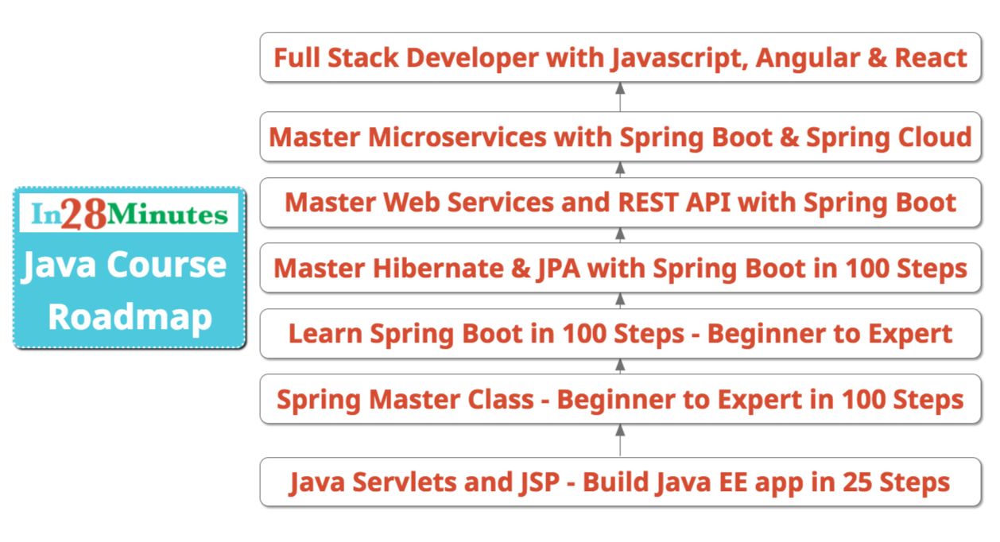
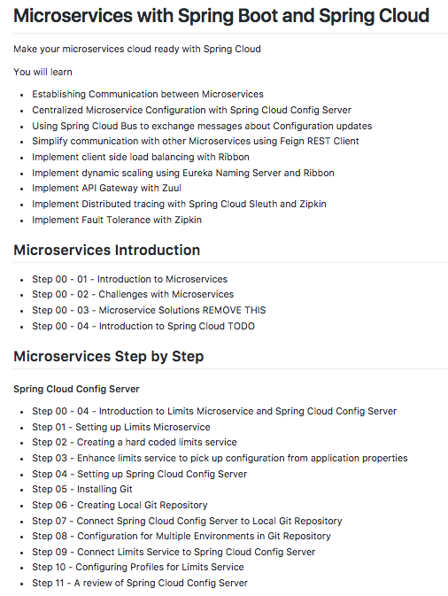
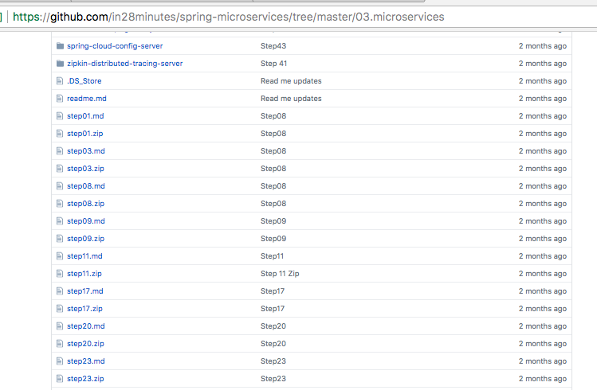
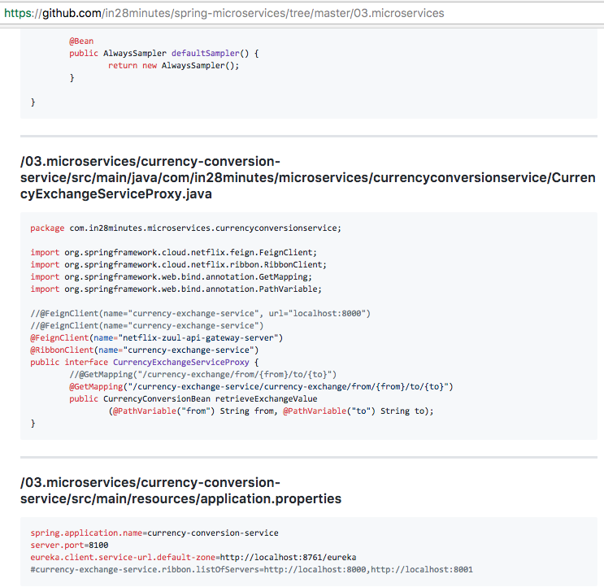

# The in28Minutes Way

#### Question

> How did in28Minutes get to 100,000 learners across the world? 

#### Answer

> We are focused on creating the awesome course (learning) experiences. Period.

#### An awesome learning experience? What's that?

You need to get insight into the in28Minutes world to answer that. 

You need to understand "The in28Minutes Way"
- What are our beliefs? 
- What do we love? 
- Why do we do what we do? 
- How do we design our courses?

To find out more about our courses visit http://www.in28minutes.com

Let's get started on "The in28Minutes Way"!

#### Important Components of "The in28Minutes Way"

* [Continuous Learning](#continuous-learning)
* [Hands-on](#hands-on)
* [We don't teach frameworks. We teach building applications!](#we-don-t-teach-frameworks-we-teach-building-applications-)
* [We want you to be strong on the fundamentals](#we-want-you-to-be-strong-on-the-fundamentals)
* [Step By Step](#step-by-step)
* [Efficient and Effective](#efficient-and-effective)
* [Real Project Experiences](#real-project-experiences)
* [Debugging and Troubleshooting skills](#debugging-and-troubleshooting-skills)
* [Modules - Beginners and Experts!](#modules---beginners-and-experts-)
* [Focus on Unit Testing](#focus-on-unit-testing)
* [Code on Github](#code-on-github)
* [Design and Architecture](#design-and-architecture)
* [Modern Development Practices](#modern-development-practices)
* [Interview Guides](#interview-guides)
* [Bring the technology trends to you](#bring-the-technology-trends-to-you)
* [Building a connect](#building-a-connect)
* [Socially Conscious](#socially-conscious)
* [We care for our learners](#we-care-for-our-learners)
* [We love what we do](#we-love-what-we-do)

## Continuous Learning

Trends change. Period. 

Yesterday it was REST, Spring, Spring MVC. Today it is Spring Boot, Microservices and Full Stack Development. Tomorrow it will be AI, Machine Learning and Big Data. 

Irrespective of the direction technology is heading, we think there are two characteristics that seperate the frontrunners from others
- You are an expert at what you do.
- You are a continuous learner. 

> You know what is happening. You keep learning every day. You know how to adapt when things go in a direction different from your expectations.

We believe that while you should work hard at your job and achieve great success with it, you should always have an eye towards 
- Getting better at what you do.
- Expanding your horizons.

Infact, this belief in continuous learning is what made me choose the name - in28Minutes.

> I'm a great believer that if you spend 30 minutes every day taking a small step towards your dream, you will reach the top 5% of whichever career path you choose. And that where in28Minutes comes from.

At in28Minutes we believe in Continous Learning. We are learning with you and identifying things you would want to learn. 

We started with Spring and Spring MVC. We have expanded to Spring Boot and Spring Cloud. We now have the best courses on building web applications, SOAP and RESTful web services, APIs and Microservices. We also teach the finer aspects of programming - unit testing, mocking and modern development practices - TDD, 4 Principles of Simple Design and Refactoring.

Today, we have courses to help a Java beginner to become an expert on APIs, Web Services and Microservices with Spring, Spring Boot and Spring Cloud. Almost all these courses are
- Best sellers on Udemy
- Have Great Reviews

In the next few months, we are expanding into 
- Front End
- Automation Testing

We continuously work on creating awesome course experiences.  
- Code and Complete Notes on Github (https://github.com/in28minutes/)
- Course Companion Guides
- Troubleshooting Guides (https://github.com/in28minutes/in28minutes-initiatives/tree/master/The-in28Minutes-TroubleshootingGuide-And-FAQ)
- Modularity of Courses helping them cater to the needs of both Beginners and Experts
- Increased Coverage of Topics

We spend time every day visualizing how we can make your course experiences better.

> You are a 28Minuter if you spend atleast half an hour a day in making your dreams come a step closer. 

## Hands-on

You do not learn to drive by watching Tom Cruise drive at 300 kmph. You have to do it yourselves to learn. 

The same applies to learning programming and learning to develop applications! You have to get your hands dirty. 

That's how you learn the most and that's exactly how we design our courses! 

> We design them to be hands-on.

If you are one of our 1300 followers on GitHub (https://github.com/in28minutes/) , you will know that we start working on a course atleast 3-6 months ahead of the release. 

Sometimes, it could be years before the course is live.

> For Example, I've been working on a programming course for the last 2 years to enable you to learn  both object oriented programming and functional programming irrespective of the language. You might be wondering "why 2 years?". I want the course to teach programming, design, unit testing, great programming practices, high quality code and be a lot of fun. I want the course to create great programmers. The first version of the course with Java will be released soon. 

Follow us on Github (https://github.com/in28minutes/) to know what we are working on.

> We believe that the best courses use the right examples to illustrate concepts. 

Finding the right example and fitting it into the hand-on approach is not an easy job. But that's the effort we put in to help you have an amazing learning experience.

And here is a review that recognizes our efforts in the background to make a course just right!

##### Master Microservices with Spring Boot and Spring Cloud
> A lot of preparation work has taken place from the teacher and this is visible throughout the course.

The fun part is "even our interview courses are full of code examples"!

When you learn something with a hands-on example, you retain the concepts for longer. And when you follow along with us and do it, you retain 200% more. 

That's the secret recipe for our amazing reviews. 

##### Spring Master Class - Beginner to Expert 

> You do not get bored in long conversations and you get time to get your hands dirty at the end of each video

> The instructor has  explained and demonstrated each single setting and covered so much!

##### Java Servlets and JSP 

> The best part of it is the hands-on approach which the author maintained throughout the course as he had promised at the beginning of the lecture. He explains the concepts really well and also makes sure that there is not a single line of code you type without understanding what it really does. It was so engaging that it gets you interested in web development and kinda makes you want to learn more about it.

> I got a working servlet! I got a working website!

##### Learn Spring Boot in 100 Steps - Beginner to Expert 

> I also appreciate the mind and hands approach of teaching something and then having the student apply it.  It makes everything a lot clearer for the student and uncovers issues that we will face in our project early.

## We don't teach frameworks. We teach building applications!

Projects are not built with one framework. There is an eco system that's used to build a project. An ecosystem of tools, concepts and frameworks. There are finer aspects like architecture, design, unit testing, security, exception handling and unit testing which make a project great.

> You do not become a great developer by understanding the framework. 

That's why we teach how to build applications using frameworks.

The fundamentals of a web service, a web application or a microservice do not change. If you create a good web service, irrespective of the framework you use to build it, it has potential to evolve into a good microservice. 

The frameworks you use might change but the applications will live for longer. We focus on helping you to learn to build great applications so that you can easily adapt to new frameworks.

Here are some of the titles of our awesome courses and you can see that all of them are focused on building something using the framework. They help you understand the framework but more importantly - they help you build an application with the framework.
  - Master Microservices with Spring Boot and Spring Cloud
  - Master Web Services and REST API with Spring Boot
  - Build Java EE(JEE) app in 25 Steps - Java Servlets and JSP
  - Build Java Web App in 25 Steps - Spring MVC For Beginners

Here are some of the reviews related to building awesome applications with a wide variety of frameworks and tools

##### Spring MVC For Beginners : Build Java Web App in 25 Steps 

> I learned a lot practically building the web application and you guys have tried using new concepts like bootstrap, HTML 5 which helps us go through them as well.

> This course covers quite a lot of subjects: Maven, Spring MVC, and Maven support for Bootstrap, Hibernate Validator, JSTL, jQuery, ...The author does a good job introducing all of these technologies.

##### JUnit Tutorial for Beginners - Learn Java Unit Testing

> This course starts and develops into more complex topics with clear explanations. It uses Eclipse and Maven so you can have the same tools available to use.

##### Java Servlets and JSP - Build Java EE(JEE) app in 25 Steps

> Simple, yet precise explanation. The course is also enabling in understanding how to use tools like eclipse, maven, tomcat.

> You will learn the concepts of Servlets, JSP, Maven, TomCat, and bit of bootstrap and CSS also. A++++

## We want you to be strong on the fundamentals

We think that understanding the fundametals of a tool, framework or a language is what makes you an expert. While you want to quickly learn how to use a framework, the key difference between an expert and a novice is "How deep do you understand the framework?". 

We want you to learn the fundamentals. We want you to be able to make the different choices involved in choosing and using a framework. 

We want you to understand not just the What and How. We would want you to understand the Why and When questions as well?
- Why Microservices?
- Why Spring? Why Spring Boot?
- Why are we using Maven?
- When should you use Mockito?
- What magic happens behind Spring Boot?
- What are the best practices in developing RESTful Web Services

In Spring MVC course, we teach you basics of JSPs and Servlets and then move to Spring MVC to ensure you understand why we are using Spring MVC.

In the Spring Boot course, we create examples using Spring Boot and without Spring Boot to help you understand what Spring Boot offers.

In the JPA and Hibernate course, we start with JDBC, Spring JDBC and iBatis to ensure you understand how things worked before JPA. And you know the advantages of JPA.

Lets look at a few of the reviews

##### Master Java Web Services and REST API with Spring Boot 

> I was always confused about RESTful web services and kept away from it. This course opened my eyes. Thanks a lot!

> I have worked on the webservices before, but did not know what was going behind the scene. Now i do and it makes lot easier to debug.

##### Spring Master Class - Beginner to Expert 

> Amazing course. Explained super difficult concepts (that I have spent hours on the internet finding a good explanation) in under 5 minutes.

> I've finaly undrestood the concept of DI and Autowiring ...

> I love it,teaches me Spring like I am toddler.Fully detailed

> You have really de-mystified dependency injection especially how it relates to Inversion of Control a concept that was failing to wrap around my mind, now i get it.!!!

##### Spring MVC For Beginners : Build Java Web App in 25 Steps 

> I like the way of topic explaining: creating JSP/Servlet app and then editing it according to Spring MVC principles and functionality step-by-step.

> Really complete Spring course for beginners, not only shows you the HOW to use Spring MVC but also the WHYs of every feature, snippet, configuration, design pattern and logic, not only for the Spring/Java related code but also HTML5, external libraries and maven

## Step By Step

All our courses take a step by step approach. We build awesome web applications, web services and microservices step by step. 

We believe that complex things should be explained by breaking them down into small understandable chunks and explained in small practical steps.

You can take a look at one of our recent courses for an example -  https://github.com/in28minutes/spring-microservices/tree/master/03.microservices

Let's hear this being reflected in our reviews for our courses

#### "Spring Master Class - Beginner to Expert" 

> Well-paced, clear, step-by-step explanation of a framework that is extremely complex if you try to absorb it all at once, but very intuitive when broken down.  The instructor breaks it down extremely well and the supplemental materials make it easy to play along.

> A great course which simplifies learning the complex things in depth.

> The course is structured in a very logical way and the instructor is well versed with whatever he is teaching. Liked it. A great experience!

## Efficient and Effective

We value your time and our time. 
- We want our courses to be very efficient. 
- We want you to learn the most in the least possible time. 
- We want you to be able to pick and choose the modules you want to learn.

Our courses use very efficient setup. 
- We use embedded Tomcat for all Spring Boot Courses! 
- We use maven tomcat plugin for our JSP Servlet and Spring MVC Course.
- We use in memory databases where possible.
- We use Unit Tests to illustrate examples.

That's why you would be able to learn a lot in a very short span of time!

Let's hear this being reflected in our reviews

##### Spring Master Class - Beginner to Expert

> The course is good for a beginner in spring framework like me. It also focus on writing the effective programming  with the help of utilising all the options available in Eclipse and Maven.

##### Java Servlets and JSP - Build Java EE(JEE) app in 25 Steps 

> I can see that you will be able to learn many advanced concepts very quickly and broadly within a short time frame. 

##### Spring MVC For Beginners : Build Java Web App in 25 Steps 

> It covers many many topics just in 6 hours! Even if I've lost something (but just because I wanted to follow all this dense course in one solution)  I can say that now I know many more things and I can go to study better what it has been explained. Thanks!

Bonus - Here are a couple of videos to help you become more efficient with Eclipse and Maven
- 10 Maven Tips for Beginners - https://www.youtube.com/watch?v=exNl7USPfsg
- 10 Eclipse Tips for Beginners - https://www.youtube.com/watch?v=dN9GYsG1v_c

## Real Project Experiences

We replicate real project experiences by building all important application features and by using the tools which are used in projects today. We build features like Exception Handling, Security and use tools/frameworks like Maven, Tomcat, JUnit and Mockito.

This ensures that you can apply what you learnt directly in your project. 

That's one of the most important goals we set when we start creating our course examples. 

> Make it as near to a real project experience as possible. 

And as always, our efforts reflect in our reviews.

##### "Master Java Web Services and REST API with Spring Boot" 

> Course made by in28minutes are really excellent.  And it directly helpful in developing application .

> Great course. The instructor has an easy way to explain exposing practical examples. Very straight. I definitely recommend!

##### "Spring MVC For Beginners : Build Java Web App in 25 Steps" 

> After finishing, I'm confident I know eneough to start creating other MVC projects. 

> "Thorough walk through, hitting on most of the tools that are used and needed for real world enterprise applications. Clear presentation and language."

##### "Master Hibernate and JPA with Spring Boot in 100 Steps" 

> Great course!  I was able to apply what I learned immediately!  Thanks!

##### Spring Master Class - Beginner to Expert 

> "exactly the information I need for my project"

> This is a great course. It has practical examples. It is not too fast or slow.

##### "Spring MVC For Beginners : Build Java Web App in 25 Steps" 

> The lecturer also uses more modern Java coding methodologies, whereas you still see older methodologies on other websites. 

## Debugging and Troubleshooting skills

Without great debugging skills, you cannot become a great programmer. Things go wrong when you put a project live and you want to find out why they went wrong and you want to find it quickly.

How can you develop great debugging skills?
 - Understand fundamentals
 - Learn step by step so that you know whats happening in the background
 - Ability to use logging effectively

We focus on enabling these during the courses. Let's hear this in the voice of our students.

##### "Master Microservices with Spring Boot and Spring Cloud" 

> The course does a good job of explaining terms, it goes through debug logs to explain step by step what the framework does, and it gives you a few tips on how to troubleshoot.

##### "Master Java Web Services and REST API with Spring Boot" 

> He sometimes (deliberately) make mistakes which is very helpful for newbies.

> I have worked on the webservices before, but did not know what was going behind the scene. Now i do and it makes lot easier to debug.

## Modules - Beginners and Experts!

We love modularization! We love building applications using a modular structure and the cool thing is we structure our courses around modules too!

We cater to the needs of Beginners and Experts with the same course by structuring our courses as independent modules.
- This enables an intermediate/expert learner to directly jump into an advanced module.
- This gives our learners the ability to pick and choose what they want to learn. 
- They can create their own learning paths based on their needs/experience/abilities.

Here are the modules for one of our courses
- Master Web Services and REST API with Spring Boot
- Introduction To Web Services
- Introduction to Spring Framework in 10 Steps
- Introduction to Spring Boot in 10 Steps
- SOAP Web Services with Spring and Spring Boot
- RESTful Web Services with Spring and Spring Boot
- Introduction to JPA in 10 Steps
- Connecting RESTful Web Service to JPA
- RESTful Web Services - Best Practices

An intermediate learner who is familiar with Spring and Spring Boot and wants to learn RESTful Services can skip the introduction and jump directly into to the specific section "RESTful Web Services with Spring and Spring Boot" directly.

Here are a few awesome learning talking about this in their reviews.

##### Master Java Web Services and REST API with Spring Boot

> I love how he organized this course in a way that it is not related to each other, so you can go to the segment you want to learn.

##### "Master Microservices with Spring Boot and Spring Cloud" 

> Each lesson is independent of the others so you can move to different lectures if needed.  I already have a lot of experience with programming and wanted to learn about specific examples.  This course provided that exactly. 

##### Learn Spring Boot in 100 Steps - Beginner to Expert 

> This course was perfect not only for beginners but for experienced engineers such as myself trying to get up to speed on spring boot quickly.

## Focus on Unit Testing

Unit Testing enables 
	- Quick Feedback
	- Continuous Improvement of Code

We believe that great developers write great unit tests and we want all our learners to be great developers!

We have courses on JUnit (a free course) and Mockito to teach how to write great unit tests using mocks. And We ensure that all our web services and framework courses teach how to write great unit tests and integration tests.

Our Spring Course has sections on JUnit, Mockito and teaches unit testing as an integral part of the course.

Here are a few reviews on our unit testing courses

##### Mockito Tutorial : Learn mocking with 25 Junit Examples 

> The best course of mockito and poweMockito that I have seen. Thanks for posting this great amount of great content to us.

> Very good course. The approach is very systematic and step by step. I really like the combination of theory and practical goes hand by hand. The journey from JUnit to Mockito to Powermock is very well described.

## Code on Github

All our code examples are open source and available on Github. We have 40+ repositories catering to the needs of wide range of courses and videos.

We have step by step details, step by step code and individual folder for each of the modules in our Github repository. 

> You can take a look at one of our recent courses for an example -  https://github.com/in28minutes/spring-microservices/tree/master/03.microservices

Lets take a quick look at a few screenshots from our Github repository.

#### Step by Step Details

#### Step by Step Code Backup

#### Complete Code Examples

## Design and Architecture

While we belive in Evolutionary Design, we think its important to spend time to create the right architectural mindset. 

We believe that the most important thing to do is to differentiate between Architecture and Design. Here's a great video to start off on Agile and Evolutionary Design - https://www.youtube.com/watch?v=gt6js9zl1Rs

We have created a few videos earlier on Design and Architecture. You can expect us to focus on this even more going forward.

Here are few videos:

- Introduction to Non Functional Requirements - https://www.youtube.com/watch?v=JTYxAcZC8Io
- Should I be an expert at all Design Patterns? - https://www.youtube.com/watch?v=8lEfj1cmBJ4
- Introduction to Design Patterns in 25 Minutes - https://www.youtube.com/watch?v=Vp7q_pE7Fzg
- 4 Principles of Simple Design - https://www.youtube.com/watch?v=OwS8ydVTx1c&list=PL066F8F24976D837C
- Web Service Design - REST - https://www.youtube.com/watch?v=dEL6762fj8M&list=PLBBog2r6uMCTsOXlw9xFpgONdKnT2ls3u

## Modern Development Practices

- We believe that following modern development practices is essential for a great developer. 

We created a number of videos on our YouTube channel about these practices.  
- Introduction to Modern Development Practices - https://www.youtube.com/watch?v=0Kqzfyp-w4s
- Introduction to DevOps - https://www.youtube.com/watch?v=I-JkJZruWyU
- How to become a good programmer? - https://www.youtube.com/watch?v=iJe1Ru4bJQo
- TDD - https://www.youtube.com/watch?v=45T32_ImO2c&list=PLBBog2r6uMCSa9_mNISSpTcbTcKlMAe6t
- Static Code Analysis - Best Practices - https://www.youtube.com/watch?v=rB_BaftN3nE
- JUnit - https://courses.in28minutes.com/p/junit-tutorial-for-beginners
- Introduction to Coding Standards - https://www.youtube.com/watch?v=XRKDpQ3b27M
- Introduction to Code Quality - https://www.youtube.com/watch?v=M4Ip6joERv4
- Code Review Best Practices - https://www.youtube.com/watch?v=hVJGu0xdXII
- Unit Testing (JUnit) Best Practices - https://www.youtube.com/watch?v=BukAouJgEjo
- Agile and Evolutionary Design - https://www.youtube.com/watch?v=gt6js9zl1Rs

## Interview Guides

We believe that interviews should not be focused on whether the interviewee remembers the nuances (api or annotations) of a framework or a language. Interviews should be focused on the thought process of a interviewee - "How would he/she approach a specific problem?"

Having said that, it is important for you to revise your concepts and fill the gaps in your understanding before an interview. And that's exactly how we think about our Spring and Java Interview Guides.

Our Interview Guides are 
- Aimed to help you quickly review important concepts and features
- Hands-on and full of code examples

Here are few reviews

##### "Spring Framework Interview Guide - 200+ Questions & Answers" 

> Best course to refresh the spring concepts and syntax in short time to prepare the interviews.

##### "Java Interview Guide : 200+ Interview Questions and Answers" 

> This is the best course to refresh or learn almost all the core java topics related to interview in few hours. Thanks for the awesome explanation Ranga it helped me a lot for changing my job.

## Bring the technology trends to you

There is a lot of churn in the industry. There is new stuff happening all around the technology world. AI, IOT, Machine Learning, Big Data, Cloud and DevOps are the buzzwords today. 

We would want to ensure that you are aware of the trends. We would give a new direction to our YouTube channel and help you whats happening with the buzzwords as well as the technologies where we are experts.
- Microservices - Node JS/Spring Boot
- Frontend Frameworks - Javascript/etc
- Automation Testing
- Mobile Development - Android/iPhone/Cross Platform

We would create more videos like these to help you understand our view of what's happending in the industry - Java Learning Roadmap and Trends - May 2017 - https://www.youtube.com/watch?v=6ObWpCUpGYc

We will help you get the expert view by connecting with the industry. More about it in the next section.

## Building a connect

While we are creating great learning experiences with our courses, we think a real mindset change happens only when a learner gets a chance to interact with experts - who are passionate and doing great work.

We want to bring the experts to you and help you understand their vision, their passion and knowledge. We believe, this will enable you to make the right choices in your technology career.

You can read more about this initiative in here - https://github.com/in28minutes/in28minutes-initiatives/tree/master/in28Minutes-connect

We want to promote online learning because we think Online Learning is a great socio economic leveller. 

We want to give you
 - Behind the scenes look at experts - stories, lessons, beliefs and vision!
 - What's happening in the industry?
 - How can they adapt?

## Socially Conscious

We would want an inclusive society where every one has an equal chance to succeed.

We are ready to offer our courses at substantial discounts and even for free for the right causes
  - We are and would want to support initiatives like women back to work 
  - We want to help re-skilling for those who lost jobs.

If you are aware of organizations supporting these intiatives, do help us reach out to them and help them Re-skill.

in28Minutes is proud of the great things that India has done on the technology front
- We invented Zero and thats the base for everything we do in the programming world.
- We created wonderful programmers.
- We created wonderful world leaders for top technology organizations.

However, we believe there is a lot of work to be done.

And we would want to do our bit.

###### Promote Online Learning in India

> We think Online Learning is a great socio economic leveller. Online learning has come a long way in the last few years around the world. However, adoption in India remains slow and we want to increase adoption by bringing online learning at an early stage - college and industry entry level. We belive once you start learning online, it will remain your No 1 choice of learning.

##### Create More Great Programmers from India

> There are awesome programmers from India doing great work across the world. However, as a percentage of IT professionals, the number of awesome programmers remains miniscule.

For enabling this - we would create awesome free courses for entry level programmers to understand and love programming. 

We would want to reduce the barriers in learning programming by creating programming courses in local languages
  - c++ in telugu - https://www.youtube.com/watch?v=FzosXb-n3V8&list=PLB54DFFD608FDCCA5
  - C in telugu - https://www.youtube.com/watch?v=0Asyny8Wto4&list=PLA8E0AD777C0B9827

##### Support Re-skilling of Experienced Developers

> Whethers its developers coming back to workforce or who lost their jobs, we would want to provide them the means to help them get back.

## We care for our learners

We care for our learners. We ensure that their needs are addressed and we are creating awesome course and learning experiences. And they love us back :)

Here are a few reviews show our learner's love for us

##### Master Microservices with Spring Boot and Spring Cloud

> Superb course! Very detailed and helpful

> Its amazing to learn from this  course

##### Learn Spring Boot in 100 Steps - Beginner to Expert

> So clear, funny and easy to learn with you. A pleasure!

> Lot lot, lot of great and quality stuff, as always with Ranga.

> Honestly, this is the best Spring Boot course I've ever tried out. These things make even more sense to me, and I am enjoying every single moment of it. Super snazzy and flawless presentations, Ranga! Keep up the clean work!

> I love this guy

##### Java EE Made Easy - Patterns, Architecture and Frameworks

> Excellent as usual

##### Spring Master Class - Beginner to Expert" 

> Excellent and amazing course!!! I've been searching for such a complete and awesome course on spring for a long time. It's a really comprehensive course and all concepts are explained in details.

> The way he explains everything is just amazing. He understand very well the concepts and very meticulous explaining every concept 

##### Master Java Web Services and REST API with Spring Boot 

> Genius !!!

> V V good and what else i should say  .. no word ..

##### Master Hibernate and JPA with Spring Boot in 100 Steps 

> this is a big course , excelent teacher  , the best  hahahahha

> We are lucky to have Ranga's courses published on Udemy so that we got opportunity to learn those in faster pace.

##### Spring MVC For Beginners : Build Java Web App in 25 Steps 

> Brilliant! The best course ever!

> "Very Good lecture and I have not seen like this before I salute for you Sir"

> Excellent, fabulous. The way he has prepared the material and the way he teaches is really awesome. What an effort .. Thanks a million

## We love what we do

We are helping shape the careers of our learners and that's what we love doing. Since we started teaching full time, we put in more effort to ensure you are having the best course experience possible. 

We are venturing into Automation Testing and Full Stack Development next and we will bring the same level of expertise and commitment to those courses as well.

We want you to achieve what you want by making you experts and enjoy what you are learning.

##### Master Microservices with Spring Boot and Spring Cloud

> Its amazing to learn from this  course

##### Learn Spring Boot in 100 Steps - Beginner to Expert

> So clear, funny and easy to learn with you. A pleasure!

> Lot lot, lot of great and quality stuff, as always with Ranga.

##### Spring MVC For Beginners : Build Java Web App in 25 Steps 

> Wow, great coach!

> By the time you complete the course, you realise that he has taught you all the most important Spring concepts in a fun, entertaining and easy to understand manner.

> This guy is fantastic. Really. Wonderful teaching skills, and goes well out of his way to make sure that everything he is doing is fully understood. This is the kind of tutorial that gets me excited to work with a framework that I may otherwise not be.

## The End

Wow! Wasn't it a wonderful read? We would love to hear your thoughts.  
To find out more about our courses visit http://www.in28minutes.com

Share on Twitter - https://twitter.com/home?status=Having%20a%20great%20time!%20%0A%20%23in28Minutes%20%23ImLearningIn28Minutes

#in28Minutes #ImLearningIn28Minutes #ImLovingIn28Minutes 

Good Luck and Keep Learning in28Minutes
- Linked In : https://www.linkedin.com/in/rangakaranam/​
- Facebook  : https://www.facebook.com/in28Minutes​
- Twitter   : https://twitter.com/in28Minutes​
- YouTube   : https://www.youtube.com/rithustutorials​
​
