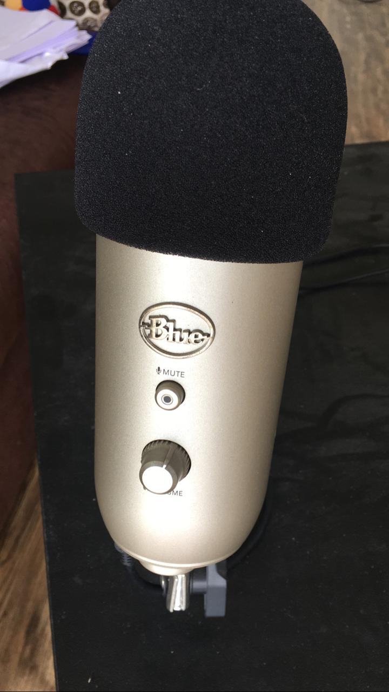

## Audio Setup

- Blue Microphones YETI USB Microphone(Silver)
https://www.amazon.in/gp/product/B002VA464S
- (EARLIER) Studio Microphone Mic Wind Screen Pop Filter/ Swivel Mount, 360° Flexible Gooseneck Holder
- (NOW) Mudder Mic Cover Foam Microphone Windscreen for Blue Yeti, Yeti Pro Condenser Microphone
- (NOW) ZRAMO Foam Windscreen Designed to fit the Blue Yeti, Yeti Pro Condenser Microphone, MXL, Audio Technica, and Other Large Microphones - Black

### Settings

> Make sure you adjust volume, gain and pattern to the settings shown in the screen.

## Software

- Camtasia for Mac
	- Both recording and editing.
- Custom Software for 
	- Splitting videos into small chunks after recording.